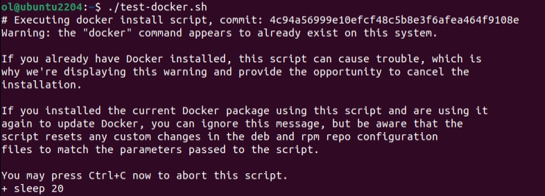
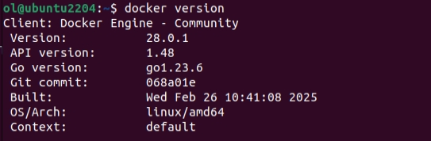
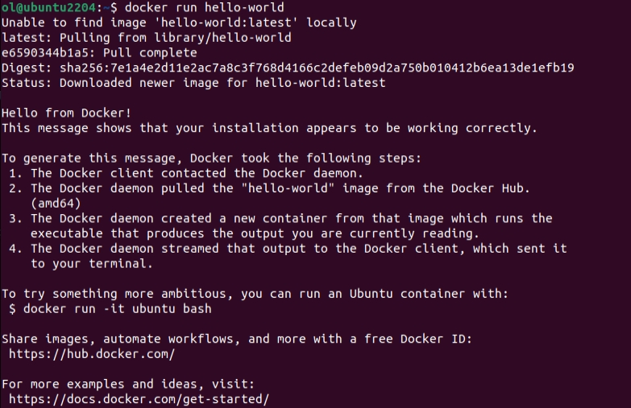

# How to Compile

**Topics**

- [Quectel Open SDK](#quectel-open-sdk)
- [Ubuntu Environment](#ubuntu-environment)
- [Docker compilation environment](#docker-compilation-environment)
- [Compile](#compile)

## Quectel Open SDK

Here let's take the `EC25EFAR06A12M4G_OCPU_20.200.20.200` SDK version as an example, the unzip process should be done by a non-root user in a Ubuntu environment.

```bash
$ tar xvf EC25EFAR06A12M4G_OCPU_20.200.20.200_SDK.tar.bz2
$ tree -L 1
.
├── Makefile
├── ql-ol-bootloader
├── ql-ol-crosstool
├── ql-ol-extsdk
├── ql-ol-kernel
├── ql-ol-rootfs
├── ql-ol-rootfs.tar.gz
├── ql-ol-usrdata
├── ql-ol-usrfs
└── target
```

|     Directory    |     Content               |
|   ------         |       ------              |
| ql-ol-crosstool  | Cross tool chain               |
| ql-ol-bootloader | QTI bootloader source code     |
| ql-ol-kernel     | Linux kernel source code       |
| ql-ol-rootfs     | Root file system for platform runtime |
| ql-ol-extsdk     | Include API，example and tools        |

## Ubuntu Environment

It is best to try Quectel SDK on Ubuntu 16.04 or 18.04. Ubuntu 22.04 and above is not tested.

Or you can refer to [the compilation environment using Docker](#docker-compilation-environment)

```bash
$ sudo apt-get install -y \
    perl  sudo mc re2c wget  sudo \
    g++ g++-multilib \
    python
    
$ sudo apt-get install -y \
    bison gcc make build-essential \
     libc6-dev-i386 libncurses-dev libssl-dev \
     wget coreutils diffstat \  
     chrpath cpio gawk  sed  \
     texi2html texinfo unzip flex bc

$ sudo update-alternatives --install /usr/bin/python  python /usr/bin/python2  2700
```

## Docker compilation environment

[Docker](https://www.docker.com/) is an open source platform for developing, delivering, and running applications. It leverages containerization technology, enabling developers to package applications and their dependencies into a portable container called a Docker container. These containers can run quickly and consistently on any machine running Docker, whether it is a development environment, a test environment, or a production environment.

**Steps**

1. Download the official installation script.

    ```bash
    curl -fsSL https://test.docker.com -o test-docker.sh
    ```

1. Execute the script

    ```bash
    sudo sh test-docker.sh
    ```

    

1. Check the Docker version information. If the version information can be output, the installation is successful.

    ```bash
    docker version
    ```

    

1. Try running the hello-world image to verify that Docker is installed correctly.

    ```bash
    docker run hello-world
    ```

    

## Compile

1. Enable the cross tool

    ```bash
    cd ql-ol-sdk 

    source ql-ol-crosstool/ql-ol-crosstool-env-init
    QUECTEL_PROJECT_NAME      =EC25E
    QUECTEL_PROJECT_REV       =EC25EFAR06A12M4G_OCPU_20.200
    Relocating ............done
    Extracting the rootfs...
    Done.

    make kernel_menuconfig
    ```

1. Build the kernel

    ```bash
    make kernel
    ```

1. Build the rootfs

    ```bash
    make rootfs
    ```

1. Build the userdata

    ```bash
    make usrsdata
    ```
