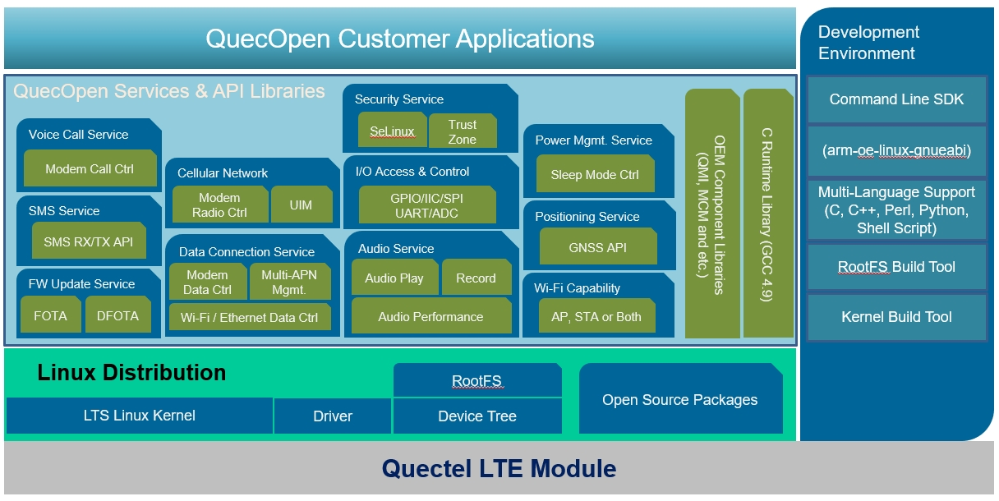
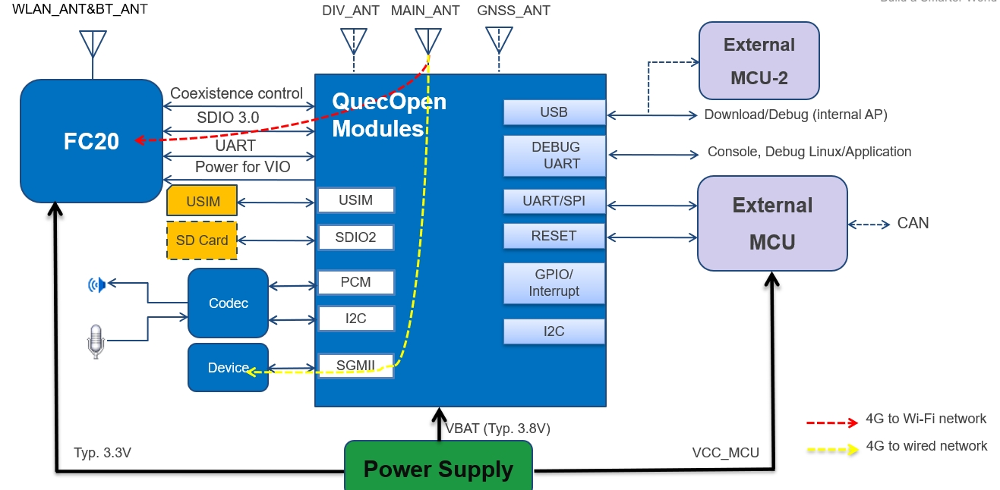

# EC2x Overview

Quectel EC2X is based Qualcomm MDM9x07 Chip.
CPU & O.S

ARMv7 Cortex A7 up to 1.2GHz with 256KB L2 cache. 
(Performance: 2280 DMIPS @1.2GHz, 1.9 DMIPS/MHz). 
       
Linux distribution with kernel 3.18.

## Quectel module

## Software Framework

## Platform Info

The memory and flash size

|          | ROM      | RAM      |  /bit    |
| -------- | -------- | -------- | -------- |
| 4G       |  512MB   |   256MB  |  4+2     |
| 2G       |  256MB   |   256MB  |  2+2     |
| 1G       |  128MB   |   128MB  |  1+1     |

FC20 is based on Qualcomm QCA102.

## Hardware Overview
 
EC2x 支持SPI/I2C/Uart,Audio PCM/I2S接口、USB、SDIO、SIM卡、SGMII。详细需要查阅Hardware-Design.
模组的硬件资源
    
    USB
    SGMII
    USIM
    SDIO/SDC
    WLAN
    UART
    SPI/I2C
    PCM/I2S
    
    

硬件请参考

    Quectel_EC21-QuecOpen_Hardware_Design_V1.0.pdf

如果使用移远的EVB，需要拿到对应EVB和TE-A的原理图。

移远的EC2x可以用在UMTS&LTE-EVB或者LTE OPEN-EVB上。

