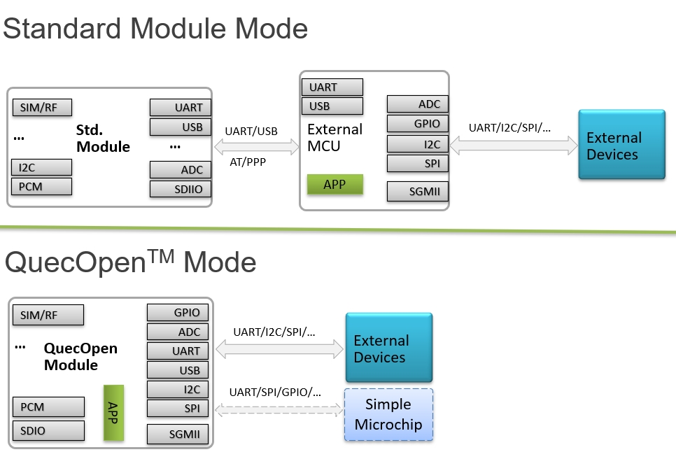
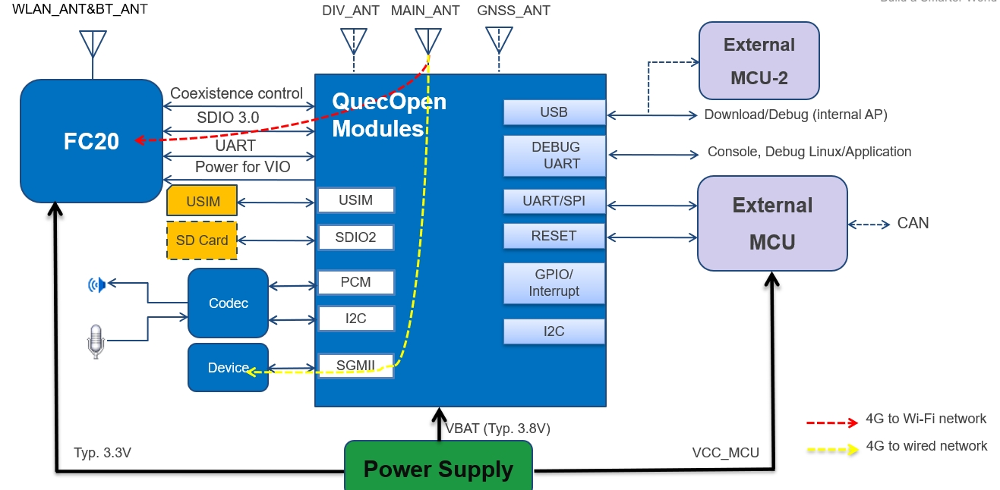

# EC2x Overview

Quectel EC2X is based Qualcomm MDM9x07 Chip.
CPU & O.S

ARMv7 Cortex A7 up to 1.2GHz with 256KB L2 cache. 
(Performance: 2280 DMIPS @1.2GHz, 1.9 DMIPS/MHz). 
       
Linux distribution with kernel 3.18.

## Quectel module

## Software Framework

## Platform Info

The memory and flash size

|          | ROM      | RAM      |  /bit    |
| -------- | -------- | -------- | -------- |
| 4G       |  512MB   |   256MB  |  4+2     |
| 2G       |  256MB   |   256MB  |  2+2     |
| 1G       |  128MB   |   128MB  |  1+1     |

FC20 is based on Qualcomm QCA102.

## Hardware Overview
 
EC2x supports SPI/I2C/Uart, Audio PCM/I2S interface, USB, SDIO, SIM card, SGMII. 

For details, please refer to hardware resources of the module
    
    UART
    - Debug port (x1)
    - Application UART port (x3): All of them support hardware handshake option
    GPIO (more than 30)
    I2C (x1)
    SPI (x1)
    PCM (x1)
    ADC (x2)
    SDIO (x2): one for Wi-Fi, and the other for SD card or eMMC.
    SGMII  (x1)
    
Please refer to Quectel_EC2x-QuecOpen_Hardware_Design_V1.0.pdf

If you use Quectel's EVB, you need to get the schematics of the corresponding EVB and TE-A.

Quectel's EC2x can be used on UMTS&LTE-EVB or LTE OPEN-EVB.

