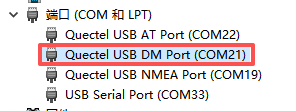
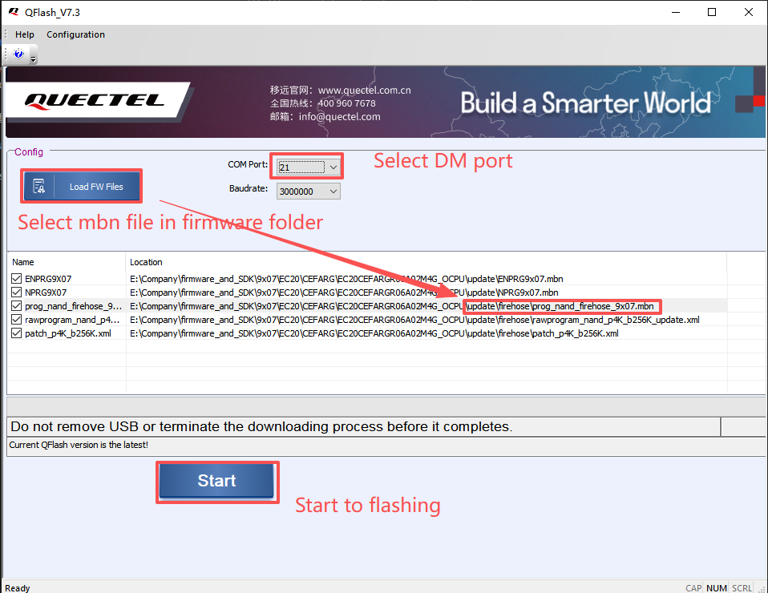
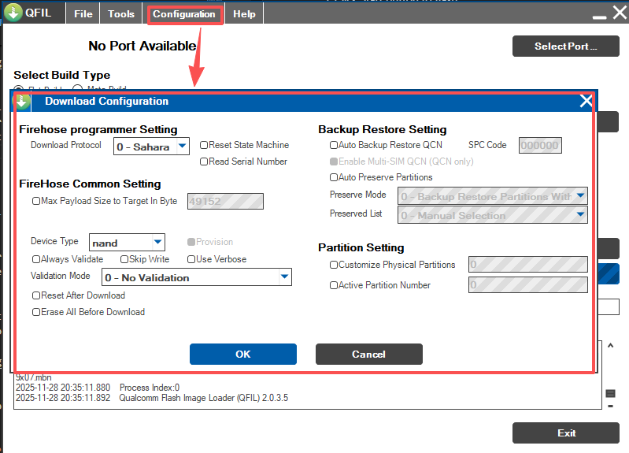
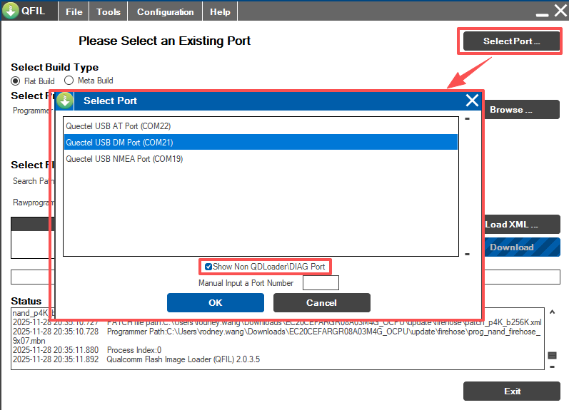
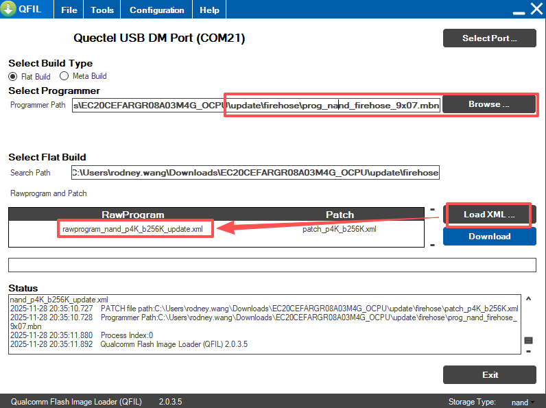
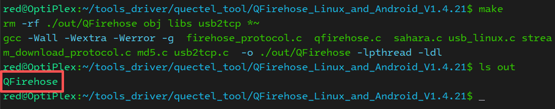
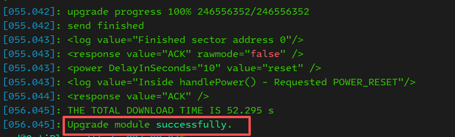
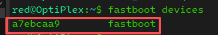
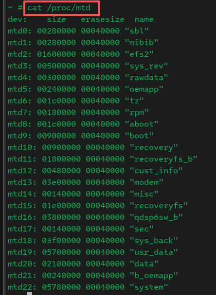

# Firmware updating  
## Overview  
This article is applicable for module EC2X,EG9X,EG2X serials module. Now, there are multiple tools can be used for firmware updating on different platform. On windows OS, it supports Qflash, QFil, qfirehose tools. On Linux, it support Qfirehose tool and fastboot tools. We use DM port to update firmware on all of platform as below.   



## Firmware update on Windows  

### QFlash  
Quectel provides firmware update tool QFlash. It is recommanded for perference. 
1. Open tool and select DM port as COM Port.
2. Click button load FW files to select file update\firehose\partition_complete_p4K_b256K.mbn in firmware folder.
3. Click Start button to flash.   
 

### QFil
QFil is a Qualcomm tool. It may ask license. QFil will output more flash information during updating. 
Please follow below picture to set before updating.  
1. Tool Configurations   
  

2. Select DM port   


3. Select update files  
Click Browse to select prog_nand_firehose_9x07.mbn. Then click Load XML to select file rawprogram_nand_p4K_b256K_update.xml.  
  
4. Click Download to update firmware.

## Firmware update on Linux
### QFirehose 
Quectel provides flash tool on Linux platform called qfirehose. Tool is shared as source code format. Customer should compile it by themselves. 
1. Compile tool  
Firstly, make sure GCC is installed. Then we can just run 'make' to compile tool as below. Generated program file in folder out as below.   


2. Flashing  
Use below command to update firmware. Parameter -f specify firmware path.  
```bash
sudo ./qfirehose -f EC20CEFARGR08A03M4G_OCPU
```
It indicates updating is success with below log.   


### Fastboot 
1. Install adb and fastboot tools. Below steps we have tested on Ubuntu. 

```bash
sudo apt-get install android-tools-adb
sudo apt-get install android-tools-fastboot
```
2. Use below command to go into fastboot mode.
```bash
adb reboot bootloader
```
Use below command to check if a fastboot devices can be found.  
 

3. Then use below format to update single partition.
```bash
fastboot flash <partition name> <iamge file>
``` 
We can check partition name with below command on module.   
