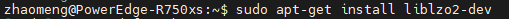
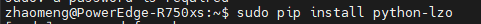
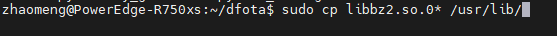
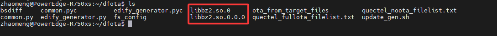
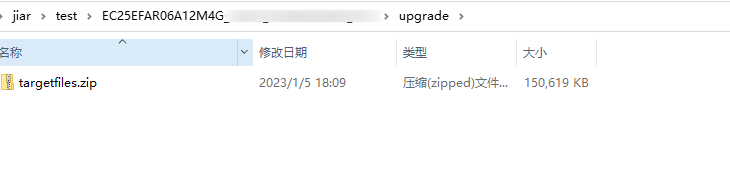
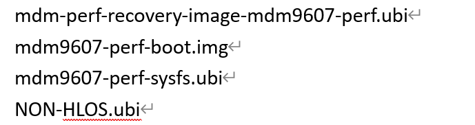
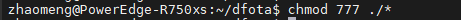
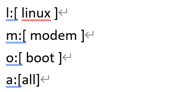

# DFOTA Guide
The purpose of this document is to configure the dfota compilation environment, dfota tools, and dfota production.
Note:Please obtain the differential tool from Quectel's support personnel based on the project

## Install the required software

### 1.Install the Lzo library  
  

### 2.Copy the library files from the differential tool from the current directory to/usr/lib  
  

  

## Prepare the necessary documents for DFota

### 1.ZIP format dfota required files
upgrade/targetfiles.zip
Place the existing version in the v1 folder of the dfota tool directory and the target version in the v2 folder.  

### 2.UBI format dfota required files
Four files, place the existing version in the v1 folder and the target version in the v2 folder.  

## Add permissions to the source code of the dfota tool  

## Start DFota make

  

  

## The final update. zip firmware will be generated

Note:Regarding the differential part of dfota, Quectel suggests differentiating all firmware. If it is necessary to differentiate individual components such as a separate differential kernel, it is necessary to ensure that the modem firmware has not been updated. For detailed information, please consult Quectel support engineers. We kindly remind that after creating the dfota package, please conduct stability testing to avoid functional problems caused by OTA upgrades