# Partition creation and mount 
The purpose of the document is to add a new UBI partition and explain how to mount it in the file system

## 1.Create a UBI partition
1.1.Enter the partition to configure the file, modify the partition configuration information, and add a new partition named 'test'
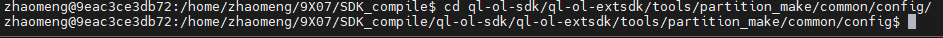

1.2.Modify partition configuration table file
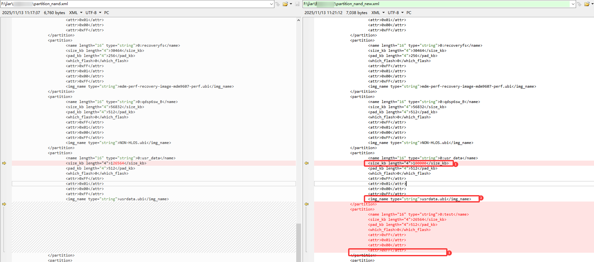
Note:As shown in the comparison diagram, a test partition has been added to the modified file. The part marked as 1 indicates that the usrdata partition has been reduced, while the parts marked as 2 and 3 indicate that the usrdata partition will pre download Ubi firmware. However, the new partition removed this sentence, indicating that it will not pre download Ubi firmware. This is to facilitate the creation and mounting process of new Ubi partitions within the module. Customers can refer to the usrdata partition to create a test Ubi firmware

2.1.The newly added partition configuration file will overwrite the original one, and then create partition configuration firmware
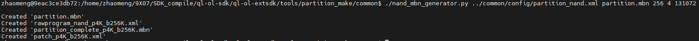

2.2.Replace the generated file
As shown in step 2.1, the four files generated after compilation are replaced with files of the same name corresponding to the firmware package. The rawprogram_nand_p4K-b256K.xml file is placed in the firehose directory, and one of the firmware packages initially has an ”update“ file name. The new file needs to be modified to have the same name. Of course, you can choose not to modify it, but you need to change the selection of the XML file with ”update“ to this file when selecting the upgrade file in the upgrade tool
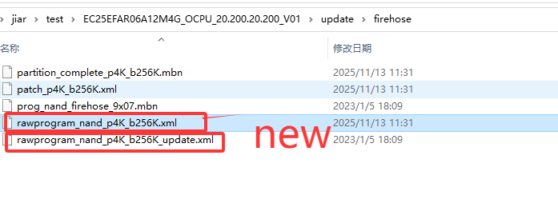

## 2.Validation
Upgrade the module using the firmware package that replaces the file. After the upgrade is complete, the debug port can see the newly added partition. 
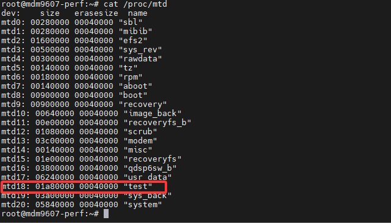

At this point, the partition is only being added and has not yet been mounted as a UBI file system.  
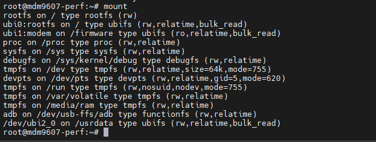

## 3.Mount the partition
3.1.Format MTD partition ,example:test partition.  
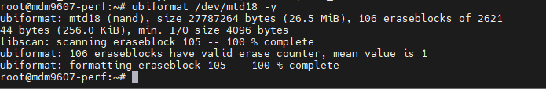  

Note:This command indicates selecting MTD for formatting; -y represents formatting the entire partition

3.2.Connect the formatted MTD partition to UBI
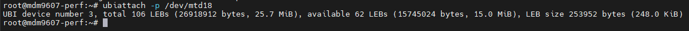  

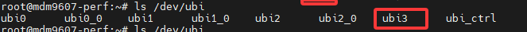  

Or we can use below commands.  
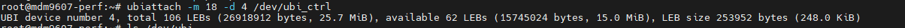   

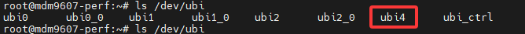  

Select an MTD to connect to a Ubi; `-p 'specifies the device path,' - m 'specifies the MTD number, which can be equivalently replaced; `-d 'specifies a certain' ubi ', omission will result in automatic allocation by the system; `The ubi controller node omits the default/dev/ubiuctrl. If the previously used MTD is not formatted, the previously established connection information still exists. After executing the connection, the volume will be created directly based on the old information. If formatted, Example 1 will result in the existence of '/dev/ubi2' after execution. If unformatted, it will result in the existence of '/dev/ubi2_0', which creates a volume.

Note:
ubiattach -p /dev/mtd18 //The ubi number created by this command is assigned by the system itself
ubiattach -m 18 -d 2 /dev/ubi_ctrl //The ubi number created by this command can be specified by oneself

3.3. Create UBI volume  
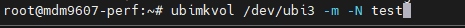

3.4.Mount ubifs

Create a mount file directory.  
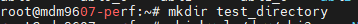

Mount the partition to direactory created on above step.  
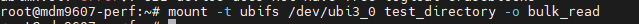

3.5.Check the mount  
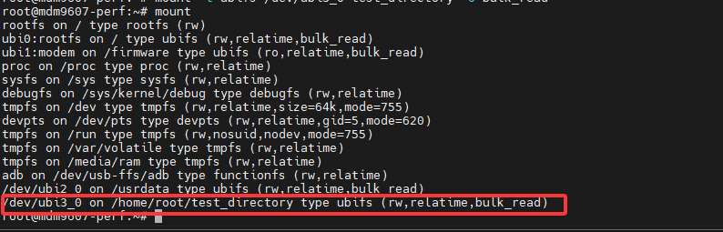

At this point, we are operating in the test_irectory directory, which is equivalent to accessing the test partition

3.6. Additions
umount ubifs  
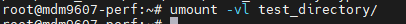  

disconnect UBI   
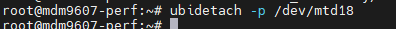