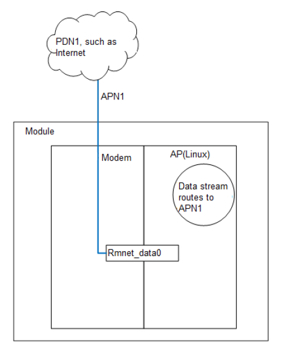
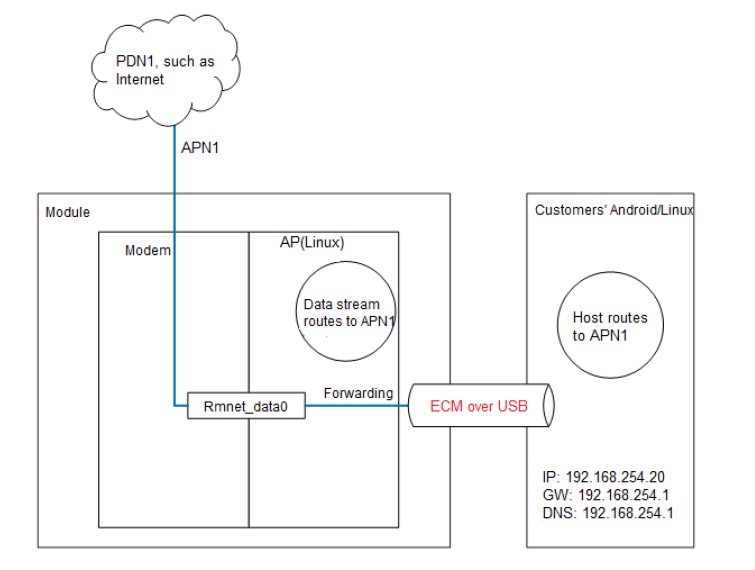
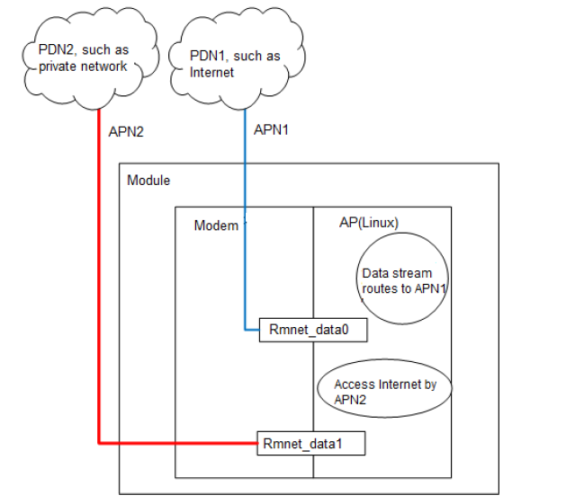

# Multiple Datacall and Route settings
In this article, we will introduce the configurations for different data call scenario.

## 1. Single data call. 
In this application scenario, there is no need for any routing. Just need start data call, rement_data0 interface will be created. The applicaiton running on AP side will forward data correctly.

  

## 2. Single Data Call with ECM Device 
In this scenario, there is a internal data call is created. But USB usb tethering is supported also. Module will be connected to external host via USB interface. The diagram as below.

  

Inside module, it does not ask route. Data is sending and receving via rmnet_data0. But external host is connected LAN via USB ECM. It should be configured with correct LAN ip and gateway. Usually, these settings are configured vis DHCP. There is DHCP and DNS server inside module.

## 3. Multiplex Data Call  
In multiplex data call scenario, one connection is usded for public communication. The other one is used for private communication, such as to access some private network.

  
 
We should created two data call via two APNs. One of them is private APN. Usually, most of application will access internet via public connection. We should have a default route for it. The other one should set a specified route rules. 
Below is some example to add default and specified route rules.
1. Clear settings
```bash
route del default
iptables -t filter -F
iptables -t nat -F
```

2. Add default route
```sh
route add default dev rmnet_data0
```

3. Default DNS Configuration  
The DNS setting is sotred in file /etc/resolv.conf for linux platform.
```bash
echo "nameserver 192.0.2.2" > /etc/resolv.conf
echo "nameserver 192.0.2.0" >> /etc/resolv.conf
``` 
4. Configure the DNS for the private network.
```bash
ip route add 192.0.2.2/32 dev rmnet_data1
ip route add 192.0.2.0/32 dev rmnet_data1
```
5. Add route for private connection. It means all of accessing of 192.0.2.2 via be forawared via rmnet_data1 interface.
```bash
route add –net 192.0.2.2/32 gw 10.32.80.46 dev rmnet_data1
```