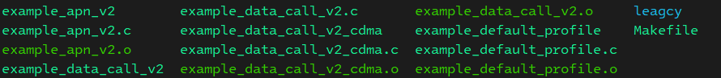
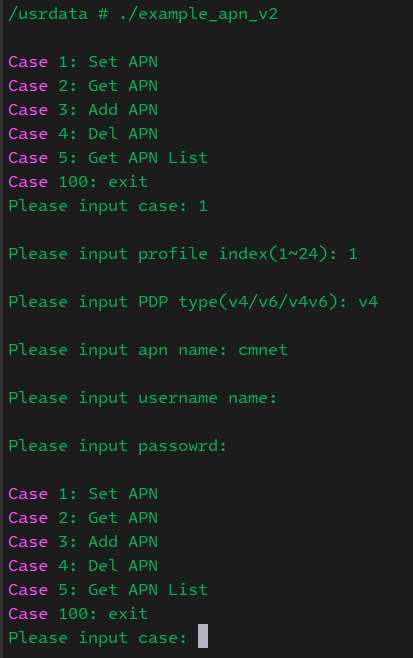
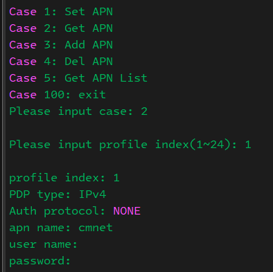
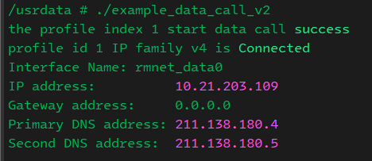
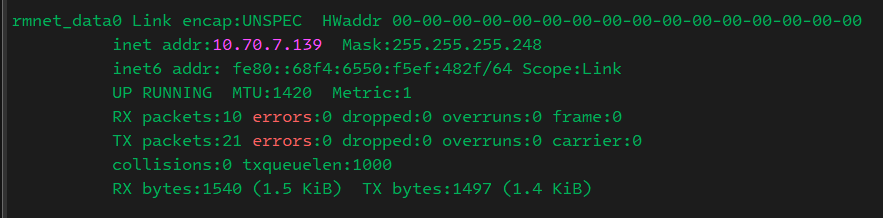

# Data Call Introduce and Practice
## Introduction 
It introduces the process of establishing the wireless data service, namely the process of module data call. The entire calling process needs to be performed in strict accordance with the sequence described in next chapter, especially for customers who are new to wireless service. 
This article is applicable for EC2X, EG9X and EG2X serials module.

## The sequence to start data call
### Network status checking
We firstly should check network status before start data call because good network registration is essential requirement. 

1. Check if SIM card and antenna is connected.
2. Check the device status in sequence by the following APIs.  
a) Test (U)SIM card: QL_MCM_SIM_GetCardStatus ()   
b) Detect signal strength: QL_MCM_NW_GetSignalStrength ()   
c) Check network registration status: QL_MCM_NW_GetRegStatus()  
d) Query operator: QL_MCM_NW_GetRegStatus()  
e) Query network access technology: QL_MCM_NW_GetRegStatus()  
f) Query call service status: QL_Data_Call_Init_Precondition()   
### Configure APN according to your SIM card 
In general, for multiplex data call application scenarios, it is often necessary to set some special APNs for private network access. The parameters of each APN can be queried and configured by below APIs. The APN parameter must be configured before starting a data call. The configured parameters will be saved automatically and remain valid after rebooting.
```C
int QL_APN_Set(ql_apn_info_s *apn);
int QL_APN_Get(unsigned char profile_idx, ql_apn_info_s *apn);
```
### Start data call


```C
    int retry = 10;
    ql_data_call_s data_call;
    ql_data_call_info_s data_call_info;
    ql_data_call_error_e err = QL_DATA_CALL_ERROR_NONE;

    memset(&data_call, 0, sizeof(data_call));

    /*
     * The dialup API relies on the Quectel Manager service. If the program is not initialized successfully, 
     * debugging these API interfaces will fail, so here is judged whether the service is started normally.
     */
    while(0 != QL_Data_Call_Init_Precondition() && 0 != retry) {
        printf("The Quectel manager service is not initialized, about 500ms try again.\n");
        usleep(500*1000);
        retry--;
    }

    if(0 == retry) {
        printf("Data call failure\n");
        exit(0);
    }

    if(QL_Data_Call_Init(data_call_state_callback)) {
        printf("Initialization data call failure\n");
        exit(0);
    }


    memset(&data_call_info, 0, sizeof(data_call_info));
    err = QL_DATA_CALL_ERROR_NONE;
    data_call.profile_idx = 1;
    /*
        * If your data call program is coredump, the data call status will not disappear automatically. 
        * When your program is start again, you need to call the QL_Data_Call_Info_Get interface to get 
        * the data call status. Because it is already in the data call state, you call QL_Data_Call_Start 
        * again without callback function
        */
    if(QL_Data_Call_Info_Get(data_call.profile_idx, QL_DATA_CALL_TYPE_IPV4, &data_call_info, &err)) {
        printf("get profile index %d information failure: errno 0x%x\n", data_call.profile_idx, err);
        continue;
    }
    if(QL_DATA_CALL_CONNECTED == data_call_info.v4.state) {
        printf("the profile index %d is already connected, don't up\n", data_call.profile_idx);
        continue;
    }
    data_call.ip_family = QL_DATA_CALL_TYPE_IPV4;
    data_call.reconnect = true;
    err = QL_DATA_CALL_ERROR_NONE;
    if(QL_Data_Call_Start(&data_call, &err)) {
        printf("the profile index %d start data call failure: 0x%x\n", data_call.profile_idx, err);
        
    }
    printf("the profile index %d start data call success\n", data_call.profile_idx);
    usleep(500*1000);
    
    sleep(3600);
    return 0;
```
## Test on device
### Comiple example code
We should execute below command set compiling envrionment for each new opened terminal.
```bash
source ql-ol-crosstool/ql-ol-crosstool-env-init
```
Then go into directory ql-ol-sdk/ql-ol-extsdk/example/data and run make. It will generated below files.



Then push the binary program to module, for example
```bash
adb push example_apn_v2 /usrdata  
adb push example_data_call_v2 /usrdata
```
### Run example on devices
1. Configure the APN.  
 

2. Confirm the configuration is correct. It does not ask username and password for public APN.  


3. Start data call example as below.  


4. Network interface rmnet_datax should be created.  


