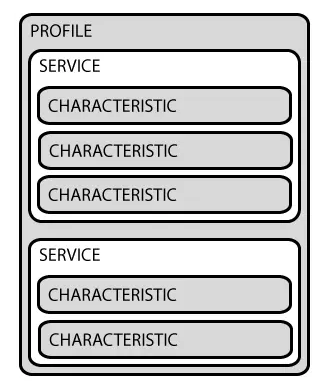
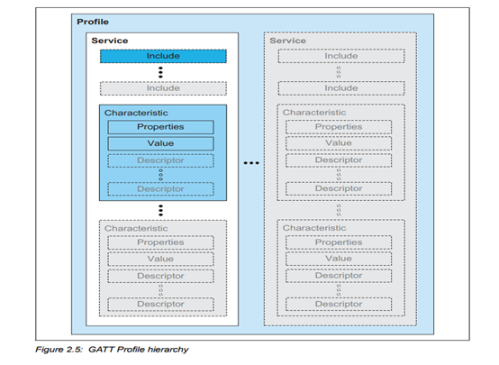
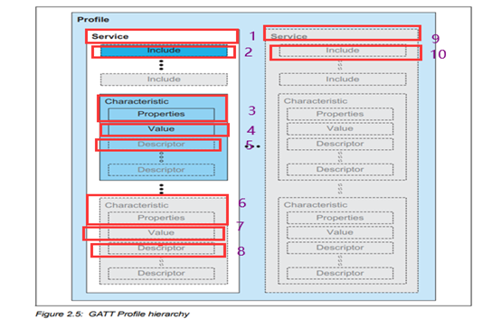

# Bluetootch application user guide
## overview

Bluetooth Low Energy (BLE) connections are based on the GATT protocol, a standard for transmitting and receiving short data units called Attributes.

## GAP

GAP (Generic Access Profile) manages device connection and advertising. It makes devices discoverable and defines interaction rules between devices.

#### Device Roles

GAP defines multiple device roles, among which Peripheral and Central are primary.
Peripheral: Typically lightweight BLE devices that transmit data and connect to a more powerful Central device.
Central: A more capable device responsible for connecting to Peripherals.

#### Advertising Data

In GAP, peripherals broadcast data via Advertising Data Payload and Scan Response Data Payload.
Advertising data is mandatory. Peripherals keep broadcasting to notify central devices of their presence.
Scan response is optional. A central device may request it to obtain extra device information.

#### Advertising Process

Peripherals transmit advertising data periodically at a set interval. A longer interval reduces power consumption but lowers discoverability.

## GATT

GATT enables BLE communication via Services and Characteristics. It relies on the Attribute Protocol (ATT), which stores relevant data in a lookup table. 

GATT takes effect after a connection established via GAP, and a GAP procedure is mandatory prior to GATT connection. 
A GATT connection is exclusive: a BLE peripheral can only connect to one central device at a time. Once connected, the peripheral stops advertising and becomes undiscoverable; it resumes advertising after disconnection. 

GATT connection is the only way for two devices to realize two-way communication.

### GATT Communication Transactions 

GATT adopts a client-server architecture. The peripheral acts as GATT Server, maintaining the ATT lookup table and definitions of services and characteristics. The central device works as GATT Client to send requests. All transactions are initiated by the client (Master) and responded by the server (Slave). After connection, the peripheral proposes a connection interval, at which the central device polls for new data. This interval is merely a recommendation; the central device may not follow it strictly due to busy resources or ongoing connections with other peripherals.

### GATT Structure

GATT transactions are built on nested Profiles, Services and Characteristics.  
  
Profiles do not physically exist on BLE peripherals. They are predefined collections of services specified by Bluetooth SIG or device developers, such as the Heart Rate Profile.

A Service organizes data into independent logical units and consists of one or more Characteristics. Each Service is identified by a unique 16-bit or 128-bit UUID. 16-bit UUIDs are officially certified and licensed, while 128-bit UUIDs are for custom use.

As the smallest logical data unit, each Characteristic also uses a 16-bit or 128-bit unique UUID.

## FAQ on Bluetooth development

**Can BLE establish multiple connections simultaneously?**
GATT protocol only supports a single connection.

**Can BLE act as both server (slave) and client (master) at the same time?**
No. It can only function as either a server or a client at one time.

**How to communicate without GATT?**
Data can be transmitted via advertising data and scan response data using interfaces `ql_bleadv_set_data` and `ql_bleadv_set_scan_rsp_data`. This is a one-way transmission from advertiser to scanner with unstable connection and potential data loss. Two-way communication requires establishing a connection and using GATT.

**How to add a GATT service?**
GATT is composed of services; a service contains includes and characteristics.
A characteristic includes properties, a value and descriptors: one property, one value, 0+ descriptors.  

Steps to add a GATT service:

1. Add service via `ql_ble_gatt_add_service`
2. Add characteristic via `ql_ble_gatt_add_chara`
3. Add characteristic value (same UUID) via `ql_ble_gatt_add_chara_value`
4. Add descriptor (optional) via `ql_ble_gatt_add_chara_desc`
5. Finish via `ql_ble_gatt_add_or_clear_service_complete`

Repeat Step 4 for multiple descriptors; Steps 2–4 for multiple characteristics; Steps 1–5 for multiple services.

**How to calculate GATT handles?**
Services, includes, characteristics, characteristic values, and descriptors are all attributes. The handle increments by 1 for each new attribute.
The system reserves 2 default services, occupying handles 1–15.Quectel custom handles start at 16.
If default services are deleted, custom handles start at 1.Maximum handle value: 65535.

For example 
Define 1 service → handle = 1
Define 1 include → handle = 2
Define 1 characteristic → handle = 3
Add characteristic value → handle = 4 (occupies 1 handle regardless of data length)
Add characteristic descriptor → handle = 5 (occupies 1 handle per descriptor)
Define 1 characteristic → handle = 6

## Common Interfaces

### BLE API

**`ql_errcode_bt_e ql_ble_get_version(char *version, unsigned int get_version_len)`**

**Function Description**
This function gets the BLE version number

**Parameter Description**
**version**: BLE version number.
**get_version_len**: The length of the BLE version that have been read.

**Return Value**
**QL_BT_SUCCESS** Successful execution
**Other values** Failed execution.

**`ql_errcode_bt_e ql_ble_get_public_addr(ql_bt_addr_s * public_addr)`**

**Function Description**
This function gets BLE public addresses.

**Parameter Description**
**public_addr**: BLE public address.

**Return Value**
**QL_BT_SUCCESS** Successful execution
**Other values** Failed execution.

**`ql_errcode_bt_e ql_ble_get_random_addr(ql_bt_addr_s *random_addr)`**

**Function Description**
This function gets BLE random addresses.

**Parameter Description**
**random_addr**:BLE random address.

**Return Value**
**QL_BT_SUCCESS** Successful execution
**Other values** Failed execution.

**`ql_errcode_bt_e ql_ble_add_public_whitelist(ql_bt_addr_s public_addr)`**

**Function Description**
This function adds a BLE public address to the whitelist.

**Parameter Description**
**public_addr**:BLE public address

**Return Value**
**QL_BT_SUCCESS** Successful execution
**Other values** Failed execution.

**`ql_errcode_bt_e ql_ble_add_random_whitelist(ql_bt_addr_s random_addr)`**

**Function Description**
This function adds a BLE public address to the whitelist.

**Parameter Description**
**random_addr**:Random address

**Return Value**
**QL_BT_SUCCESS** Successful execution
**Other values** Failed execution.

**`ql_errcode_bt_e ql_ble_get_whitelist_info(unsigned char whitelist_count, unsigned char *real_whitelist_count, ql_ble_whitelist_info_s whitelist[])`**

**Function Description**
This function gets BLE whitelist information

**Parameter Description**
**whitelist_count**:The number of whitelists expected to be gotten.
**real_whitelist_count**:The number of whitelists actually gotten.
**whitelist**:BLE whitelist information

**Return Value**
**QL_BT_SUCCESS** Successful execution
**Other values** Failed execution.

**`ql_errcode_bt_e ql_ble_remove_whitelist(ql_ble_whitelist_info_s whitelist)`**

**Function Description**
This function removes a specified BLE address whitelist

**Parameter Description**
**whitelist**:BLE whitelist information.

**Return Value**
**QL_BT_SUCCESS** Successful execution
**Other values** Failed execution.

**`ql_errcode_bt_e ql_ble_clean_whitelist()`**

**Function Description**
This function cleans all BLE whitelists.

**Parameter Description**
None

**Return Value**
**QL_BT_SUCCESS** Successful execution
**Other values** Failed execution.

**`ql_errcode_bt_e ql_ble_conncet_public_addr(ql_bt_addr_s public_addr)`**

**Function Description**
This function connects BLE public addresses. It needs to process the connection result asynchronously

**Parameter Description**
**public_addr**：BLE public address.

**Return Value**
**QL_BT_SUCCESS** Successful execution
**Other values** Failed execution.

**`ql_errcode_bt_e ql_ble_conncet_random_addr(ql_bt_addr_s random_addr)`**

**Function Description**
This function connects BLE random addresses. It needs to process the connection result asynchronously.

**Parameter Description**
**random_addr**：BLE random address.

**Return Value**
**QL_BT_SUCCESS** Successful execution
**Other values** Failed execution.

**`ql_errcode_bt_e ql_ble_cancel_connect(ql_bt_addr_s addr)`**

**Function Description**
This function cancels the BLE connection being established. It needs to handle the cancel result asynchronously.

**Parameter Description**
**addr**：BLE address.

**Return Value**
**QL_BT_SUCCESS** Successful execution
**Other values** Failed execution.

**`ql_errcode_bt_e ql_ble_disconnect(unsigned short conn_id)`**

**Function Description**
This function disconnects an established connection. It needs to process the disconnection result asynchronously.

**Parameter Description**
**conn_id**：The connection ID obtained when the connection was established.

**Return Value**
**QL_BT_SUCCESS** Successful execution
**Other values** Failed execution.

**`ql_errcode_bt_e ql_ble_get_connection_state(ql_bt_addr_s addr, ql_bt_ble_connection_state_e *state)`**

**Function Description**
This function gets the connection state of specified BLE address.

**Parameter Description**
**addr**：BLE address
**state**：Connection state

**Return Value**
**QL_BT_SUCCESS** Successful execution
**Other values** Failed execution.

**`ql_errcode_bt_e ql_ble_update_conn_param(ql_ble_update_conn_infos_s conn_param)`**

**Function Description**
This function updates BLE connection parameters.

**Parameter Description**
**conn_param**：Connection parameter

**Return Value**
**QL_BT_SUCCESS** Successful execution
**Other values** Failed execution.

**`ql_errcode_bt_e ql_ble_exchange_mtu(unsigned short conn_id, unsigned short mtu)`**

**Function Description**
This function requests to update MTU.

**Parameter Description**
**conn_id**：The connection ID obtained when the connection was established
**mtu**：MTU value. Range: 23–247.

**Return Value**
**QL_BT_SUCCESS** Successful execution
**Other values** Failed execution.

## BLE GATT Server API

**`ql_errcode_bt_e ql_ble_gatt_server_init(ql_bt_callback bt_cb)`**

**Function Description**
This function initializes BLE GATT server and registers a callback function. Only when the
QL_BT_SUCCESS is returned can other interfaces be performed.

**Parameter Description**
**bt_cb**：BLE callback function

**Return Value**
**QL_BT_SUCCESS** Successful execution
**Other values** Failed execution.

**`typedef void (*ql_bt_callback)(void *ind_msg_buf, void *ctx)`**

**Function Description**
This function defines a BLE callback function..

**Parameter Description**
**ind_msg_buf**：The registered callback function.
**ctx**：The parameter of the callback function.

**Return Value**
None

**`ql_errcode_bt_e ql_ble_gatt_server_release()`**

**Function Description**
This function releases BLE GATT server resources

**Parameter Description**
None

**Return Value**
**QL_BT_SUCCESS** Successful execution
**Other values** Failed execution.

**`ql_errcode_bt_e ql_bleadv_set_typical_addr_param(ql_bleadv_typical_addr_param_s adv_param)`**

**Function Description**
This function sets advertising parameters of a BLE directed address.

**Parameter Description**
**adv_param**：Advertising parameter.

**Return Value**
**QL_BT_SUCCESS** Successful execution
**Other values** Failed execution.

**`ql_errcode_bt_e ql_bleadv_set_param(ql_bleadv_param_s adv_param)`**

**Function Description**
This function sets BLE advertising parameters.

**Parameter Description**
**adv_param**：Advertising parameter.

**Return Value**
**QL_BT_SUCCESS** Successful execution
**Other values** Failed execution.

**`ql_errcode_bt_e ql_bleadv_set_data(ql_bleadv_set_data_s adv_data)`**

**Function Description**
This function sets BLE advertising data.

**Parameter Description**
**adv_param**：Advertising parameter.

**Return Value**
**QL_BT_SUCCESS** Successful execution
**Other values** Failed execution.

**`ql_errcode_bt_e ql_bleadv_set_scan_rsp_data(ql_bleadv_set_data_s adv_data)`**

**Function Description**
This function sets the scan response data.

**Parameter Description**
**adv_data**：Scan response data

**Return Value**
**QL_BT_SUCCESS** Successful execution
**Other values** Failed execution.

**`ql_errcode_bt_e ql_ble_gatt_add_service(unsigned short server_id, ql_ble_gatt_uuid_s uuid,unsigned char primary)`**

**Function Description**
This function adds a GATT service.

**Parameter Description**
**server_id**：Service ID that tags the same set of services.
**uuid**：The data that saves UUID
**primary**：Service type. 

**Return Value**
**QL_BT_SUCCESS** Successful execution
**Other values** Failed execution.

**`ql_errcode_bt_e ql_ble_gatt_add_chara(unsigned short server_id, unsigned short chara_id, unsigned char prop, ql_ble_gatt_uuid_s uuid)`**

**Function Description**
This function adds a GATT characteristic.

**Parameter Description**
**server_id**：Service ID that tags the same set of services. It should be consistent with the server_id in ql_ble_gatt_add_service ().
**chara_id**：Characteristic ID that tags the same characteristic.
**prop**: Characteristic properties.
**uuid**: The data that saves UUID

**Return Value**
**QL_BT_SUCCESS** Successful execution
**Other values** Failed execution.

**`ql_errcode_bt_e ql_ble_gatt_add_chara_value(unsigned short server_id, unsigned short chara_id,unsigned short permission, ql_ble_gatt_uuid_s uuid, unsigned short value_len, unsigned char *value)`**

**Function Description**
This function adds a GATT characteristic value.

**Parameter Description**
**server_id**：Service ID that tags the same set of services. It should be consistent with the server_id in ql_ble_gatt_add_service ().
**chara_id**：Characteristic ID that tags the same characteristic. It should be consistent with the chara_id in ql_ble_gatt_add_chara().
**permission**: Characteristic value permission.
**uuid**: The data that saves UUID
**length**: The length of characteristic value.
**value**: Characteristic value.

**Return Value**
**QL_BT_SUCCESS** Successful execution
**Other values** Failed execution.

**`ql_errcode_bt_e ql_ble_gatt_change_chara_value(unsigned short server_id, unsigned short chara_id,unsigned short value_len, unsigned char *value)`**

**Function Description**
This function changes the characteristic value after a GATT connection is established.

**Parameter Description**
**server_id**：Service ID that tags the same set of services. It should be consistent with the server_id in ql_ble_gatt_add_service ().
**chara_id**：Characteristic ID that tags the same characteristic. It should be consistent with the chara_id in ql_ble_gatt_add_chara().
**value_len**: The length of characteristic value
**value**: Characteristic value.

**Return Value**
**QL_BT_SUCCESS** Successful execution
**Other values** Failed execution.

**`ql_errcode_bt_e ql_ble_gatt_add_chara_desc(unsigned short server_id, unsigned short chara_id,unsigned short permission, ql_ble_gatt_uuid_s uuid, unsigned short value_len, unsigned char *value)`**

**Function Description**
This function adds GATT characteristic descriptors.

**Parameter Description**
**server_id**：Service ID that tags the same set of services. It should be consistent with the server_id in ql_ble_gatt_add_service ().
**chara_id**：Characteristic ID that tags the same characteristic. It should be consistent with the chara_id in ql_ble_gatt_add_chara().
**permission**: Characteristic value permission.
**uuid**: The data that saves UUID
**length**: The length of characteristic value.
**value**: Characteristic descriptor value.

**Return Value**
**QL_BT_SUCCESS** Successful execution
**Other values** Failed execution.

**`ql_errcode_bt_e ql_ble_gatt_add_or_clear_service_complete(unsigned short type,ql_ble_sys_service_mode_e mode)`**

**Function Description**
This function finishes adding service or clears all services that have been added to memory.

**Parameter Description**
**type**:Execution type
0 Clear all services, characteristics, and others that have been added to memory
1 Add the memory service to the protocol stack
**mode**：Whether to reserve the system default service mode when adding a service. Reserved by default.

**Return Value**
**QL_BT_SUCCESS** Successful execution
**Other values** Failed execution.

**`ql_errcode_bt_e ql_bleadv_start()`**

**Function Description**
This function starts BLE advertising.

**Parameter Description**
None

**Return Value**
**QL_BT_SUCCESS** Successful execution
**Other values** Failed execution.

**`ql_errcode_bt_e ql_bleadv_stop()`**

**Function Description**
This function stops BLE advertising.

**Parameter Description**
None

**Return Value**
**QL_BT_SUCCESS** Successful execution
**Other values** Failed execution.

**`ql_errcode_bt_e ql_ble_send_notification_data(unsigned short conn_id, unsigned short att_handle,unsigned short length, unsigned char *value)`**

**Function Description**
This function sends notification data.

**Parameter Description**
**conn_id**:The connection ID obtained when the connection was established.
**att_handle**：GATT handle.
**length**：The length of the notification data. It is no longer than the length of MTU minus 3 or the defined characteristic value
**value**：Notification data.

**Return Value**
**QL_BT_SUCCESS** Successful execution
**Other values** Failed execution.

**`ql_errcode_bt_e ql_ble_send_indication_data(unsigned short conn_id, unsigned short att_handle,unsigned short length, unsigned char *value)`**

**Function Description**
This function sends indication data.

**Parameter Description**
**conn_id**:The connection ID obtained when the connection was established.
**att_handle**：GATT handle.
**length**：The length of the notification data. It is no longer than the length of MTU minus 3 or the defined characteristic value
**value**：Indication data.

**Return Value**
**QL_BT_SUCCESS** Successful execution
**Other values** Failed execution.

**`ql_errcode_bt_e ql_ble_set_ibeacon_data(unsigned char uuid_l[QL_BLE_LONG_UUID_SIZE],unsigned short major, unsigned short minor)`**

**Function Description**
This function sets iBeacon data.

**Parameter Description**
**uuid_l**:16-bit UUID.
**major**：Major part.
**minor**：Minor part.

**Return Value**
**QL_BT_SUCCESS** Successful execution
**Other values** Failed execution.

**`ql_errcode_bt_e ql_ble_write_ibeacon_cfg(ql_ble_ibeacon_cfg_s info)`**

**Function Description**
This function writes iBeacon data to NVM.

**Parameter Description**
**info**:iBeacon data.

**Return Value**
**QL_BT_SUCCESS** Successful execution
**Other values** Failed execution.

**`ql_errcode_bt_e ql_ble_read_ibeacon_cfg(ql_ble_ibeacon_cfg_s *info)`**

**Function Description**
This function reads iBeacon data from NVM.

**Parameter Description**
**info**:iBeacon data.

**Return Value**
**QL_BT_SUCCESS** Successful execution
**Other values** Failed execution.

## BLE GATT Client API

**`ql_errcode_bt_e ql_ble_gatt_client_init(ql_bt_callback bt_cb)`**

**Function Description**
This function initializes BLE GATT client and registers a callback function. Only when the QL_BT_SUCCESS is returned can other interfaces be performed.

**Parameter Description**
**bt_cb**:Callback function

**Return Value**
**QL_BT_SUCCESS** Successful execution
**Other values** Failed execution.

**`ql_errcode_bt_e ql_ble_gatt_client_release()`**

**Function Description**
This function releases BLE GATT client resources.

**Parameter Description**
None

**Return Value**
**QL_BT_SUCCESS** Successful execution
**Other values** Failed execution.

**`ql_errcode_bt_e ql_blescan_set_param(ql_blescan_scan_s scan_param)`**

**Function Description**
This function sets BLE scan parameters.

**Parameter Description**
**scan_param**:Scan parameter

**Return Value**
**QL_BT_SUCCESS** Successful execution
**Other values** Failed execution.

**`ql_errcode_bt_e ql_blescan_start()`**

**Function Description**
This function starts BLE scanning.

**Parameter Description**
None

**Return Value**
**QL_BT_SUCCESS** Successful execution
**Other values** Failed execution.

**`ql_errcode_bt_e ql_blescan_stop()`**

**Function Description**
This function stops BLE scanning.

**Parameter Description**
None

**Return Value**
**QL_BT_SUCCESS** Successful execution
**Other values** Failed execution.

**`ql_errcode_bt_e ql_ble_gatt_discover_all_service(unsigned short conn_id)`**

**Function Description**
This function discovers all services. It needs to process the data in the callback.

**Parameter Description**
**conn_id**:The connection ID obtained when the connection was established.

**Return Value**
**QL_BT_SUCCESS** Successful execution
**Other values** Failed execution.

**`ql_errcode_bt_e ql_ble_gatt_discover_by_uuid(unsigned short conn_id, ql_ble_gatt_uuid_s uuid)`**

**Function Description**
This function discovers the service of specified UUID. It needs to process the data in the callback.

**Parameter Description**
**conn_id**:The connection ID obtained when the connection was established.
**uuid**:The data that saves UUID.

**Return Value**
**QL_BT_SUCCESS** Successful execution
**Other values** Failed execution.

**`ql_errcode_bt_e ql_ble_gatt_discover_all_includes(unsigned short conn_id, unsigned shortstart_handle, unsigned short end_handle)`**

**Function Description**
This function discovers all includes. It needs to process the data in the callback.

**Parameter Description**
**conn_id**:The connection ID obtained when the connection was established.
**start_handle**:Start handle.
**end_handle**:End handle

**Return Value**
**QL_BT_SUCCESS** Successful execution
**Other values** Failed execution.

**`ql_errcode_bt_e ql_ble_gatt_discover_all_characteristic(unsigned short conn_id, unsigned short start_handle, unsigned short end_handle)`**

**Function Description**
This function discovers all characteristics. It needs to process the data in the callback.

**Parameter Description**
**conn_id**:The connection ID obtained when the connection was established.
**start_handle**:Start handle.
**end_handle**:End handle

**Return Value**
**QL_BT_SUCCESS** Successful execution
**Other values** Failed execution.

**`ql_errcode_bt_e ql_ble_gatt_discover_chara_desc(unsigned short conn_id, unsigned short start_handle, unsigned short end_handle)`**

**Function Description**
This function discovers characteristic descriptor. It needs to process the data in the callback.

**Parameter Description**
**conn_id**:The connection ID obtained when the connection was established.
**start_handle**:Start handle.
**end_handle**:End handle

**Return Value**
**QL_BT_SUCCESS** Successful execution
**Other values** Failed execution.

**`ql_errcode_bt_e ql_ble_gatt_read_chara_value_by_uuid(unsigned short conn_id, ql_ble_gatt_uuid_suuid, unsigned short start_handle, unsigned short end_handle)`**

**Function Description**
This function reads characteristic value of specified UUID. It needs to process the data in the callback.

**Parameter Description**
**conn_id**:The connection ID obtained when the connection was established.
**uuid**:The data that saves UUID.
**start_handle**:Start handle.
**end_handle**:End handle

**Return Value**
**QL_BT_SUCCESS** Successful execution
**Other values** Failed execution.

**`ql_errcode_bt_e ql_ble_gatt_read_chara_value_by_handle(unsigned short conn_id, unsigned short handle, unsigned short offset, unsigned char islong)`**

**Function Description**
This function reads characteristic value by handle. It needs to process the data in the callback.

**Parameter Description**
**conn_id**:The connection ID obtained when the connection was established.
**handle**:GATT handle value.
**offset**:The offset address of multiple reads.
**islong**:Long characteristic value symbol.
0 Short characteristic value, multiple reads are not required
1 Long characteristic value, multiple reads are required

**Return Value**
**QL_BT_SUCCESS** Successful execution
**Other values** Failed execution.

**`ql_errcode_bt_e ql_ble_gatt_read_mul_chara_value(unsigned short conn_id, unsigned char *att_handle, unsigned char length)`**

**Function Description**
This function reads multiple characteristic values. It needs to process the data in the callback.

**Parameter Description**
**conn_id**:The connection ID obtained when the connection was established.
**att_handle**:GATT handle value.
**length**:The length of characteristic value handle.

**Return Value**
**QL_BT_SUCCESS** Successful execution
**Other values** Failed execution.

**`ql_errcode_bt_e ql_ble_gatt_read_chara_desc(unsigned short conn_id, unsigned short att_handle,unsigned char islong)`**

**Function Description**
This function reads characteristic descriptor value. It needs to process the data in the callback.

**Parameter Description**
**conn_id**:The connection ID obtained when the connection was established.
**att_handle**:GATT handle value.
**islong**:Long characteristic value symbol.
0 Short characteristic value, multiple reads are not required
1 Long characteristic value, multiple reads are required

**Return Value**
**QL_BT_SUCCESS** Successful execution
**Other values** Failed execution.

**`ql_errcode_bt_e ql_ble_gatt_write_chara_desc(unsigned short conn_id, unsigned short att_handle,unsigned short length, unsigned char *value)`**

**Function Description**
This function writes characteristic descriptor value.

**Parameter Description**
**conn_id**:The connection ID obtained when the connection was established.
**att_handle**:GATT handle value.
**length**:The length of the characteristic descriptor data.
**value**:Characteristic descriptor data.

**Return Value**
**QL_BT_SUCCESS** Successful execution
**Other values** Failed execution.

**`ql_errcode_bt_e ql_ble_gatt_write_chara_value(unsigned short conn_id, unsigned short att_handle,unsigned short length, unsigned char *value, unsigned short offset, unsigned char islong))`**

**Function Description**
This function writes characteristic value.

**Parameter Description**
**conn_id**:The connection ID obtained when the connection was established.
**att_handle**:GATT handle value.
**length**:The length of the characteristic descriptor data.
**value**:The characteristic value to be written.
**offset**:The offset address of the characteristic value to be written.
**islong**:Long characteristic value symbol.
0 Short characteristic value, multiple reads are not required
1 Long characteristic value, multiple reads are required

**Return Value**
**QL_BT_SUCCESS** Successful execution
**Other values** Failed execution.

**`ql_errcode_bt_e ql_ble_gatt_write_chara_value_no_rsp(unsigned short conn_id, unsigned short att_handle, unsigned short length, unsigned char *value)`**

**Function Description**
This function writes characteristic value without peer response.

**Parameter Description**
**conn_id**:The connection ID obtained when the connection was established.
**att_handle**:GATT handle value.
**length**:The length of the characteristic value to be written.
**value**:The characteristic value to be written.

**Return Value**
**QL_BT_SUCCESS** Successful execution
**Other values** Failed execution.

**`ql_errcode_bt_e ql_bt_rssi_filter_set(UINT8 rssi_value);`**

**Function Description**
This function sets the RSSI value and filters devices with RSSI higher than the set value.

**Parameter Description**
**rssi_value**:RSSI value.

**Return Value**
**QL_BT_SUCCESS** Successful execution
**Other values** Failed execution.

**`ql_errcode_bt_e ql_bt_rssi_filter_get(UINT8 *rssi_value);`**

**Function Description**
This function gets the set RSSI value.

**Parameter Description**
**rssi_value**:RSSI value.

**Return Value**
**QL_BT_SUCCESS** Successful execution
**Other values** Failed execution.

**`ql_errcode_bt_e ql_bt_name_filter_set(ql_bt_namefilter_type_e filter_type, unsigned char * ble_keyword)`**

**Function Description**
This function sets a string and filters devices whose names are the same as or contain the string.

**Parameter Description**
**filter_type**:Setting for the device name filter type
0 Disable filtering based on device name
1 Enable filtering based on device name and report devices with exactly the same name as
ble_keyword
2 Enable filtering based on device name and report devices where ble_keyword is a subset of the
device name.
**ble_keyword**:Filtered keyword string.

**Return Value**
**QL_BT_SUCCESS** Successful execution
**Other values** Failed execution.

**`ql_errcode_bt_e ql_bt_name_filter_get(ql_bt_namefilter_type_e * filter_type, unsigned char * ble_keyword)`**

**Function Description**
This function gets the string for filtering devices.

**Parameter Description**
**filter_type**:Setting for the device name filter type
0 Disable filtering based on device name
1 Enable filtering based on device name and report devices with exactly the same name as ble_keyword
2 Enable filtering based on device name and report devices where ble_keyword is a subset of the device name.
**ble_keyword**:Filtered keyword string.

**Return Value**
**QL_BT_SUCCESS** Successful execution
**Other values** Failed execution.

**`ql_errcode_bt_e ql_bt_same_dev_filter_set(ql_bt_same_dev_filter_switch_e same_dev_filter_switch)`**

**Function Description**
This function sets whether to report device repeatedly.

**Parameter Description**
**same_dev_filter_switch**:Whether to report device repeatedly.
0 Not repeat
1 Repeat

**Return Value**
**QL_BT_SUCCESS** Successful execution
**Other values** Failed execution.

**`ql_errcode_bt_e ql_bt_same_dev_filter_set(ql_bt_same_dev_filter_switch_e same_dev_filter_switch)`**

**Function Description**
This function sets whether to report device repeatedly.

**Parameter Description**
**same_dev_filter_switch**:Whether to report device repeatedly.
0 Not repeat
1 Repeat

**Return Value**
**QL_BT_SUCCESS** Successful execution
**Other values** Failed execution.

**`ql_errcode_bt_e ql_bt_same_dev_filter_get(ql_bt_same_dev_filter_switch_e * same_dev_filter_switch)`**

**Function Description**
This function gets the setting of whether to report device repeatedly.

**Parameter Description**
**same_dev_filter_switch**:Whether to report device repeatedly.
0 Not repeat
1 Repeat

**Return Value**
**QL_BT_SUCCESS** Successful execution
**Other values** Failed execution.