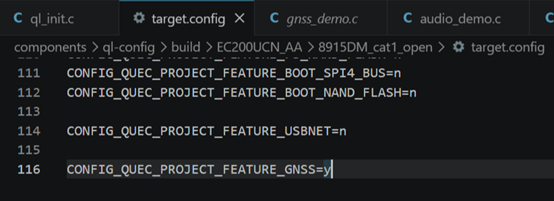
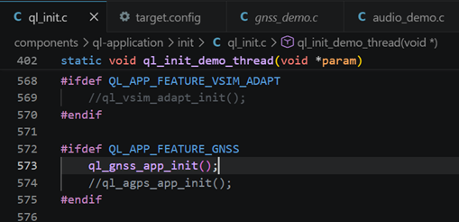

# GNSS application note

**1\. Module Function Introduction**

Currently, the GNSS module on the 8910 platform uses the UC6226/UC6228 chip provided by StarCore, supporting GPS, GLONASS, BDS, and Galileo. It enables multi-system joint positioning and supports various SBAS signal reception and processing, providing users with a fast, accurate, and high-performance positioning experience. Compared to the 8910 platform, the GNSS module is external, primarily used with the platform's UART3 for boot/firm upgrades, command control, and reception and parsing of NMEA raw data.

**2\. Brief introduction to the main APIs**

1\. ql_errcode_gnss ql_gnss_switch(ql_GnssSW gnss_sw);

\* Enable/Disable/Software Reset GNSS

\* Before enabling the GNSS module, only parameter queries are possible. Parameter settings are only possible after the GNSS module is successfully enabled.

\* Enabling or disabling GNSS involves a hardware reset.

2\. ql_errcode_gnss ql_auto_gnss_cfg(ql_AutoGnssSW autoflag);

\* GNSS automatically starts upon power-on

3\. ql_GnssState ql_gnss_state_info_get(void);

\*Get the current GNSS status

\*Status: Off/On/Locking/Locking successful

4\. ql_errcode_gnss ql_gnss_agps_cfg(ql_AGPSGnssSW gnssagpsflag);

\* Turn AGPS on/off

**3\. Enable GNSS feature**

Taking the EC200U module as an example, locate the target.config file in the path shown in the image, and confirm that the gnss function is enabled (y means enabled, n means disabled).  

**4.Run gnss demo**

Locate the file ql_init.c in the path \\components\\ql-application\\init\\ql_init.c, and as shown in the image, open "ql_gnss_app_init();". After that, compile and the GNSS demo will begin running.  

**5\. Introduction to Common NMEA Statements**

| GGA | GNSS positioning solution results                       | The most commonly used statements contain very intuitive information: UTC time, latitude and longitude, altitude, positioning status, satellites involved in the calculation, and positioning accuracy factor. For single-point positioning, GGA is generally sufficient.                                                                                                          |
| GSA | Intragalactic precision factor and available satellites | Each entry contains a list of available satellites within a galaxy, along with three precision factors: the galaxy's horizontal, vertical, and positional dimensions. This is essentially an overview of GSV information.                                                                                                                                                          |
| GSV | The following is a list of satellite attributes.        | This contains information on all known satellites for the GNSS receiver, including those already searched or currently being searched. Each entry lists a maximum of four satellites, each with four attributes: PRN number, elevation angle, azimuth angle, and CN0 signal strength.                                                                                              |
| RMC | Minimum positioning information                         | By incorporating the key positioning information required by the application layer, the goal is to enable positioning and navigation by focusing on only this one piece of information. Therefore, information from other statements is reused. This includes UTC time, whether positioning is active, latitude and longitude, altitude, heading, speed, and magnetic declination. |
| VTG | Ground speed and heading                                | No further explanation needed                                                                                                                                                                                                                                                                                                                                                      |

**6\. Important parameters of NMEA statement**

1\. To check if a GNSS receiver has successfully located an object, you can look at the GGA's "GPS Quality Indicators." 0 indicates no location was found, and 1 indicates a successful location. Other parameters are less commonly used but are worth knowing.

2\. How large is the GNSS positioning deviation? Look at the GSA's DOP (Density Factor). Note that this is just a scalar value without a physical unit. It ranges from 0 to 99, and a value around 1.0 generally indicates good positioning performance.

3\. How is the GNSS satellite search status? Look at the C/N0 value of GSV and the number of GGAs participating in the calculation. The former judges the strength of the satellite signal (1~99), the higher the better, and it is generally below 50; the latter judges the number of available satellites. Multi-systems need 6 satellites for positioning, and in general environments, about 10 satellites can participate in the calculation. A satellite with all four attributes can participate in the calculation.

4\. Whether GNSS receives ephemeris data: Check the structure of the GSV. If a satellite information has PRN, elevation, and azimuth, but no CN0 value, it means that the satellite information was obtained through ephemeris data.