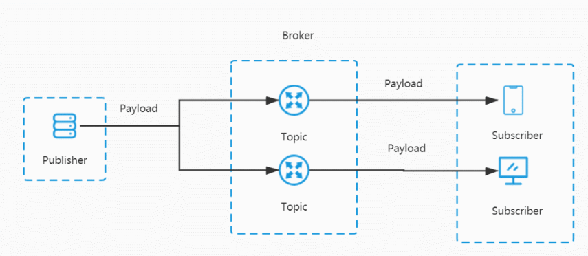

# MQTT user guide
## Overview

MQTT is a lightweight messaging protocol designed to facilitate reliable communication between devices in Internet of Things (IoT) applications. It operates on a publish-subscribe pattern, involving communication between an MQTT server (broker or server) and multiple MQTT clients. 

## MQTT Communication Mechanism

In MQTT, communication is accomplished through TCP connections between clients and the server. The client initiates a connection request by sending a CONNECT message and then sends various operational messages, such as SUBSCRIBE, PUBLISH, UNSUBSCRIBE, once the connection is established.

Publishers, when sending messages to a specific topic, transmit the message content along with the specific topic to the MQTT server. The server then delivers the message to all subscribers who have subscribed to that topic.

Subscribers use the SUBSCRIBE message to subscribe to topics of interest, specifying the topic and desired QoS level. Upon receiving a subscription request, the server records the subscriber's subscription information and forwards relevant messages to the subscriber when the messages are published.

MQTT also supports retained messages, where a publisher can send a retained message and set a retained flag. The retained message is stored by the server and sent to subscribers who subscribe to the relevant topic. This allows new subscribers to receive the latest retained message.

Additionally, MQTT provides the mechanism of persistent sessions. Persistent sessions allow clients to maintain their subscription and publication state information when reconnecting. This ensures that important messages are not lost.

Through these mechanisms, MQTT achieves reliable message delivery, decoupling, and asynchronous real-time communication. It is suitable for scenarios such as IoT, sensor networks, and real-time data transmission. MQTT offers a flexible communication model and mechanisms that enable efficient message interactions between devices and applications.

### MQTT Client 

An MQTT client refers to a device or application that connects to an MQTT server. Each client is identified by a unique client identifier, which is used by the server to distinguish and differentiate between different clients.

### Publish
A publisher is the sender of messages in MQTT. Publishers publish messages to specific topics, and delivers these messages to all subscribers of that topic through the MQTT server.

### Subscribe
A subscriber is the receiver of messages in MQTT. Subscribers can subscribe to topics of interest to receive messages related to those topics. Once a subscriber subscribes to a specific topic, it will receive all published messages under that topic. In projects, topics are often defined based on different events. When a device subscribes to an event topic, it can receive push messages related to that topic.

### QoS Level

MQTT defines three different levels of Quality of Service (QoS) for controlling the reliability and assurance of message delivery:

1. QoS 0 (At most once): Message publishers send a message only once without any acknowledgment mechanism. Messages at this level can be lost or delivered multiple times. This level is suitable for scenarios where reliability is not critical.
2. QoS 1 (At least once): Message publishers ensure that the message is delivered at least once, which might lead to duplicate deliveries. This level uses a publish-and-acknowledge mechanism to achieve reliable delivery and is suitable for scenarios that require at least once delivery.
3. QoS 2 (Exactly once): Message publishers ensure that the message is delivered exactly once, achieved through a two-step handshake and four-step handshake confirmation mechanism. This level provides the highest level of delivery reliability and is suitable for scenarios where precise delivery is of utmost importance.

### Last Will and Testament (LWT)

MQTT allows clients to set a Last Will and Testament (LWT) message when establishing a connection. During the connection setup process, a client can define the parameters for the LWT message, including the topic, message content, and QoS level. If the MQTT server detects that a client has not sent a keep-alive packet within the specified interval and the client has not requested to close the connection, the server considers the client to have disconnected abnormally. In such cases, the server publishes the LWT message to the specified topic based on the client's LWT settings. Subscribers of this topic can then receive the LWT message, indicating the offline status of the client.

## Common Interfaces

**`int ql_mqtt_client_init(mqtt_client_t *client, int cid)`**

**Function Description**
This function initializes MQTT client and creates a new MQTT client handle.

**Parameter Description**
**\*client**: MQTT client handle.
**cid**: Data channel number.

**Return Value**
error code, refer to mqtt_error_code_e.

**`int ql_mqtt_connect(mqtt_client_t *client, const char *host,mqtt_connection_cb_t cb, void *arg, const struct mqtt_connect_client_info_t*client_info, mqtt_state_exception_cb_t exp_cb)`**

**Function Description**
This function sends the CONNECT request to the server for establishing an MQTT session connection between the client and the server.

**Parameter Description**
**\*client**: MQTT client handle
***\*host**: MQTT server address
**cb**: CONNECT request result callback function
**\*arg**:Callback argument of CONNECT request result callback function.
**client_info**:MQTT client information
**exp_cb**:Callback function for abnormal disconnection of MQTT session

**Return Value**
error code, refer to mqtt_error_code_e.

**`int ql_mqtt_publish(mqtt_client_t *client, const char *topic, const void *payload,  unsigned short payload_length, unsigned char qos, unsigned char retain, mqtt_request_cb_t cb, void *arg)`**

**Function Description**
This function publishes messages of the specified topic.

**Parameter Description**
**\*client**: MQTT client handle
**topic**:Topic of published message.
**payload**: Published message.
**payload_length**: Length of the published message
**qos**:QoS level of published message.
**retain**:Indicates whether to reserve the published message or not.
**cb**:Callback function of PUBLISH request result.
**arg**:Callback argument of PUBLISH request result callback function.

**Return Value**
error code, refer to mqtt_error_code_e.

**`int ql_mqtt_sub_unsub(mqtt_client_t *client, const char *topic, unsigned char qos, mqtt_request_cb_t cb, void *arg,unsigned char sub)`**

**Function Description**
This function subscribes to or unsubscribes from the specified topic.

**Parameter Description**
**\*client**: MQTT client handle
**topic**:Topic of published message.
**qos**:QoS level of published message.
**cb**:Callback function of the subscription/un-subscription result.
**arg**:Callback argument of the subscription/un-subscription result callback function
**sub**:Subscription or un-subscription.

**Return Value**
error code, refer to mqtt_error_code_e.

**`int ql_mqtt_disconnect(mqtt_client_t *client, mqtt_disconnect_cb_t cb, void *arg)`**

**Function Description**
This function sends the DISCONNECT request to the server for disconnecting MQTT session between MQTT client and the server.

**Parameter Description**
**\*client**: MQTT client handle
**cb**:DISCONNECT request result callback function.
**arg**:Callback argument of DISCONNECT request result callback function.

**Return Value**
error code, refer to mqtt_error_code_e.

**`int ql_mqtt_set_inpub_callback(mqtt_client_t *client, mqtt_incoming_publish_cb_t inpub_cb, void *arg);`**

**Function Description**
This function sets the callback function for receiving messages published by the server.

**Parameter Description**
**\*client**: MQTT client handle
**inpub_cb**:Callback function for receiving messages published by the server.
**arg**:Argument of callback function for receiving messages published by the server.

**Return Value**
error code, refer to mqtt_error_code_e

**`int ql_mqtt_client_is_connected(mqtt_client_t *client);`**

**Function Description**
This function queries whether the session has been established between the client and the server.

**Parameter Description**
**\*client**: MQTT client handle

**Return Value**
1 MQTT session is established.
0 MQTT session is not established.

**`int ql_mqtt_client_deinit(mqtt_client_t *client)`**

**Function Description**
This function de-initializes MQTT client.

**Parameter Description**
**\*client**: MQTT client handle

**Return Value**
error code, refer to mqtt_error_code_e

**`char *ql_mqtt_onenet_generate_auth_token(signed long long expire_time,char *product_id,char*device_name,char *version,char *access_key)`**

**Function Description**
This function generates the password required by OneNET platform

**Parameter Description**
**expire_time**: Expiration time of the token on the OneNET platform. Unit: second
**product_id**: Product ID of OneNET platform.
**device_name**: Device name of OneNET platform.
**version**: Version of OneNET platform 
**access_key**:Device password of OneNET platform.

**Return Value**
NULL Failed execution.
Other values Successful execution. After execution, execute free() to free up space.

**`int ql_mqtt_client_setopt(mqtt_client_t *client, int opt_tag,...)`**

**Function Description**
This function configures the parameter processing type of the MQTT client handle.

**Parameter Description**
**\*client**: MQTT client handle
**opt_tag**:Parameter processing type configured in the MQTT client handle context

**Return Value**
error code, refer to mqtt_error_code_e
