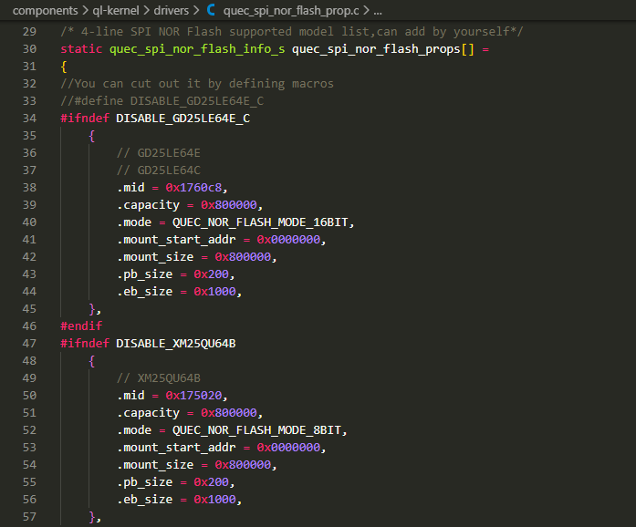
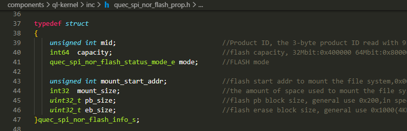
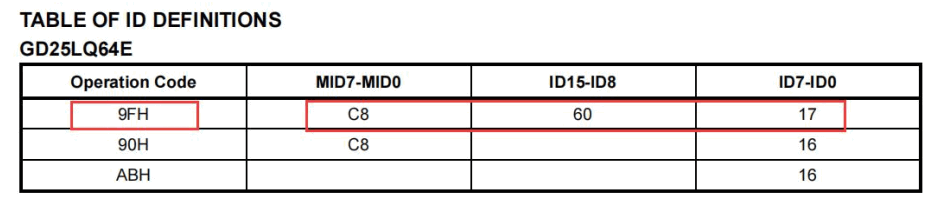
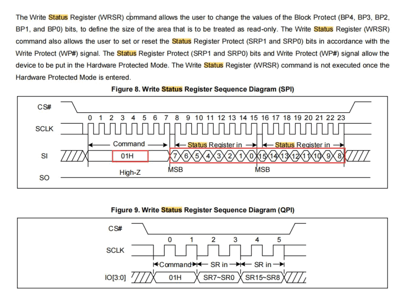
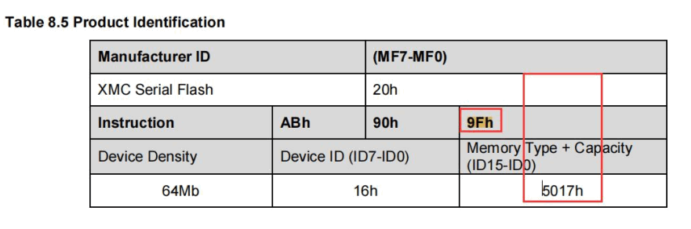
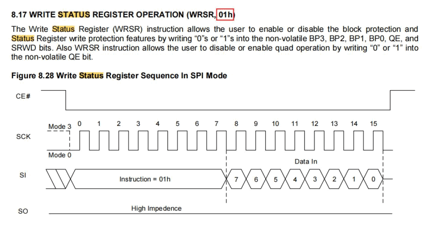

# How to adapt extern flash
This chapter introduces how to adapt 4-wire extern SPI NOR flash.

## Add new type
Add your specific flash configuration in the file:

    components\ql-kernel\drivers\quec_spi_nor_flash_prop.c

The array definition of quec_spi_nor_flash_props[] is in:

    components\ql-kernel\inc\quec_spi_nor_flash_prop.h

 

## How to get the Key info from datasheet
### Example-1: GD25LQ64E
The screenshots of GD25LQ64E's datasheet are as below shown:

We can find the **`mid`** is **`0x1760c8`** by **`9FH`** cmd in the datasheet.

And we can know that the **`Write Status Register (WRSR)`** can write 16-bits at a time by **`01H`** cmd. So the parameter of **`mode`** should be set to **`QUEC_NOR_FLASH_MODE_16BIT`**.

 

### Example-2: XM25QU64B
The screenshots of XM25QU64B's datasheet are as below shown:

We can find the **`mid`** is **`0x175020`** by **`9FH`** cmd in the datasheet.

And we can know that the **`Write Status Register (WRSR)`** can only write 8-bits at a time by **`01H`** cmd. So the parameter of **`mode`** should be set to **`QUEC_NOR_FLASH_MODE_8BIT`**.
