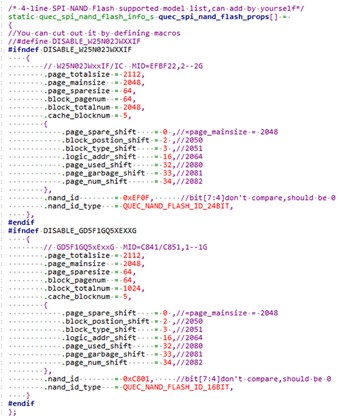
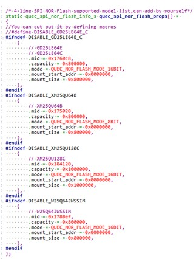

# File system introduction

**1\.Design Principles**  
   The file system API is designed to be as close as possible to the C standard library. The module's internal file system uses the SFFS format, therefore it is incompatible with any file system on PCs or Linux.
**2\.File system partitioning**

The file system provides users with three disk partitions, with drive letters UFS:, EFS:, EXNSFFS:, EXNAND:, and SD:. The UFS disk is located in the internal Flash memory and is used to store the user's regular files (this partition also includes an SFS encrypted file directory for storing encrypted files).

The EXNSFFS disk is an external 4-wire SPI NOR Flash file system partition, requiring the user to connect an external 4-wire SPI NOR Flash memory to use.

The EXNAND disk is an external SPI NAND FLASH file system partition, requiring the user to connect an external SPI NAND Flash memory to use.

The EFS disk is an external 6-wire SPI NOR Flash file system partition, requiring the user to connect a 6-wire SPI NOR Flash memory to use.

The SD disk is an SD card partition.

**3\.Brief Description of File System Functions**

File operations: Open, read, write, close, delete, and rename files; jump to the file pointer; get the current file pointer position; set the file pointer back to the beginning; change and get the file size, etc.

Directory operations: Create, open, read, and close directories; delete empty directories; jump to the directory pointer; get the current directory pointer position; set the directory pointer back to the beginning, etc.

Other functions: Get file status and remaining partition space; write and read configuration files; configure SFS file keys; write and read a single character; synchronize modified data to storage devices, etc.

**4\.Commonly Used APIs（Summary）**

\`ql_fopen()\` opens a specified file and returns a file handle.

\`ql_fclose()\` closes a specified file.

\`ql_remove()\` deletes a specified file.

\`ql_fread()\` reads data from a specified file.

\`ql_fwrite()\` writes data to a specified file.

\`ql_fsize()\` gets the file size.

\`ql_file_exist()\` checks if a file exists.

\`ql_mkdir()\` creates a directory.

\`ql_opendir()\` opens a specified directory and returns a directory handle.

\`ql_closedir()\` closes a specified directory.

\`ql_readdir()\` retrieves file information from a specified directory.

**5\.Precautions**  
   **File path format is disk name:/path/file name (e.g., UFS:test.txt).  
   SFS encrypted files require setting a key before accessing them.
**6\.Supported NAND Flash Model Information**  
   Information regarding the NAND flash model supported by the module is defined in \`quec_spi_nand_flash_props\` within \`quec_spi_nand_flash_prop.c\`, for example：   
     
**7\.SPI NAND Flash file system mounting**  
   The SPI NAND flash file system mounting API header file is ql_api_fs_nand_flash.h, located in the components\\ql-kernel\\inc\\ directory of the SDK package.
**8\.Supported NOR Flash Model Information**  
   **Information on some external NOR flash models supported by the module is defined in \`quec_spi_nor_flash_props\` within \`quec_spi_nor_flash_prop.c\`, for example:    
     
**9\.4-wire SPI NOR Flash file system mount**  
   **The API header file for mounting the 4-wire SPI NOR flash file system is ql_api_spi4_ext_nor_sffs.h, located in the components\\ql-kernel\\inc\\ directory of the SDK package.