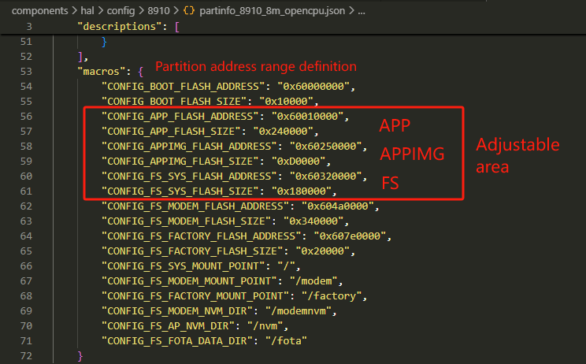
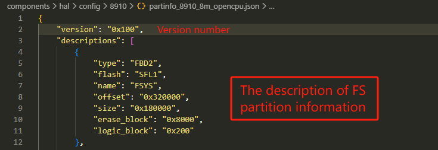
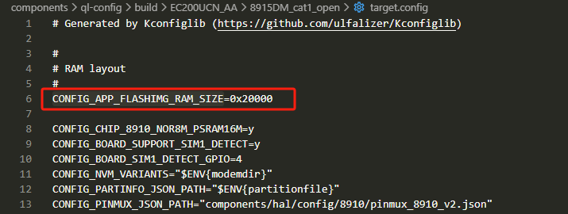

# Memory management
## How to adjust Flash partition
This chapter introduces how to adjust the embedded flash partition and how to
modify the partition configuration file.

### Adjustment Principle
1. FOTA upgrade or downgrade is not allowed between firmware versions with different partitions.
2. The embedded flash partition adjustment can only be performed among the three partitions, APP, APPIMG and FS. The APP and APPIMG partitions should be 4K aligned, and the FS partition should be 32K aligned.
3. Execute cmd of "build_all.bat new" to compile after partition adjustment.

### Configuration File
You can adjust the embedded flash partition of the module based on actual requirements. The embedded flash partition configuration file is located in the directory:

    components\hal\config\8910

Take **`partinfo_8910_8m_opencpu.json`** as an example, the partition configuration information is shown in the figure below:

### Adjust size
In the partition configuration file, you can adjust the start address and range among APP, APPIMG and FS only.

    1. When adjusting the size of APP and APPIMG, you only need to modify the information of partition address range definition (macros).
    2. When adjusting the size of FS partition, you need to modify the information of partition address range definition (macros) and FS partition description (descriptions).

  

## How to adjust RAM partition
We can adjust the RAM size in the file of **`target.config`**, which is depended on the module type you use. Take an example:

    components\ql-config\build\EC200UCN_AA\8915DM_cat1_open\target.config

Modify the value of **`CONFIG_APP_FLASHIMG_RAM_SIZE`**. See the figure below:

