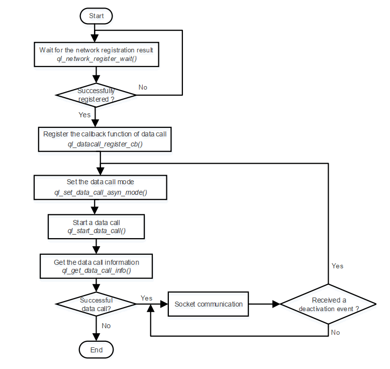
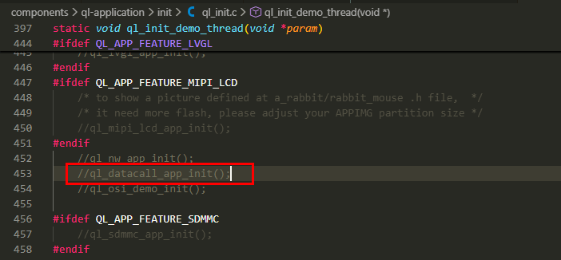

# How to Datacall
## Datacall APIs
QuecOpen support the following APIs of Datacall function.

| Function | Description |
| :--- | :--- |
| `q_network_register_wait()` | Waits for the network registration result. |
| `q_set_data_call_asyn_model()` | Sets the execution mode of `q_start_data_call()` and `q_stop_data_call()`. |
| `q_start_data_call()` | Starts a data call. |
| `q_stop_data_call()` | Stops a data call. |
| `q_get_data_call_info()` | Gets data call information. |
| `q_datacall_register_cb()` | Registers the callback function of data call. |
| `q_datacall_unregister_cb()` | Cancels the callback function registered with `q_datacall_register_cb()`. |
| `q_datacall_get_sim_profile_is_active()` | Gets the current status of PDP context activation. |
| `q_bind_sim_and_profile()` | Binds the (U)SIM card in use and PDP context ID, and gets sim_cid, the combination of (U)SIM card and PDP context ID. |
| `q_get_sim_and_profile()` | Gets (U)SIM card and PDP context ID from sim_cid. |
| `ql_datacall_set_nat()` | Enables NAT. |
| `ql_datacall_get_nat()` | Gets the NAT-enabled (U)SIM card and PDP context ID. |
| `ql_datacall_set_default_pdn_cfg()` | Sets the default bearer configuration. |
| `ql_datacall_get_default_pdn_cfg()` | Gets the default bearer configuration. |
| `ql_datacall_get_default_pdn_info()` | Gets the default bearer information. |

 

## API Calling Process

Data call process includes three parts: **`network registration`**, **`data call`** and **`socket establishment`**.

Network registration is performed automatically and requires no code intervention. You only need to call **`ql_network_register_wait()`** to wait for the registration to complete. If the current module does not register network, the thread currently calling this function will be blocked until the network registration is successful or times out. You can also call **`ql_nw_register_cb()`** to register the callback function for network event to
receive **`QUEC_NW_DATA_REG_STATUS_IND`** event.

PDP context activation can be carried out once the module has successfully registered the network. Current data call supports both synchronous and asynchronous modes, which can be set with **`ql_set_data_call_asyn_mode()`**.

Socket communication can be carried out after a successful data call.

 

## API Calling Process
To help you understand the data call process, **`datacall_demo.c`**, the example program, is available in **`components\ql-application\nw\`** directory of QuecOpen SDK.

