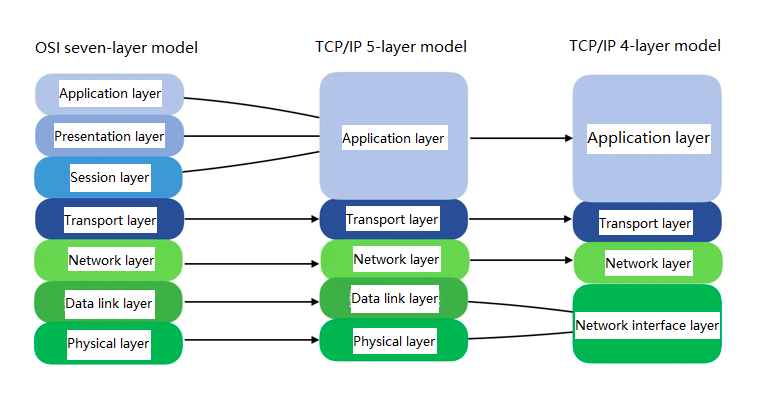
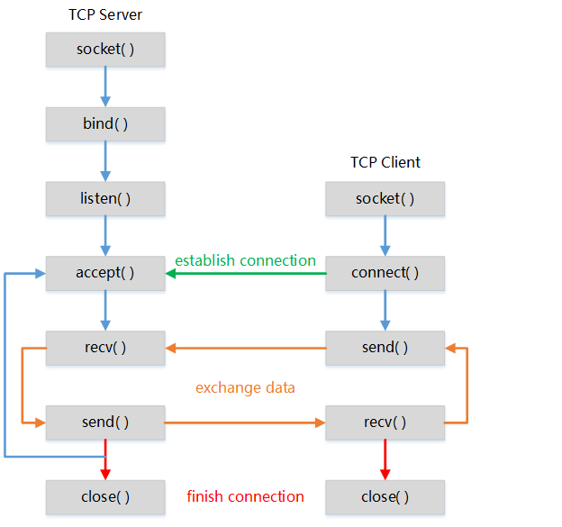
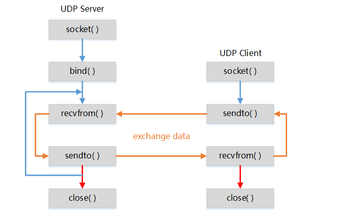

# Socket Guide

## OSI Seven-Layer Model

The OSI (Open System Interconnection) seven-layer model is a standard system developed by the International Organization for Standardization (ISO) for computer or communication systems. It provides a specification for the implementation of network communication protocols. As long as both communicating parties adopt the same protocol at the same layer, they can communicate with each other.

The seven layers are respectively:
Application Layer, Presentation Layer, Session Layer, Transport Layer, Network Layer, Data Link Layer, Physical Layer。

To simplify protocol implementation or facilitate understanding, the models of five layers or four layers have emerged.The four-layer model is widely referenced, consisting of the Application Layer, Transport Layer, Network Layer, and Network Interface Layer.

  
To facilitate explanation, the following illustration is based on the four-layer model.

## Transport Layer Protocol

An IP address serves as the host address in a network, enabling two network hosts to locate each other, which forms the foundation of successful network communication.

To distinguish which application an incoming packet should be delivered to on a host, transport layer protocols have evolved based on network layer protocols. The transport layer assigns different ports to local network applications. After receiving packets from the network layer, it forwards the data to corresponding applications according to different port numbers.

To meet different needs, transport layer protocols are divided into UDP and TCP protocols.

### TCP Protocol

The TCP protocol has the following characteristics:

1. Connection-oriented
2. One-to-one communication
3. Reliable data delivery
4. Full-duplex communication
5. Byte stream-oriented

Based on TCP, some application layer protocols have been derived to meet different needs. Different applications will default to a specific port number. The port number can also be changed according to the actual situation.

The five-tuple that determines a TCP connection: protocol type (TCP), local IP, local port, remote IP and remote port.

### UDP Protocol

The UDP protocol has the following characteristics:

1. Connectionless
2. Supports one-to-one, one-to-many, and many-to-many communication
3. Irreliable delivery
4. Full-duplex communication
5. Message-oriented

Some application layer protocols have been derived from UDP to meet different needs, with different applications specifying a default port number by default. The port number can also be changed according to the actual situation.

##  Socket Programming

### TCP Network Programming

TCP Server and Client Socket Programming Model  

**TCP Client Network Programming**

1. Call `socket()` to create a socket object.
2. Call `connect()` to connect to the server.
3. Call `send()` to send data to the server.
4. Call `recv()` to receive data sent by the server.
5. Loop steps 3 and 4 until certain conditions are met or the connection ends, then call `close()` to close the socket and release resources.

### UDP Network Programming

UDP Server and Client Socket Programming Model  

## Common Interfaces

**`int getaddrinfo_with_pcid(const char *nodename,const char *servname, const struct addrinfo *hints,struct addrinfo **res, u8 pcid);`**

**Function Description**
Domain name resolution function

**Parameter Description**

**\*nodename**: The address to be resolved, which can be either a domain name or an IP address
**\*servname**: Can be a decimal port number, or a predefined service name such as ftp, http, etc.
**\*hints**: Can be a null pointer; or a pointer to an addrinfo structure that provides hints specifying the type of information expected to be returned.
**\*\*res**: Pointer to a linked list of addrinfo structures
**pcid**: Context channel

**`int socket(int domain, int type, int protocol)`**

**Function Description**
The `socket()` function is used to create a socket descriptor, which uniquely identifies a socket. Similar to a file descriptor, the socket descriptor can be passed as a parameter to perform read and write operations.

**Parameter Description**

**domain**: Protocol domain, also known as protocol family. Common protocol families include `AF_INET`, `AF_INET6`, etc.

The protocol family determines the address type of the socket, and the corresponding address type must be adopted during communication.

For example, `AF_INET` specifies the combination of an IPv4 address (32-bit) and a port number (16-bit); 

**type**: Specifies the socket type. Common socket types include `SOCK_STREAM`, `SOCK_DGRAM`, `SOCK_RAW`,  etc.

**protocol**: Specifies the transmission protocol. Common protocols include `IPPROTO_TCP`, `IPPROTO_UDP`, etc. This parameter is generally set to **0**. When the protocol family and socket type are confirmed, the value can be defaulted to 0. When creating a raw socket without confirming the protocol family and socket type in advance, the specific protocol type can be specified via this parameter.

**Notes**

When a socket is created by the `socket()` function, the returned socket descriptor is only bound to a protocol type without a specific communication address. To assign a fixed address to the socket, the `bind()` function must be called. 

**Return Value**

Success：Non-negative integer (socket descriptor)

**`int bind(int s, const struct sockaddr *name, socklen_t namelen)`**

**Function Description**
Bind the socket to the local IP address and port

**Parameter Description**
**s**: Socket descriptor.
**\*name**: Address structure containing local IP and port
**namelen**: Length of the address structure

**Return Value**
**Success**: 0
**Failure**:Less than 0 

**`int fcntl(int fd, int cmd, long arg)`**

**Function Description**

fcntl() is used to manipulate certain properties of file descriptors, such as blocking and non-blocking modes.

Common commands are as follows:

**F_DUPFD**: Finds the smallest unused file descriptor that is greater than or equal to the argument arg, and duplicates the file descriptor fd. Returns the newly duplicated file descriptor on success. The new descriptor shares the same file table entry with fd, but has its own set of file descriptor flags, and the FD_CLOEXEC file descriptor flag is cleared.

**F_GETFD**: Gets the close-on-exec flag. If the FD_CLOEXEC bit of this flag is 0, the file will not be closed when exec()-related functions are called.

**F_SETFD**: Sets the close-on-exec flag. The flag is determined by the FD_CLOEXEC bit of the argument arg.

**F_GETFL**: Gets the file descriptor status flags, which correspond to the flags argument of open().

**F_SETFL**: Sets the file descriptor status flags. The argument arg is the new flag, but only the O_APPEND, O_NONBLOCK, and O_ASYNC bits can be changed; changes to other bits will have no effect.

**F_GETLK**: Gets the status of the file lock.

**F_SETLK**: Sets the status of the file lock. The l_type value of the flock structure must be F_RDLCK, F_WRLCK, or F_UNLCK. If the lock cannot be established, returns -1 with the error code EACCES or EAGAIN.

**F_SETLKW**: Performs the same function as F_SETLK, but if the lock cannot be established, this call will block until the lock succeeds. If interrupted by a signal while waiting for the lock, returns -1 immediately with the error code EINTR.

**`int connect(int sockfd, const struct sockaddr *addr, socklen_t addrlen)`**

**Function Description**

Initiates a connection on a socket.

**Parameter Description**
**sockfd**: The socket descriptor.
**addr**: The socket address of the server.
**addrlen**: The length of the socket address.

**`int select(int maxfdp1, fd_set *readset, fd_set *writeset, fd_set *exceptset, struct timeval *timeout);`**

**Function Description**

The select function is used in non-blocking scenarios to test whether a specified file descriptor is readable, writable, or has pending exceptional conditions.

**Parameter Description**

**maxfdp1**: The number of file descriptors to be checked, indicating the upper bound of the fd_set to be scanned. It is generally set to the maximum file descriptor value among the three fd_set groups plus 1. This parameter is used to improve efficiency, so that the function does not need to check all bits in fd_set.

**readfds, writefds, exceptset**: Pointers to the descriptor sets corresponding to readable events, writable events (mainly meaning the write buffer is available), and exceptional events respectively.

**timeout**: Specifies the waiting period. The function returns with a value of 0 if no event occurs on the monitored descriptors within this period. It has three cases:
1. timeout = NULL: Blocking mode. select remains blocked until an event occurs on any file descriptor.
2. The structure pointed to by timeout is set to a non-zero time value. The function returns either when an event occurs within the specified time or when the time expires.
3. The time value in the structure pointed to by timeout is set to 0: Non-blocking mode. It only checks the status of the descriptor set and returns immediately without waiting for any external events.

**Return Value**

Returns the total number of file descriptors whose corresponding bits are still set to 1.

**`ssize_t write(int s, const void *dataptr, size_t size)`**

**Function Description**
Send data through a socket (for TCP transmission)

**Parameter Description**
**s**: Socket descriptor
**\*dataptr**: Data buffer pointer
**size**: Length of data to send

**Return Value**
**Success**: Number of bytes actually sent
**Failure**: Less than 0

**`ssize_t send(int s, const void *dataptr, size_t size, int flags)`**
**Function Description**
Send data through a socket (supports TCP and UDP transmission)

**Parameter Description**
**s**: Socket descriptor
**\*dataptr**: Data buffer pointer
**size**: Length of data to send
**flags**: Transmission flags (usually 0)

**Return Value**
**Success**: Number of bytes actually sent
**Failure**: Less than 0

**`ssize_t sendto(int s, const void *dataptr, size_t size, int flags,const struct sockaddr *to, socklen_t tolen);`**
**Function Description**
Send data to a specified destination address (UDP only)

**Parameter Description**
**s**: Socket descriptor
**\*dataptr**: Data buffer pointer
**size**: Length of data to send
**flags**:Send flags (usually 0)
**\*to**:Destination address (IP + port)
**tolen**:Length of destination address structure

**Return Value**
**Success**: Number of bytes actually sent
**Failure**: Less than 0

**`ssize_t read(int s, void *mem, size_t len)`**

**Function Description**

Receive data from a socket (for TCP reception)

**Parameter Description**
**s**: Socket descriptor
**\*mem**: Buffer to store received data
**size**: Maximum length of the buffer

**Return Value**
**Greater than 0**: Number of bytes actually received
**Equal to 0**: Peer closed the connection
**Less than 0**: Read failed

**`ssize_t recv(int s, void *mem, size_t len, int flags)`**

**Function Description**
Receive data from a socket (TCP only)

**Parameter Description**
**s**: Socket descriptor
**\*mem**: Buffer to store received data
**size**: Maximum length of the buffer
**flags**:Receive flags (usually 0)

**Return Value**
**Greater than 0**: Number of bytes actually received
**Equal to 0**: Peer closed the connection
**Less than 0**: Read failed

**`ssize_t recvfrom(int s, void *mem, size_t len, int flags,struct sockaddr *from, socklen_t *fromlen);`**

**Function Description**
Receive data from a socket and get the sender's address (UDP only)

**Parameter Description**
**s**: Socket descriptor
**\*mem**: Buffer to store received data
**len**: Maximum length of the buffer
**flags**:Receive flags (usually 0)
**\*from**:stores sender's address
**\*fromlen**:length of address structure

**Return Value**
**Greater than 0**: Number of bytes actually received
**Less than 0**: Read failed

**`int getsockopt(int s, int level, int optname, void *optval, socklen_t *optlen)`**

**Function Description**

Get the current configuration parameters of a socket

**Parameter Description**

**s**: Socket descriptor

**level**: Protocol level 

**optname**: name to get

**optlen**: Input/output parameter, length of the buffer

**Return Value**

**Success**: 0
**Failure**:Less than 0 

**`int setsockopt(int s, int level, int optname, const void *optval, socklen_t optlen)`**

**Function Description**
Set socket option parameters

**Parameter Description**
**s**: Socket descriptor
**level**: Protocol level
**optname**: Option name
**\*optval**: Option value buffer
**optlen**: Length of option value

**Return Value**
**Success**: 0
**Failure**:Less than 0 

**errno Enumeration**

**EBADF**: sock is not a valid file descriptor
**EFAULT**: The memory pointed to by optval is not a valid process address space
**EINVAL**: Invalid optlen when calling setsockopt()
**ENOPROTOOPT**: The option is unrecognized by the specified protocol layer
**ENOTSOCK**: The descriptor sock does not refer to a socket

**level Parameter Enumeration**

**SOL_SOCKET**: Generic socket options
**IPPROTO_IP**: IP protocol options
**IPPROTO_TCP**: TCP protocol options
**IPPROTO_UDP**: UDP protocol options

`int shutdown(int s, int how)`

**Function Description**
Used to shut down the data transmission capability of a socket, supporting partial shutdown or graceful disconnection. It can close the read channel only, the write channel only, or both read and write channels. Unlike close(), this function does not release the socket file descriptor. It is commonly used to implement TCP half-close to notify the peer to stop sending or receiving data.

**Parameter Description**

**s**:socket file descriptor to be operated.
**how**:Shutdown mode, used to specify the direction to close

**SHUT_RD (0)**: Close the read channel; no further data can be received.
**SHUT_WR (1)**: Close the write channel; no further data can be sent, and a FIN packet will be sent to initiate TCP disconnection.
**SHUT_RDWR (2)**: Close both read and write channels.

**Return Value**
**Success**: 0
**Failure**:-1,with error code set.

`int close(int s);`

**Function Description**
This method marks the socket as closed and releases all resources.

**Parameter Description**

**s**:socket file descriptor to be operated.