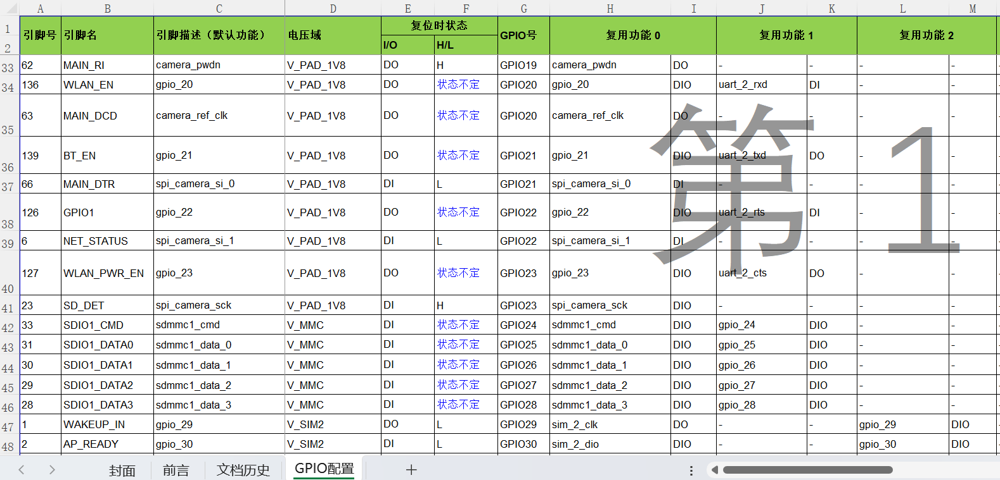

# GPIO User Guide

## **1\. Basic Concepts of GPIO**

GPIO (General Purpose Input/Output) is a general-purpose interface used to control external peripherals or read external signals.  
In the Unisoc 8910 platform, GPIO can function as a regular digital I/O or be multiplexed for other functions, such as:

- UART TX/RX
- SPI, I2C
- PWM
- Audio

Therefore, correct GPIO configuration requires understanding parameters like direction, pull-up/pull-down, multiplexed functions, voltage levels, and EINT (External Interrupt) capabilities.

## **2\. Overview of GPIO Usage**

To use GPIO on the Unisoc 8910 platform, you typically follow these steps:

- Configure GPIO pin multiplexing (func)
- Set the direction (input / output)
- Set the pull-up/pull-down resistor (none, pull-up, pull-down)
- Configure External Interrupt (EINT) if needed
- Read and write GPIO levels

The SDK provides a set of fixed APIs to initialize, read/write, set direction, and configure pull-up/down resistors.

Common API List:

GPIO Basic API

- ql_gpio_init()
- ql_gpio_deinit()
- ql_gpio_set_level()
- ql_gpio_get_level()
- ql_gpio_set_direction()
- ql_gpio_get_direction()
- ql_gpio_set_pull()
- ql_gpio_get_pull()

GPIO Interrupt (EINT) Related

- ql_eint_register()
- ql_eint_enable() / ql_eint_disable()

Special Purpose API

- ql_pin_set_func() - Set pin multiplexing functions (most commonly used)

## **3\. Interpreting the GPIO Configuration Table**

The Unisoc platform typically provides a GPIO configuration table that describes the capabilities of each pin.

Below is an explanation of the fields in a typical Pin Table:

| Field | Description |
| --- | --- |
| Pin Name | GPIO number, such as GPIO_1 / GPIO_24 |
| Func0 / Func1 / Func2… | Different multiplexed functions, such as UART, SPI, PWM |
| Default Func | Default function on power-up |
| Direction | Default direction (input / output) |

Key Fields to Focus on:

 **1\. Func (Multiplexed Function)**

- FUNC0 typically corresponds to GPIO mode.
- FUNC1/2/3 are used for specific peripherals, for example:

| Function | Multiplexed Result Example |
| --- | --- |
| UART | UART2_TXD, UART2_RXD |
| SPI | SPI_CLK, SPI_CS |
| PWM | PWM_OUT |

A pin can only be used as a regular GPIO when FUNC0 is selected.

**2\. Pull (Pull-up/Pull-down Resistors)**

| Value | Description |
| --- | --- |
| No Pull | Floating (default for most input modes) |
| Pull Up | Internal pull-up resistor |
| Pull Down | Internal pull-down resistor |

Used to avoid floating inputs and reduce noise.

**3\. Direction**

- Input
- Output

Users can dynamically modify the direction using the API.

**4\. EINT (External Interrupt) Capability**

If a GPIO supports EINT, it can be used as an interrupt input.  
Typical applications include buttons, Hall sensors, or triggering by external signals.

## **4\. GPIO Usage Examples**

GPIO usage on the Unisoc 8910 platform is primarily divided into the following steps:

- Configure Pin Multiplexing
- Initialize GPIO (Input/Output/Pull-up/Pull-down)
- Set or read GPIO levels
- Dynamically modify GPIO properties (direction, pull-up/down, level)

The following examples are fully based on the actual SDK demo code, and are ready for use.

**4.1 GPIO Configuration Structure**

The Unisoc GPIO example initializes GPIO pins in bulk using an array of configuration structures:

static ql_gpio_cfg \_ql_gpio_cfg\[\] =

{

/\* gpio_num gpio_dir gpio_pull gpio_lvl \*/

{ GPIO_0, GPIO_INPUT, PULL_DOWN, 0xff }, // Input, Pull-down

{ GPIO_1, GPIO_OUTPUT, 0xff, LVL_HIGH } // Output, High level

};

**4.2 GPIO Initialization Function**

void \_ql_gpio_demo_init(void)

{

uint16_t num;

for (num = 0; num < sizeof(\_ql_gpio_cfg)/sizeof(\_ql_gpio_cfg\[0\]); num++)

{

ql_gpio_deinit(\_ql_gpio_cfg\[num\].gpio_num);

ql_gpio_init(

\_ql_gpio_cfg\[num\].gpio_num,

\_ql_gpio_cfg\[num\].gpio_dir,

\_ql_gpio_cfg\[num\].gpio_pull,

\_ql_gpio_cfg\[num\].gpio_lvl

);

}

}

This function initializes the GPIOs based on the configuration array.

**4.3 Set Pin Multiplexing**

The SDK requires that GPIOs be switched to GPIO mode using ql_pin_set_func() before use:

ql_pin_set_func(QL_TEST1_PIN_GPIO0, QL_TEST1_PIN_GPIO0_FUNC_GPIO);

ql_pin_set_func(QL_TEST1_PIN_GPIO1, QL_TEST1_PIN_GPIO1_FUNC_GPIO);

**4.4 Get GPIO Properties (Direction/Pull-up/Pull-down/Level)**

ql_GpioDir gpio_dir;

ql_PullMode gpio_pull;

ql_LvlMode gpio_lvl;

ql_gpio_get_direction(GPIO_0, &gpio_dir);

ql_gpio_get_pull(GPIO_0, &gpio_pull);

ql_gpio_get_level(GPIO_0, &gpio_lvl);

Log output:

QL_GPIODEMO_LOG("gpio\[0\] dir:%d pull:%d lvl:%d", gpio_dir, gpio_pull, gpio_lvl);

**4.5 Set GPIO Output to Low Level**

ql_gpio_set_direction(GPIO_1, GPIO_OUTPUT);

ql_gpio_set_level(GPIO_1, LVL_LOW);

QL_GPIODEMO_LOG("GPIO1 set low");

Read confirmation:

ql_gpio_get_level(GPIO_1, &gpio_lvl);

**4.6 Set GPIO Output to High Level**

ql_gpio_set_direction(GPIO_1, GPIO_OUTPUT);

ql_gpio_set_level(GPIO_1, LVL_HIGH);

QL_GPIODEMO_LOG("GPIO1 set high");

**4.7 Set GPIO Input (Pull-down)**

ql_gpio_set_direction(GPIO_0, GPIO_INPUT);

ql_gpio_set_pull(GPIO_0, PULL_DOWN);

QL_GPIODEMO_LOG("GPIO0 input pull-down");

**4.8 Set GPIO Input (Pull-up)**

ql_gpio_set_direction(GPIO_0, GPIO_INPUT);

ql_gpio_set_pull(GPIO_0, PULL_UP);

QL_GPIODEMO_LOG("GPIO0 input pull-up");

**5\. Common Issues and Notes**

**1\. Why is my GPIO output not working?**

Possible reasons:

- The pin is not set to FUNC0 (GPIO mode)
- The pin is occupied by another function (e.g., UART, SPI)
- The output direction is not configured
- The pin is being pulled low/high externally

**2\. Why is the input GPIO always bouncing?**

- Pull-up/pull-down is not set
- External lines do not provide a stable signal
- Long signal lines causing interference

**3\. Why can't some GPIOs be used for EINT?**

Not all GPIOs support external interrupts, so you need to check the configuration table to confirm.

**6\. Conclusion**

The Unisoc 8910 platform GPIO usage involves three key steps:

- Check the table → Confirm pin functionality, multiplexing, and whether the GPIO or EINT is supported
- Set multiplexing (FUNC0) → Configure direction, pull-up/down, and drive strength
- Use APIs to read/write levels or register interrupts

Understanding the GPIO configuration table is crucial because it determines whether a pin can be used as a regular GPIO and what functionality it supports.