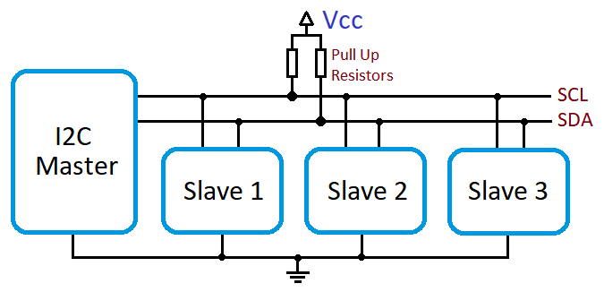
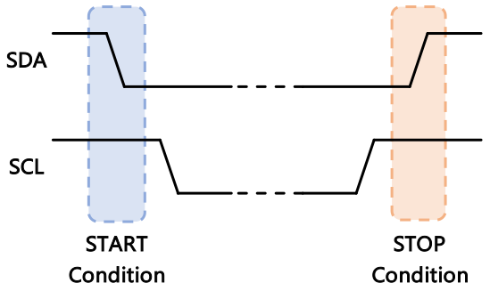
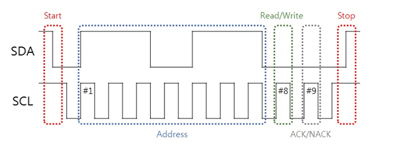
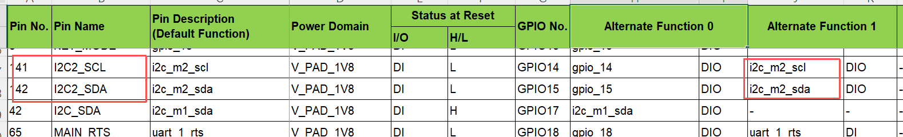
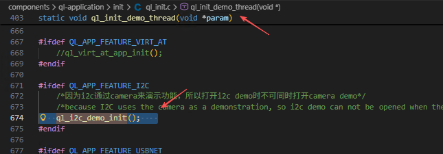

# I2C- Inter-Integrated Circuit

## I2C Overview

IIC (Inter-Integrated Circuit) bus is a two-wire serial bus developed by PHILIPS, designed to connect microcontrollers and their peripheral devices. It is also known as I2C.

I2C bus consists of SDA and SCL, supporting bidirectional data transmission and reception. Adopting a master-slave architecture, the I2C interface typically features one master device paired with one or more slave devices, where the master is responsible for initiating and terminating communication sessions.

IIC Topology：

**SDA**: Used for data transmission;

**SCL**: Used for synchronizing data transmission and reception.

Each device on the bus has a unique address for identification. Communication between the master and a slave can be achieved simply by knowing the device's address.

As bidirectional lines, both SDA and SCL are connected to a positive supply voltage via a current-source or pull-up resistor. When the bus is idle, both lines are in high level.

The data transfer rate on the bus can reach 100 kbit/s in Standard Mode, 400 kbit/s in Fast Mode, and 3.4 Mbit/s in High-Speed Mode.

## IIC Communication Timing Introduction

**Idle Level**: Both SCL and SDA are at a high logic level.

**Start Signal**: When SCL is at a high logic level, the SDA line transitions from high to low.

**Stop Signal**: When SCL is at a high logic level, the SDA line transitions from low to high.

**Acknowledge Signal**:The acknowledge signal is a response sent by the receiver to the transmitter after valid data is received. After the transmitter sends one byte (8 bits) of data, it releases the data line during the 9th clock cycle to receive the acknowledge signal from the receiver.

A low level on SDA indicates a valid acknowledge, meaning the data has been successfully received by the receiver.
A high level on SDA indicates a negative acknowledge, meaning the data has not been received successfully.

**Data Transmission**:When SCL is at a low logic level, data bit changes are allowed. After each 8-bit data transmission is completed, the slave device will either pull the SDA line low to return a 1-bit ACK signal to the master, or pull the SDA line high to return a 1-bit NACK signal.

## Common Interfaces

`ql_errcode_gpio ql_pin_set_func(uint8_t pin_num, uint8_t func_sel);`

**Parametric Description**

**pin_num**:pin number, Refer to the Pin No. in the GPIO Configuration Table

**func_sel**: pin function，Refer to the Alternate Function number in the GPIO Configuration Table

Since the same GPIO pin supports multiplexing for different functions, refer to the GPIO configuration table to multiplex the I2C pins to their I2C-specific functions prior to using the I2C interface.

### I2C init

`ql_errcode_i2c_e ql_I2cInit(ql_i2c_channel_e i2c_no, ql_i2c_mode_e Mode);`

**Parametric Description**

**i2c_no**:the i2c channel 

**fastMode**: the i2c speed mode,See ql_i2c_mode_e for details.

### i2c master write

`ql_errcode_i2c_e ql_I2cWrite(ql_i2c_channel_e i2c_no, uint8_t slave, uint8_t addr, uint8_t *data, uint32_t length);`

**Parametric Description**

**i2c_no**:the i2c channel 

**slave**: the i2c slave address

**addr**: the i2c slave regiser address

**data**: the data need to be sent

**length**: the length of the data

### i2c master read

`ql_errcode_i2c_e ql_I2cRead(ql_i2c_channel_e i2c_no, uint8_t slave, uint8_t addr, uint8_t *buf, uint32_t length);`

**Parametric Description**

**i2c_no**:the i2c channel 

**slave**: the i2c slave address

**addr**: the i2c slave regiser address

**buf**: the data that was read

**length**: the length of the data

### i2c master release

`ql_errcode_i2c_e ql_I2cRelease(ql_i2c_channel_e i2c_no);`

**Parametric Description**

**i2c_no**:the i2c channel 

## Examples

The following takes the LTE01R03A08_C_SDK_U as an example. The path of the SPI demo is components\ql-application\i2c\I2C_demo.c.
Before running this demo, please call `ql_i2c_demo_init()` in the `ql_init_demo_thread` (path: components\ql-application\init\ql_init.c), as shown in the following figure:

After opening ql_i2c_demo_init() and compiling the SDK, you can run the SPI demo.
