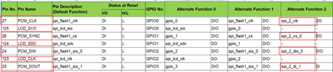
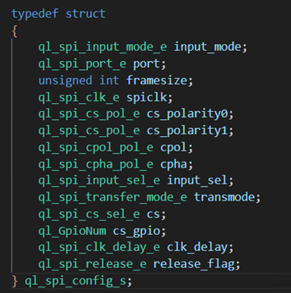
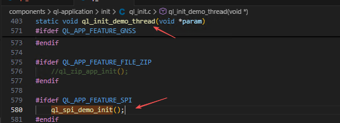

# SPI- Serial Peripheral Interface

## Basic knowledge

SPI (Serial Peripheral Interface), the Serial Peripheral Interface, is a high-speed, full-duplex, synchronous communication bus defined by Motorola. It is mainly used between EEPROMs, FLASH memory, real-time clocks (RTCs), AD converters, as well as digital signal processors (DSPs) and digital signal decoders.

**SPI interface typically uses 4 wires for communication**

**MISO**: Data input for the master device and data output for the slave device.

**MOSI**: Data output for the master device and data input for the slave device.

**SCLK**: Clock signal generated by the master device.

**CS**: Slave device chip select signal controlled by the master device.

Unlike ordinary serial communication, SPI serial communication does not require continuous transmission of at least 8 bits of data at a time. Instead, it allows data to be transmitted bit by bit and even supports pauses. This is because the SCLK line is controlled by the master device, which can regulate the entire communication process through controlling the SCLK line.

SPI is also a data exchange protocol: since its data input and output lines are independent, it enables simultaneous data transmission and reception. In point-to-point communication scenarios, the SPI interface eliminates the need for addressing operations, making it simple and efficient due to its full-duplex nature. However, in systems with multiple slave devices, each slave requires an independent enable signal, resulting in a slightly more complex hardware configuration compared to I2C systems.

### SPI Communication Modes

SPI supports four communication modes. However, the slave device is preconfigured with a specific mode at the factory, which is non-modifiable. For successful communication, both the master and slave devices must operate in the same mode. Therefore, it is necessary to configure the SPI mode of the master device, which is controlled by CPOL and CPHA . The detailed configuration is as follows:

**Mode0**：CPOL=0，CPHA=0

**Mode1**：CPOL=0，CPHA=1

**Mode2**：CPOL=1，CPHA=0

**Mode3**：CPOL=1，CPHA=1

CPOL is used to configure the state of the SCLK signal during the idle or active phase. CPHA determines at which edge the data sampling occurs.

**CPOL = 0**: SCLK is in the idle state at logic level 0, and the active state is when SCLK is at logic level 1.

**CPOL = 1**: SCLK is in the idle state at logic level 1, and the active state is when SCLK is at logic level 0.

**CPHA = 0**: Data sampling takes place on the first edge, and data transmission occurs on the second edge.

**CPHA = 1**: Data sampling takes place on the second edge, and data transmission occurs on the first edge.

For example:

**CPOL=0, CPHA=0**: In the idle state, SCLK is at a low logic level. Data sampling occurs on the first edge, which is the transition of SCLK from low to high . Data transmission takes place on the falling edge.

**CPOL=0, CPHA=1**: In the idle state, SCLK is at a low logic level. Data transmission occurs on the first edge, which is the transition of SCLK from low to high. Data sampling takes place on the falling edge.

**CPOL=1, CPHA=0**: In the idle state, SCLK is at a high logic level. Data sampling occurs on the first edge, which is the transition of SCLK from high to low. Data transmission takes place on the rising edge.

**CPOL=1, CPHA=1**: In the idle state, SCLK is at a high logic level. Data transmission occurs on the first edge, which is the transition of SCLK from high to low. Data sampling takes place on the rising edge.

**Note**: When there is no data communication, the clock line remains either at a high logic level or a low logic level.

The SDO of the master is connected to the SDI of the slave, and the SDI of the master is connected to the SDO of the slave.

## Common Interfaces

### Pin function seclect

`ql_errcode_gpio ql_pin_set_func(uint8_t pin_num, uint8_t func_sel);`

**Parametric Description**

**pin_num**:pin number, Refer to the Pin No. in the GPIO Configuration Table

**func_sel**: pin function，Refer to the Alternate Function number in the GPIO Configuration Table

Since the same GPIO pin supports multiplexing for different functions, refer to the GPIO configuration table to multiplex the SPI pins to their SPI-specific functions prior to using the SPI interface.

### SPI init

`ql_errcode_spi_e ql_spi_init_ext(ql_spi_config_s spi_config);`

**Parametric Description**

**spi_config**:SPI Bus Configuration

**input_mode**: SPI input. See ql_spi_input_mode_e for details.

**port**: SPI bus. See ql_spi_port_e for details.

**framesize**: Frame size. Range: 0–32. Default: 8. Unit: bit.

**spiclk**: SPI clock frequency. See ql_spi_clk_e for details.

**cs_polarity0**: CS0 pin level. See ql_spi_cs_pol_e for details.

**cs_polarity1**: CS1 pin level. See ql_spi_cs_pol_e for details.

**cpol**: Clock polarity. See ql_spi_cpol_pol_e for details.

**cpha**: Clock phase. See ql_spi_cpha_pol_e for details.

**input_sel**: Data input pin. See ql_spi_input_sel_e for details.

**transmod**: SPI transfer mode. See ql_spi_transfer_mode_e for details.

**cs**: CS pin. See ql_spi_cs_sel_e for details.

**cs_gpio**:Other GPIO pins used to simulate CS function. See
GPIO configuration table for details.

**clk_delay**: MISO delay sampling. See ql_spi_clk_delay_e for details.

**release_flag**:Releases SPI bus configuration. See ql_spi_release_e for details.

### SPI write

`ql_errcode_spi_e ql_spi_write(ql_spi_port_e port, unsigned char *buf, unsigned int len);`

**Parametric Description**

**port**:SPI port

**buf**: write data

**len**:write data len

### SPI read

`ql_errcode_spi_e ql_spi_read(ql_spi_port_e port, unsigned char *buf, unsigned int len);`

**Parametric Description**

**port**:SPI port

**buf**: read data

**len**:read data len

### **SPI read&write**

`ql_errcode_spi_e ql_spi_write_read(ql_spi_port_e port, unsigned char *inbuf, unsigned char *outbuf, unsigned int len);`

**Parametric Description**

**port**:SPI port

**inbuf**: the data will be read and saved to inbuf

**outbuf**:the data will be write and send to the SPI bus

**len**:data length,same length with write data and read data

### SPI release

`ql_errcode_spi_e ql_spi_release(ql_spi_port_e port);`

**Parametric Description**

**port**:SPI port

## Examples

The following takes the LTE01R03A08_C_SDK_U as an example. The path of the SPI demo is components\ql-application\spi\spi_demo.c.
Before running this demo, please call `ql_spi_demo_init()` in the `ql_init_demo_thread` (path: components\ql-application\init\ql_init.c), as shown in the following figure:

After opening ql_spi_demo_init() and compiling the SDK, you can run the SPI demo.
