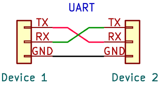
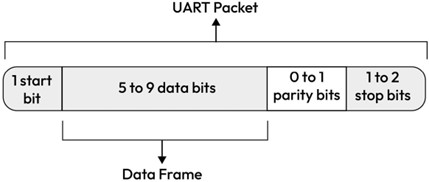
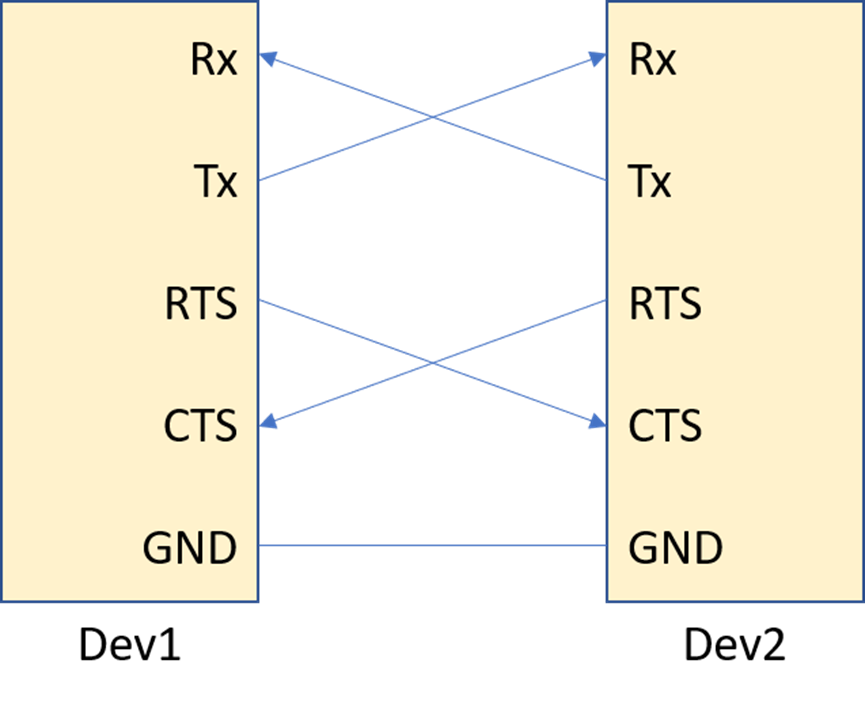
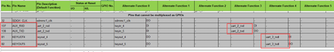
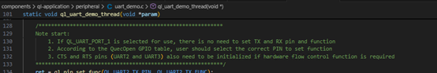
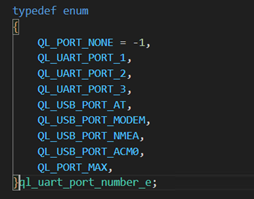
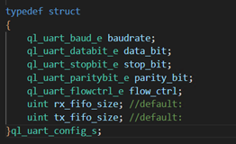
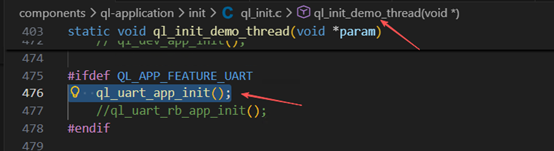

# UART- Universal Asynchronous Receiver-Transmitter

## UART Working Principle

In UART communication, two UARTs can communicate directly with each other. The host computer transmits the data to be sent in parallel from the data bus to the UART transmitter. After acquiring the parallel data from the data bus, the UART transmitter adds a start bit, a parity bit, and a stop bit to form a data packet. The data packet is then serially output bit by bit on the Tx pin. The UART receiver reads the data packet bit by bit on its Rx pin. Subsequently, the UART receiver converts the data back to parallel form and removes the start bit, parity bit, and stop bit. Finally, the UART receiver transmits the data packet in parallel to the data bus of the receiving end.

UART performs data transmission through two wires, with data flowing from the Tx pin of the UART transmitter to the Rx pin of the UART receiver.

## Frame structure

The data transmitted via UART is organized into data packets. Each data packet consists of 1 start bit, 5 to 9 data bits (depending on the UART), an optional parity bit, and 1 or 2 stop bits.

### Idle State

High level, indicating no data transmission on the line currently.

### Start Bit

When data transmission begins, the UART transmitter pulls the transmission line from high level to low level, maintaining this state for one clock cycle. When the UART receiver detects the high-to-low voltage transition, it starts reading the bits in the data frame at the baud rate frequency.

### Data Bits

The data frame contains the actual data being transmitted. Its length can be 5 to 8 bits if a parity bit is used. If no parity bit is used, the data frame can be 9 bits long. In most cases, data is transmitted starting with the least significant bit (LSB).

### Parity Bit

Parity describes whether a number is even or odd. The parity bit is a mechanism for the UART receiver to determine if data has changed during transmission. After reading the data frame, the UART receiver counts the number of bits set to 1 and checks if the total is even or odd. If the parity bit is 0 (even parity), the total number of 1s in the data frame should be even. If the parity bit is 1 (odd parity), the total number of 1s in the data frame should be odd. When the parity bit matches the data, the UART confirms that the transmission is error-free. However, if the parity bit is 0 and the total is odd, or if the parity bit is 1 and the total is even, the UART recognizes that bits in the data frame have changed.

### Stop Bit

The stop bit is located at the end of the data packet. Typically, this bit is 2 bits long, but often only one bit is used. To terminate the transmission, the UART keeps the data line at high voltage.

The transmitting and receiving UARTs must be configured with the same data packet structure.

### Baud-rate

The frequency modulated in signal in line, expressed in bits per second (bps) or b/s. The clock signal with fixed frequency will vibrate and send one bit data signal each clock period.
Both communicating parties in UART communication are required to have the same baud rate.

### Hardware flow control

Flow control, also known as traffic control.

In any communication protocol, both communicating parties are allocated buffers with limited storage space to receive data sent by the other party. If the other party sends data too quickly while the local party's processing speed is slow, a serious situation may occur where the buffer becomes full and cannot process more data, or even data loss happens.

At this point, flow control becomes particularly important. When the receiver cannot accept more data, it notifies the sender to pause data transmission. Once it is ready to receive data again, it informs the sender to resume transmission.

Hardware flow control requires two additional pins: RTS and CTS.

RTS (Request to Send): An output pin connected to the CTS pin of the counterpart device. When the local RTS pin is pulled high, it notifies the counterpart UART to pause data transmission; when the RTS pin returns to low level, it informs the counterpart to resume data transmission.

CTS (Clear to Send): An input pin connected to the RTS pin of the counterpart device. When the local CTS pin detects a high level, it pauses local data transmission; when the CTS pin detects a low level, it resumes local data transmission.

## **Common Interfaces**

### **Pin function seclect**

`ql_errcode_gpio ql_pin_set_func(uint8_t pin_num, uint8_t func_sel);`

**Parametric Description**

**pin_num**:pin number, Refer to the Pin No. in the GPIO Configuration Table

**func_sel**: pin function，Refer to the Alternate Function number in the GPIO Configuration Table

Since the same pin can be multiplexed for different functions, it is necessary to refer to the GPIO Configuration Table and first configure the TX/RX pins to UART mode before using the UART.

One point to note is that since the main UART cannot be multiplexed into other ports, there is no need to configure pin multiplexing when using the main UART.

### **Set the UART properties**

`ql_uart_errcode_e ql_uart_set_dcbconfig(ql_uart_port_number_e port, ql_uart_config_s *dcb);`

**Parametric Description**

**port**: UART number, See ql_uart_port_number_e for details

QL_UART_PORT_1 is main UART 

QL_UART_PORT_2 and QL_UART_PORT_3 are other physical UART 

QL_USB_PORT_AT,QL_USB_PORT_MODEM and QL_USB_PORT_NMEA are USB virtual UART.

**dcb**：UART configuration structure

**Baudrate**: baud rate. The default value is 115200 bps. See ql_uart_baud_e for details.

**data_bit**: data bit. The default value is 8 bits. See ql_uart_databit_e for details.

**stop_bit**: stop bit. The default value is 1 bit. See ql_uart_stopbit_efor details

**parity_bit**: parity bit. There is no parity by default. See ql_uart_paritybit_e for details.

**flow_ctrl**: flow control. It’s disabled by default. See ql_uart_flowctrl_efor details.

### **Open UART**

`ql_uart_errcode_e ql_uart_open(ql_uart_port_number_e port);`

**Parametric Description**

**port**: UART number, See ql_uart_port_number_e for details

### **Register the UART callback function**

`ql_uart_errcode_e ql_uart_register_cb(ql_uart_port_number_e port, ql_uart_callback uart_cb);`

**Parametric Description**

**port** : UART number, See ql_uart_port_number_e for details

**uart_cb** : callback function to be registered

### **UART write**

`int ql_uart_write(ql_uart_port_number_e port, unsigned char *data, unsigned int data_len);`

**Parametric Description**

**port** : UART number, See ql_uart_port_number_e for details

**data**: write data

**data_len**: write data len

### **UART read**

`int ql_uart_read(ql_uart_port_number_e port, unsigned char *data, unsigned int data_len);`

**Parametric Description**

**port**: UART number, See ql_uart_port_number_e for details

**data**: read data

**data_len**: read data len

### **Close UART**

·ql_uart_errcode_e ql_uart_close(ql_uart_port_number_e port);`

**Parametric Description**

**port** : UART number, See ql_uart_port_number_e for details

### **UART callback**

`typedef void (*ql_uart_callback)(uint32 ind_type, ql_uart_port_number_e port, uint32 size);`

**Parametric Description**

**ind_type**: Event types. Include: UART RX Data Received, RX Buffer Overflow, and TX FIFO Transmission Complete.

**port** : UART number, See ql_uart_port_number_e for details

**size**: data size

## **Examples**

The following takes the LTE01R03A08_C_SDK_U as an example. The path of the UART demo is components\ql-application\peripheral\uart_demo.c.
Before running this demo, please call `ql_uart_app_init()` in the `ql_init_demo_thread` (path: components\ql-application\init\ql_init.c), as shown in the following figure:

After opening ql_uart_app_init() and compiling the SDK, you can run the UART demo.

