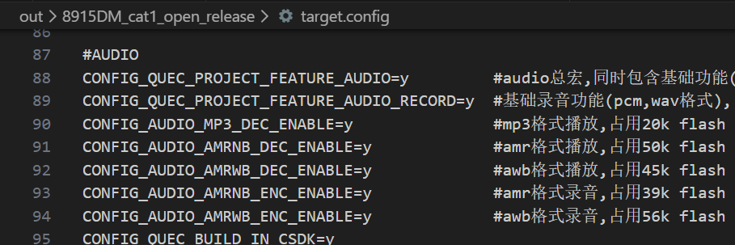
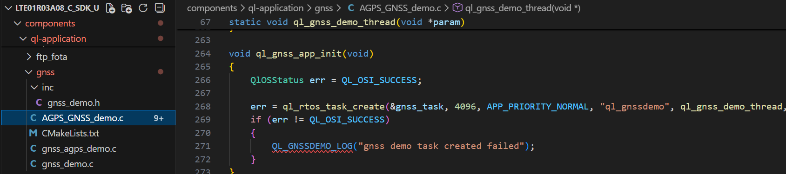
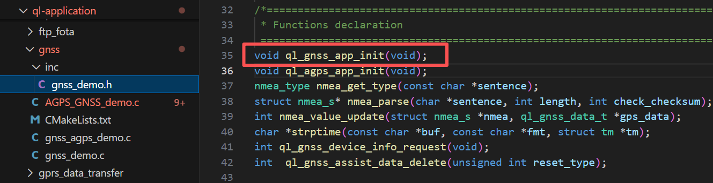
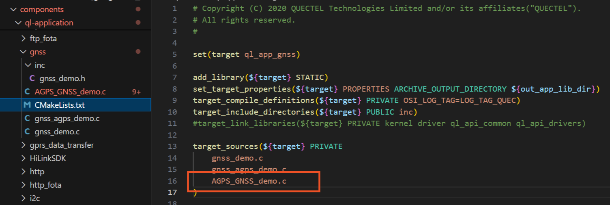

# Application Development Guide

**1\. Overview of System Feature Trimming**

The 8910 platform provides a wide range of system features. However, in certain scenarios, you may need to trim the system to:

- Reduce firmware size
- Meet FLASH storage limitations
- Disable unused features (e.g., GNSS, Bluetooth, Audio)

The SDK includes built-in configuration options that allow feature trimming.

**2\. Trimming Method**

In the out folder, locate the file target.config and modify it to enable or disable features.  


Example:Changing

CONFIG_QUEC_PROJECT_FEATURE_BT=y

to

CONFIG_QUEC_PROJECT_FEATURE_BT=n

will disable the Bluetooth feature.

After making changes, run a new build to regenerate the complete firmware.

**3\. Customer Application Development Workflow**

Create a user application under the ql_application directory.  
Inside your new folder, add your C source files, header files, and the related CMake configuration file.

**3.1 Create a New Application**

Create new source files under the directory shown in the SDK path.



**3.2 Add Initialization Function in the Header File**

Add the application initialization function declaration in the corresponding header file.



**3.3** **Add the New File to CMakeLists.txt**

Update the CMakeLists.txt file to include your newly created source files.



**4\. Commonly Used APIs (Summary)**

UART
```c
ql_uart_open()

ql_uart_read()

ql_uart_write()
```

Network
```c
ql_network_register_cb()

ql_network_start()
```

MQTT
```c
ql_mqtt_connect()

ql_mqtt_publish()
```
File System
```c
ql_fs_open()

ql_fs_read()

ql_fs_write()
```
**5\. Running and Debugging**

- Perform a new build to generate the complete firmware
- Flash the firmware to the module
- Capture logs using debugging tools for runtime troubleshooting