# Basic Log Analysis

## 1. CP Log Analysis
### 1.1. Common Analytical Application
To view the CP Log, the tool ArmTracer_V6.2.8_User is required.

Click the icon in the toolbar as shown below or "Open(O)" in the menu of “File(F)”, the “Import Log window” will be displayed. Then, click the "..." to select the logs to be analyzed or viewed. Finally, click "OK" to take effect after loading.  

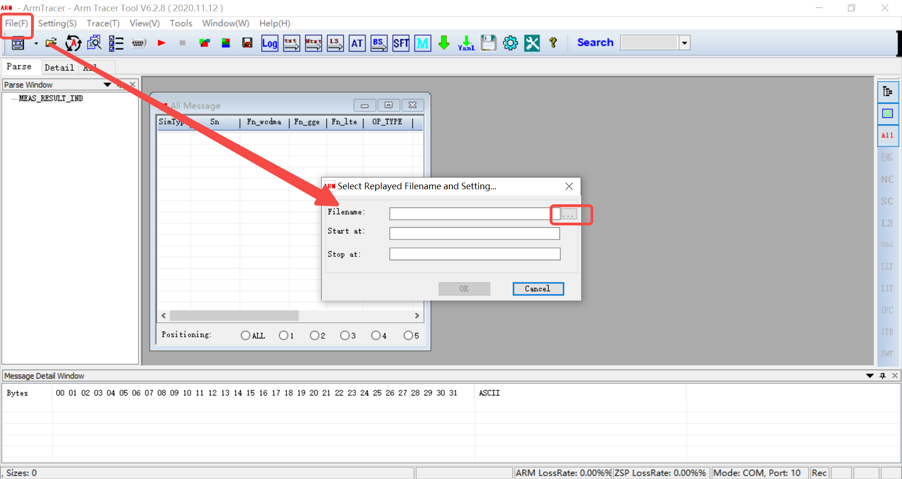
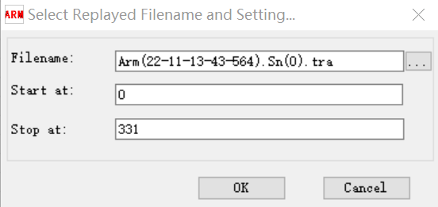

Mainly focused on used for network signalling analysis, the ArmTracer can be used to view signalling messages between the terminal/module and the network, which including "Parse window", "All message", and "Message detail window". Meanwhile, it is also available to filter L3 signalling logs via selecting “Lay3” or click “L3” on the right of "All message" directly.  

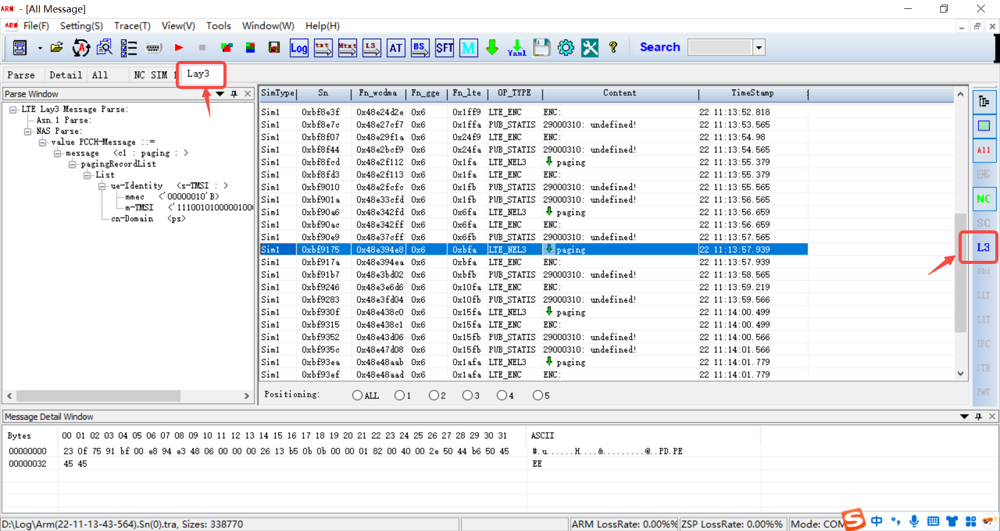

`Note`: Concerning about the analysis on data interaction occurred on application layer of terminal/module such as TCP/MQTT/HTTP, which will be carried out by the Pcap file exported from AP LOG Coolwatcher as above since the ArmTracer is not equipped with the feature of application protocol analysis.

As shown below, the ArmTracer can support five search windows at maximum at the same time. You can input keywords to be searched or filtered in the "Input Keyword" blank of the SearchWnd.  
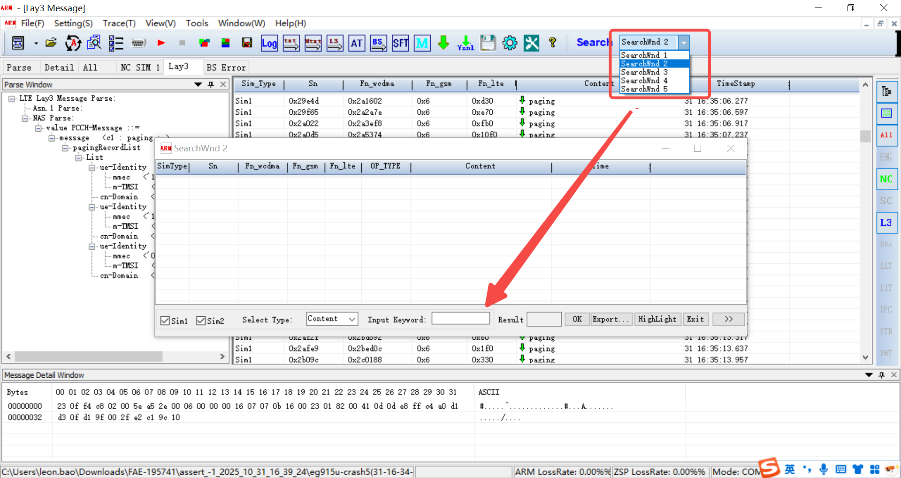

During the stage of debugging, it is needed to query the network APN and IP obtained by the module. See following signalling message.  
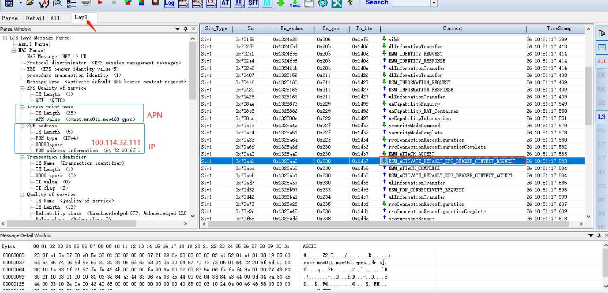

### 1.2. Network selection process  
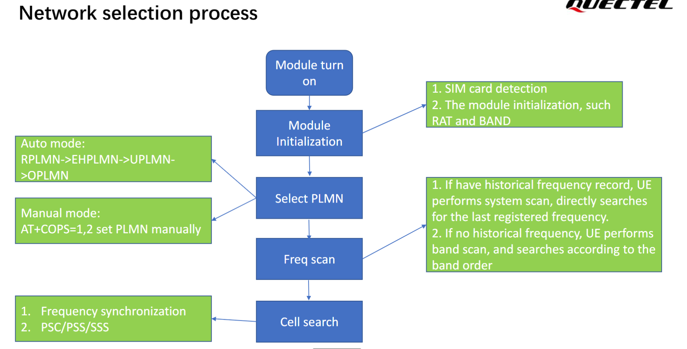
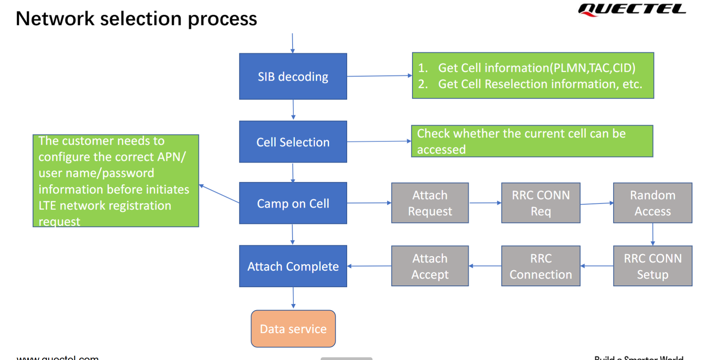
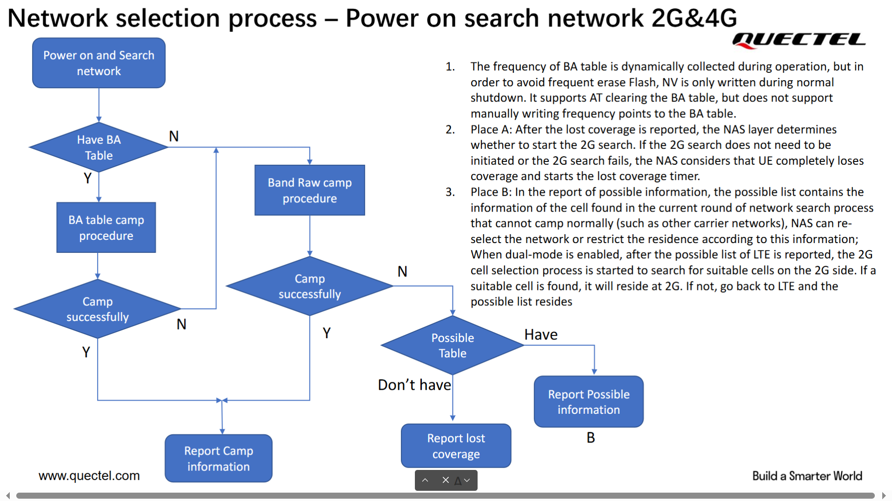

### 1.3. Network selection Log analysis  
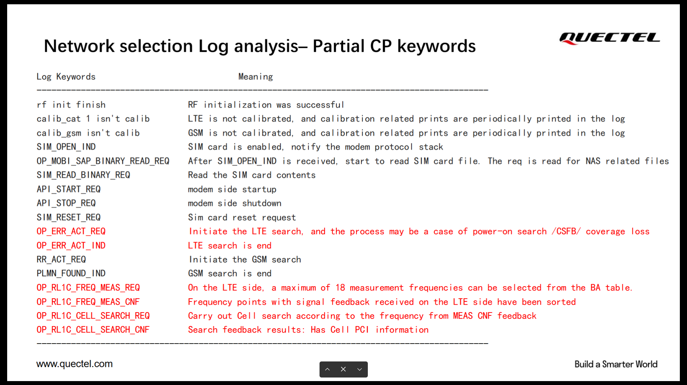

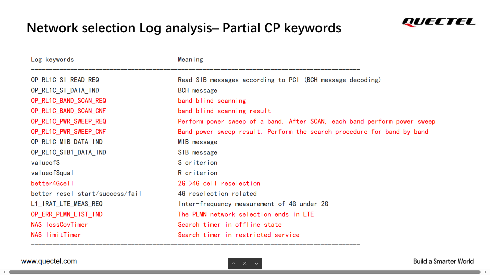

## 2. CP Log Analysis
### 2.1. Common Analytical Application  

Currently, the Notepad++ or UltraEdit is commonly used to view or analyse log; Furthermore, it is also valid to import log via Coolwatcher: Click “Load Trace (bin)” in the menu of “Tracer” and select corresponding xxx.bin file.

The Tracer button will only appear after you activate Tracer first, as shown in the following figure.  
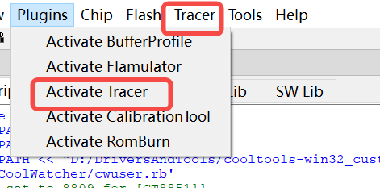

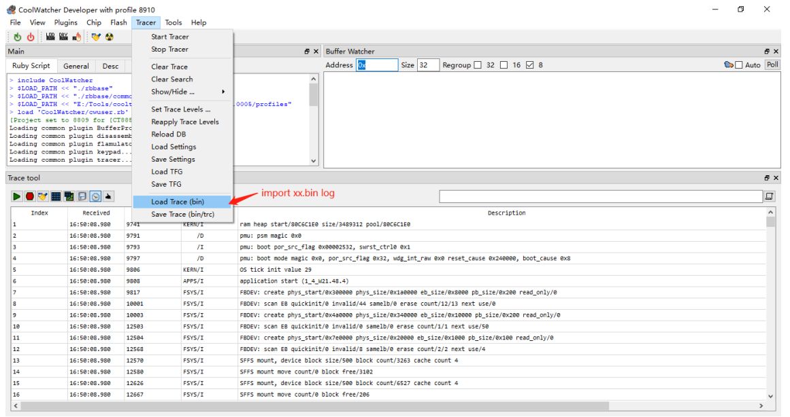

As for filtering log via Coolwatcher, which is illustrated as follows: Input filtering keywords and press Enter button. Meanwhile, it supports the regular expression filtering with a vertical bar "|".  
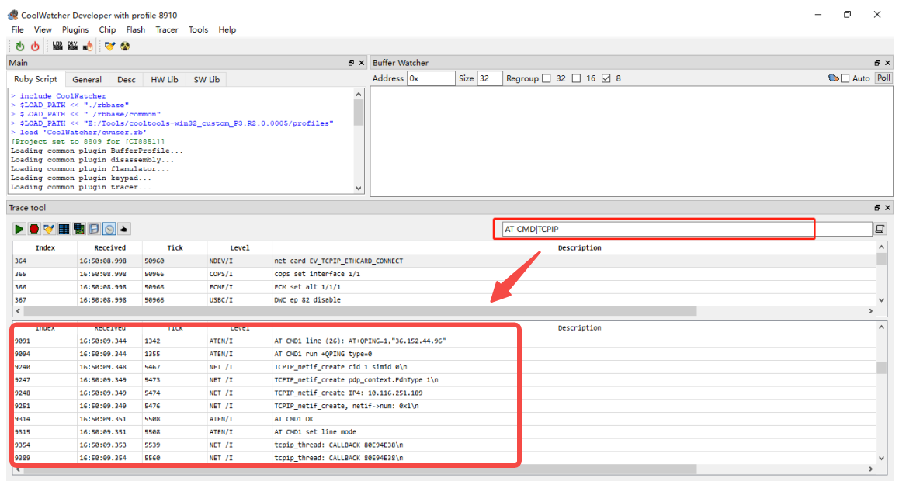

Click “Set Trace Levels” in the drop-list of “Tracer” and tick “Save Pcap”. Normally, the default path is \cooltools-win32_custom_P3.R2.0.0005\logs\cap. In addition, the Pcap file can be used to analyse the data interaction in application protocol via Wireshark.  

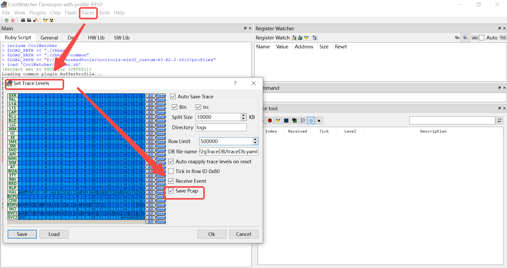
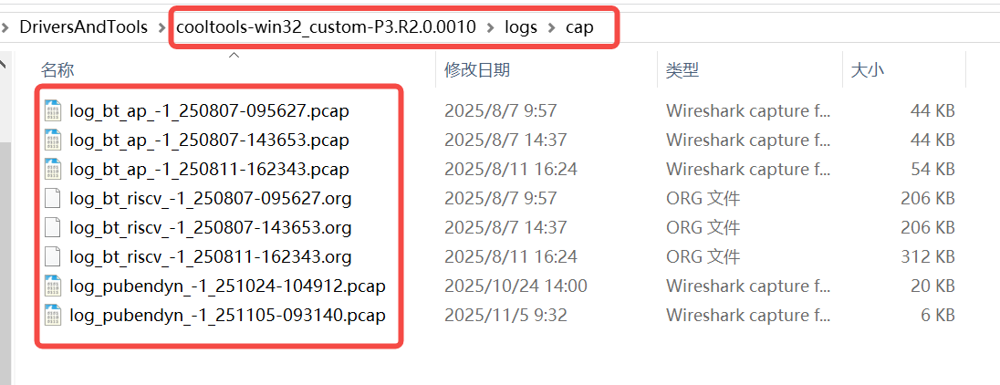
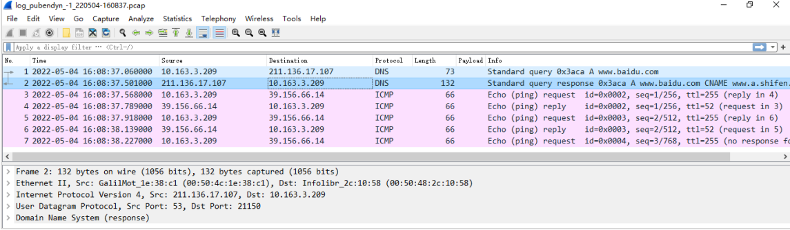
