# Unisoc8910 Firmware Download

## 1. Foreword
### 1.1. Scope

| Manufacturer Revision | System | Tools | Applicable Module Type |
|----------|----------- |-------|---------|
| CAT1 Unisoc 8910 | Windows | QFlash |  EC200U&EC600U&EG915U&EG912U&EG500U&EG700U |
| CAT1 Unisoc 8910 | Linux | QDloader |EC200U&EC600U&EG915U&EG912U&EG500U&EG700U |

### 1.2. Download
You can find above tools and related drivers on [Quectel webside](www.baidu.com). Or you can contact Quectel support.

## 2. Windows
### 2.1. Test Environment:
**System**:Windows 10
**Driver**:Quectel_Windows_USB_Driver(U)_V1.1.0
**Module**:EC200UCNLB

### 2.2. Firmware Flash
First, install the correct driver to ensure that the computer can recognize the module.
Whether the recognition is successful can be referred to the following picture.  
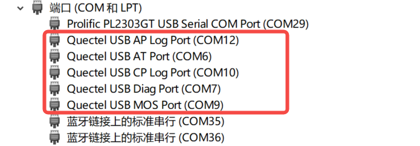

After the module is successfully identified, open the QFlash tool.
Select the correct port, baud rate, and flashing file.  
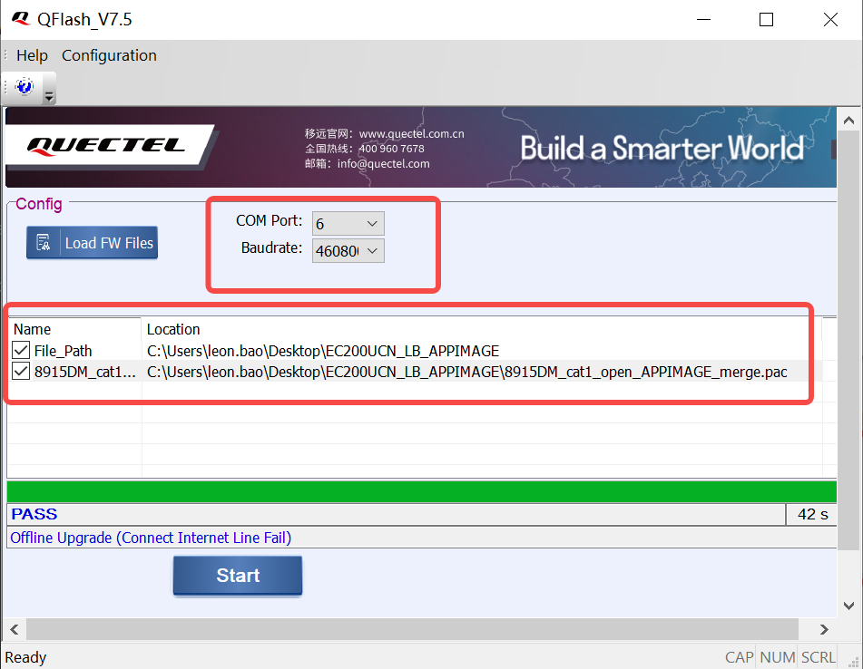

Typically, we select the AT port for the port, and choose the file with the .pac extension as the flashing file for programming.

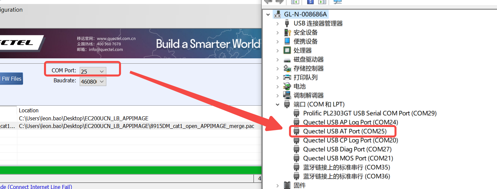
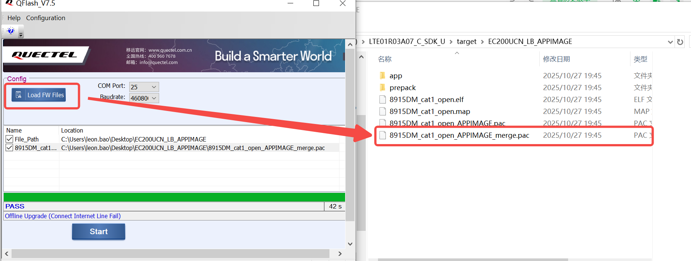

`Note`:The path where the firmware package is stored should not contain special characters or be too long, to prevent the tool from failing to recognize the firmware and causing programming errors.
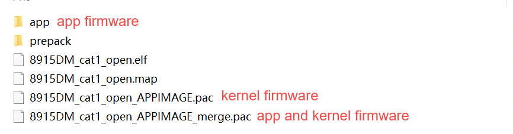

If only updating the application firmware, simply flash the newly generated application firmware.If both the application firmware and Kernel firmware need to be updated, just flash the newly generated firmware package containing the Kernel and application.

After completing the above steps, click "Start" to begin flashing.

After successful programming, the tool will display "Pass", and the module will restart automatically.
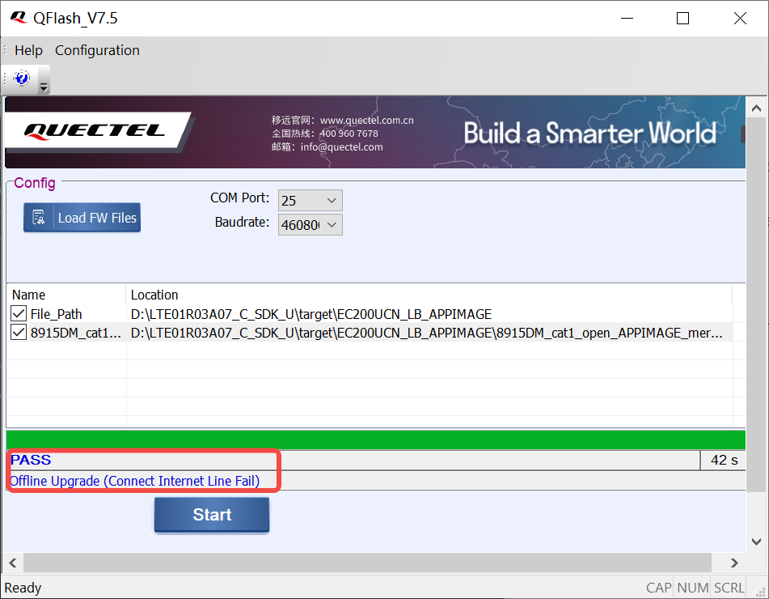
`Note`:Do not power off the module or disconnect its USB connection during the flashing process.

## 3. Linux
### 3.1. Test Environment:
>**System**:22.04.1-Ubuntu
**Kernel**:6.8.0-85-generic
**Driver**:Quectel_Linux_USB_Serial_Option_Driver_V1.0
**Module**:EC200UCNLB

### 3.2. USB Driver Installation
In the Linux environment, use the following command to decompress the `Quectel_Linux_USB_Serial_Option_Driver_V1.0` file in Chapter 1.2.
>tar -xvf Quectel_Linux_USB_Serial_Option_Driver_V1.0.tgz

Execute the following command in the window to check your Linux kernel version;

Locate the version that is closest to the system kernel in the `Quectel_Linux_USB_Serial_Option_Driver_V1.0` driver package;
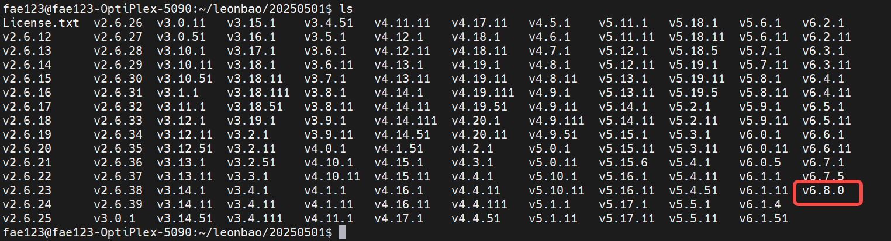

After entering the latest system version, execute make.  
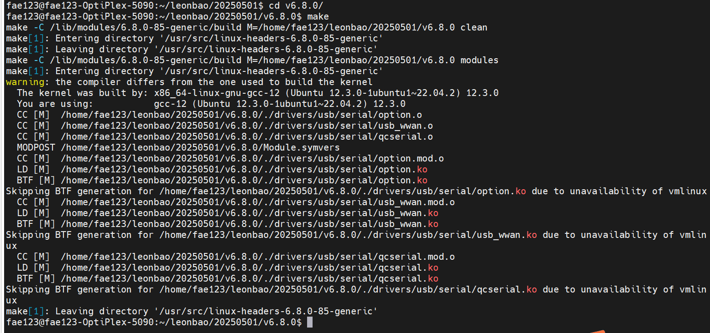

Then execute "sudo make install"  
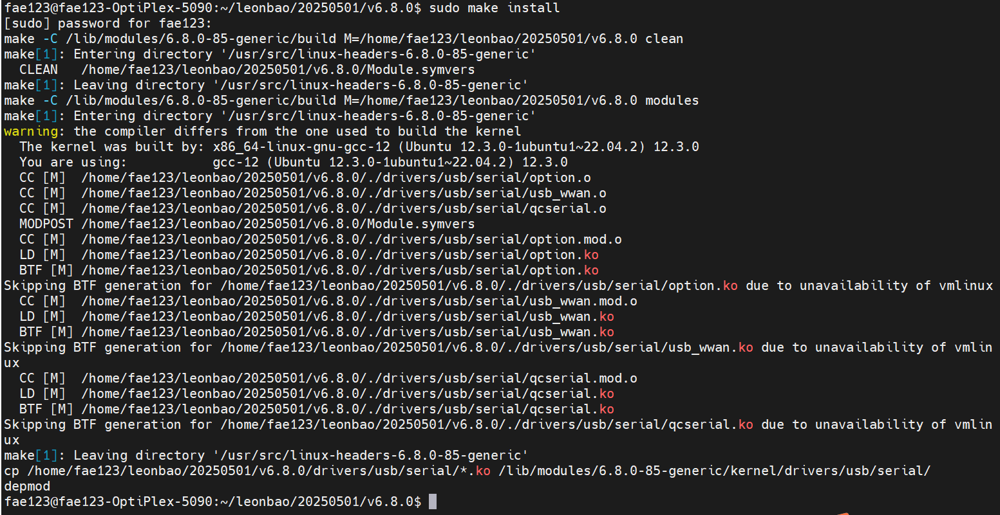

After the installation is completed, restart the system; after the restart, execute "lsusb" to check if the system has successfully recognized the modules and their USB ports. If successful, you will be able to see the following information.  
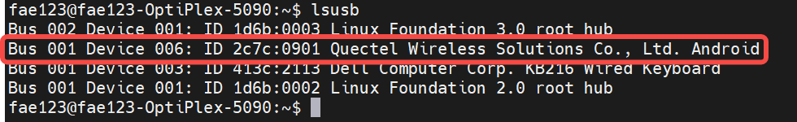
Typically, the VID for Quectel modules is 2C7C.

### 3.3. Firmware Flash

Download and extract QDloader_Linux_Android_V1.1

After completion, enter the extracted directory and use the `make` command to compile. Upon successful compilation, an `out` directory will be generated in the current directory, which contains the QDloader executable file we need.
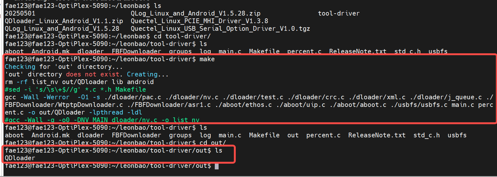

You can refer to the figure below for the tool parameters.
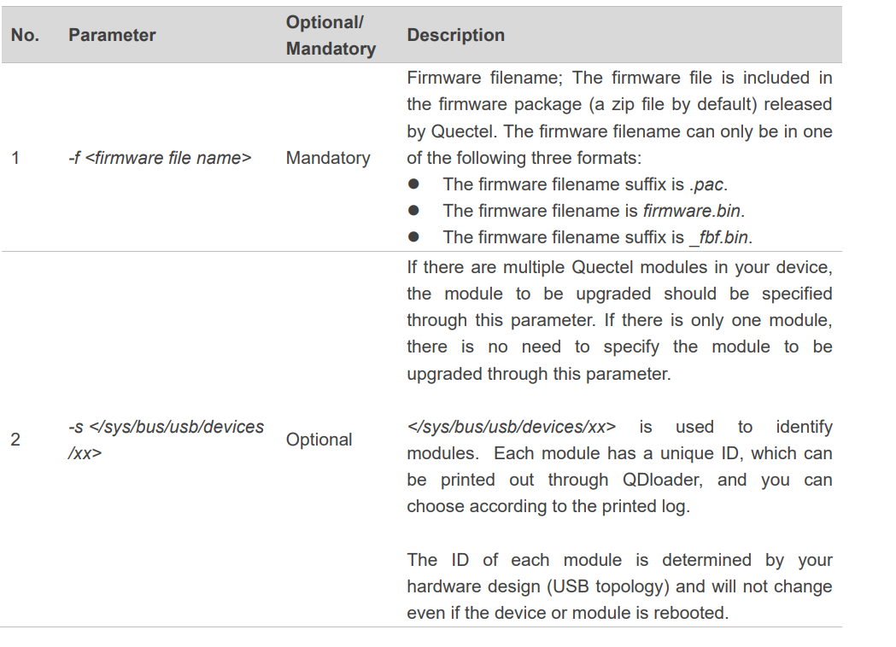

Use the following command to start flashing. Use the -f parameter to select the correct path to the firmware and the appropriate flashing file format. Taking the EC200U module as an example here, select the file with the .pac extension.

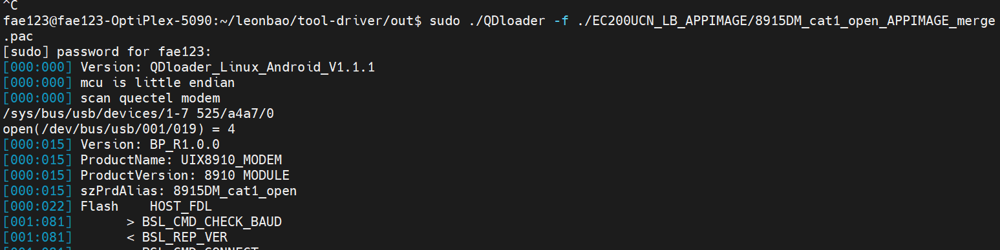

View the last line of logs printed by the tool. If it is displayed as follows, it means that the upgrade is successful.
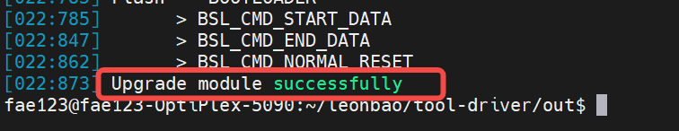

## 4. Prepack Download
### 4.1. Preset File Downloading and Upgrading
A preset file is a designated initial file within a firmware package, which is written directly to the module file system during firmware downloading. Preset files take up file system space, and the maximum size of a single preset file is currently limited to 512 KB. If file size exceeds 512 KB, the file is skipped during downloading.

The preset file can also be downloaded, upgraded or deleted by FOTA. 

*  Upgrade the preset file in the old firmware version to that in the new firmware version. 
*  If the old firmware version does not have a preset file, you can add a preset file by FOTA. 
*  If the old firmware version has a preset file and the new firmware version does not have a preset file, the preset files will be deleted after FOTA upgrade;

### 4.2. FOTA Upgrade

FOTA upgrades can be performed using HTTP or FTP.

There is corresponding demo code available for reference in the SDK, with the path as follows:`components\ql-application`
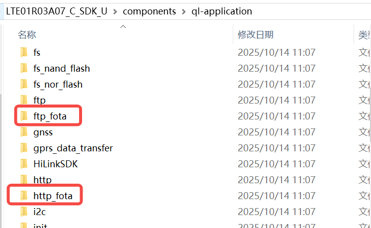

Here, we will use the FTP upgrade method for demonstration.First, upload our FOTA package to the FTP server.
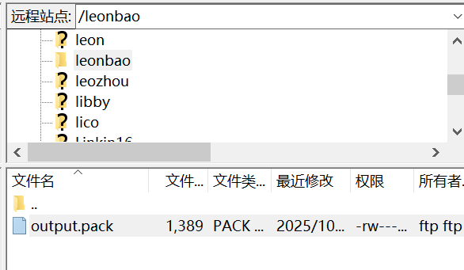

Configure your FTP server information and the path to the FOTA package in the fota_ftp_demo.c file.
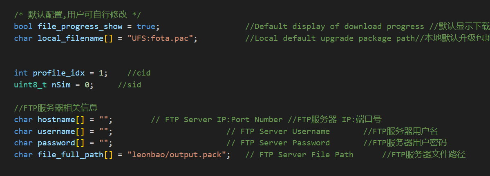

Once configured, uncomment the function to enable this feature in the init function.
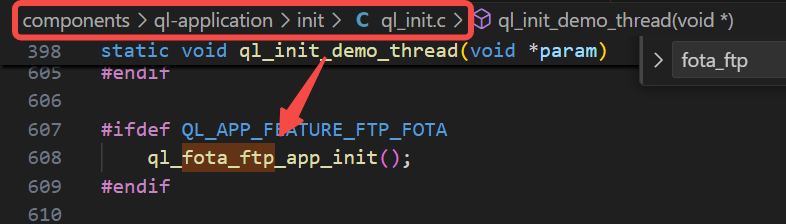

After completing the above preparations, start compiling the firmware.
> .\build_all.bat new EC200UCN_LB appimage
> 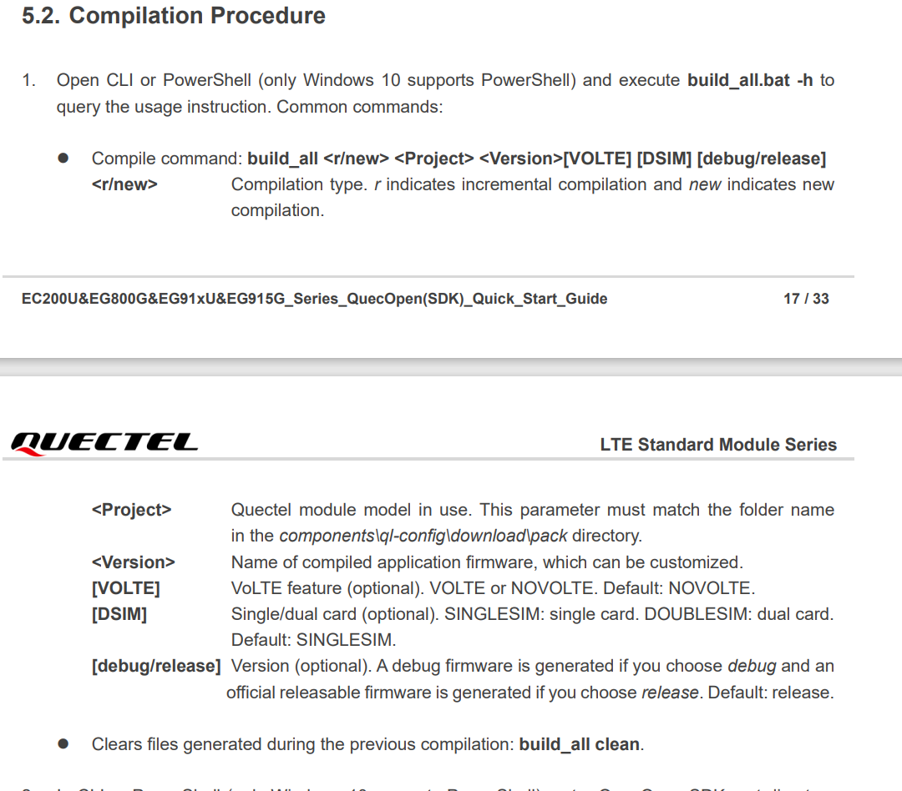

A successful compilation will display the following picture.
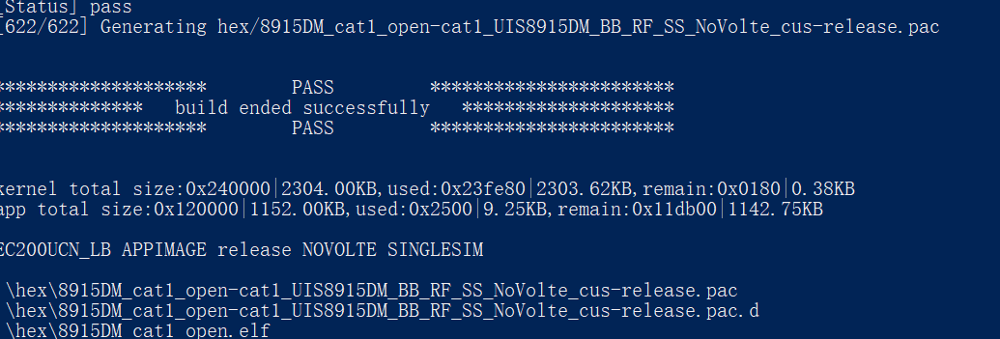

The firmware generated by compilation is located in the target directory.
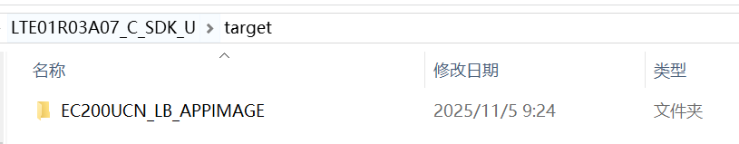

Then you just need to flash this firmware into the module.For flashing instructions, please refer to Sections 2 and 3.

`Note`:The creation of a FOTA package requires both the original version firmware and the target upgrade firmware. Moreover, the original version firmware in the FOTA package must be consistent with the current version firmware of the module to ensure a successful upgrade.