# Log Collection

## 1. Foreword
### 1.1. Scope

| Manufacturer Revision | System | Tools | Log Output | Applicable Module Type |
|----------|-----------  |-------|---------|--------|
| CAT1 Unisoc 8910 | Windows | Coolwatcher | AP/DUMP LOG | EC200U&EC600U&EG915U&EG912U&EG500U&EG700U |
| CAT1 Unisoc 8910 | Windows | ArmTracer | CP LOG | EC200U&EC600U&EG915U&EG912U&EG500U&EG700U |
| CAT1 Unisoc 8910 | Linux/Android | QLog | AP/CP/DUMP LOG | EC200U&EC600U&EG915U&EG912U&EG500U&EG700U |

### 1.2. Download
>**Windows Tools**：  
[ArmTracer_V6.2.8_User](https://cnquectel-my.sharepoint.com/:u:/g/personal/leon_bao_quectel_com/ER0x2g5jWLpLi9fR118D8XsBt7fboHwwuEDE68mj-nQznw?e=6EGp7d"%3EArmTracer_V6.2.8_User.7z%3C/a%3E)   
[cooltools-win32_custom-P3.R2.0.0010](https://cnquectel-my.sharepoint.com/:u:/g/personal/leon_bao_quectel_com/EQLAConEAMhKjg_8Js3inqwBgqnpRMJCcgYVEvdRLGeizw?e=QYvbpm)  
[QCOM_V1.6](https://cnquectel-my.sharepoint.com/:u:/g/personal/leon_bao_quectel_com/EUahMKv4vmJGp38JPEtpez8Bqv_fLvs7wN6j8E38uNcrVQ?e=9cFV3z"%3EQCOM_V1.6.zip%3C/a%3E)    
[USB Driver](https://cnquectel-my.sharepoint.com/:u:/g/personal/leon_bao_quectel_com/ERbcTwJBEm5Jj9xFbrB672UByh_s9fGoFv0glT64bkzDwg?e=PhCp3c"%3EQuectel_Windows_USB_Driver%28U%29_V1.1.0.zip%3C/a%3E)  

>**Linux Tools**:   
[QLog_Linux_and_Android_V1.5.28](https://cnquectel-my.sharepoint.com/:u:/g/personal/leon_bao_quectel_com/EXxWwnmuZXNLmL6lHKPGv3MBSYDgTDeyBN6pQnLvQgn0Rg?e=ugjJe6"%3EQLog_Linux_and_Android_V1.5.28.zip%3C/a%3E)  
[Quectel_Linux_USB_Serial_Option_Driver_V1.0](https://cnquectel-my.sharepoint.com/:u:/g/personal/leon_bao_quectel_com/EULnFLy5AjpIkHrWPkIu4rYBgPlNqGhtHAwjLPJ-HMzTxQ?e=gnxHJ8"%3EQuectel_Linux_USB_Serial_Option_Driver_V1.0.tgz%3C/a%3E)

## 2. Windows Environment
###  2.1. Test Environment:
>**System**:Windows 10  
**Driver**:Quectel_Windows_USB_Driver(U)_V1.1.0  
**Module**:EC200UCNLB  

### 2.2. AP Log Capture
#### 2.2.1. Tool Connection And Usage
1.First, install the correct driver to ensure that the computer can recognize the module. 
Whether the recognition is successful can be referred to the following picture.  
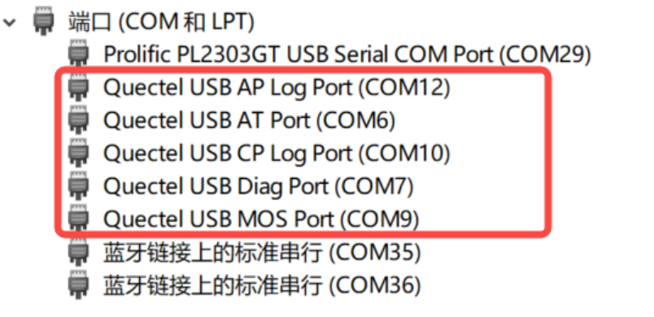

2.Next, open the CoolTools tool.Usually, we use coolwatcher_usb.exe or coolwatcher_debughost.exe to open the tool.  
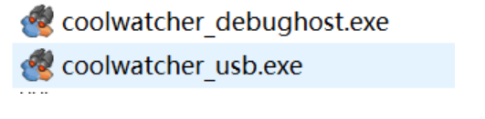

And then select the AP port in lastport.  
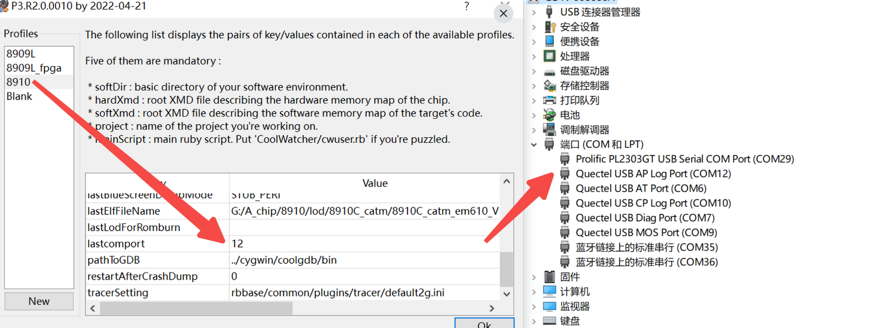

The connection was successful. We can now see the following interface.  
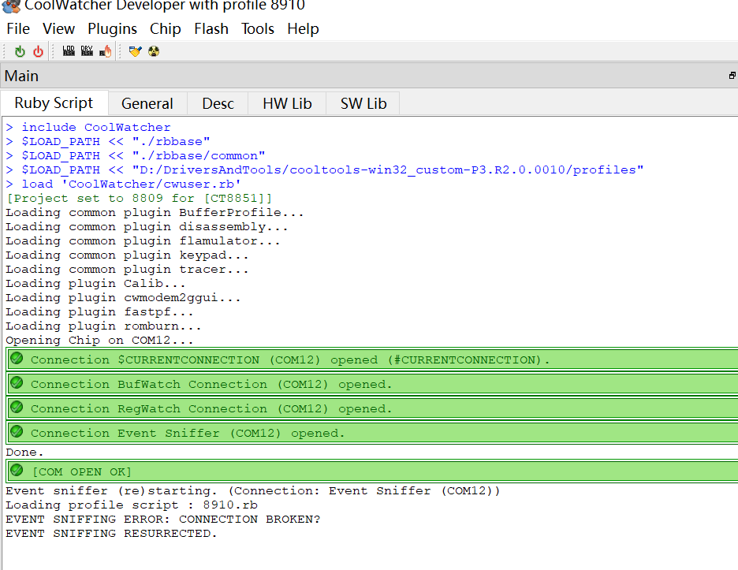

By following the menu bar operations shown in the picture below, you can start to capture the AP log.  
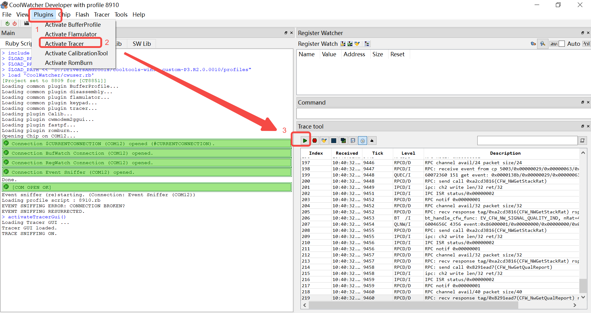

Click “Set Trace Levels” in the menu of “Tracer” or the icon shown as below to select all log types. In addition, it is suggested to tick “Save Pcap” as well.  
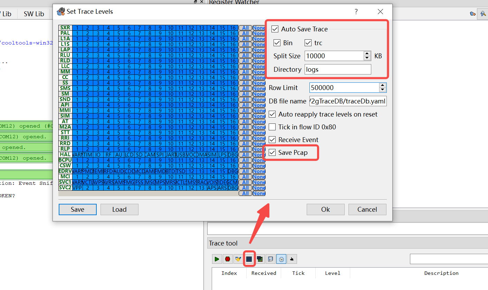

`If there is no output after clicking "Start Tracer", it is recommended to try resetting the module.`

#### 2.2.2. Save Log
##### 2.2.2.1. Manual Save
If you want to save the log, you can select "tracer" -> "Save trace" from the menu bar.  
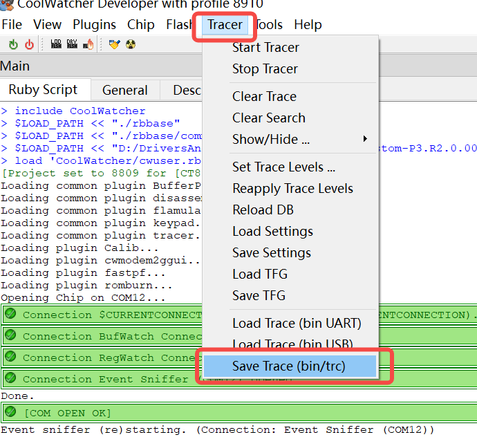

##### 2.2.2.2. Auto Save

Select “Set Trace Levels” in the drop-list of “Tracer” or the icon as described below, click “Auto Save” and set the path to save it. Normally, the log will be saved on the path of \cooltools-win32_custom-P3.R2.0.0010\logs by default automatically. In addition, the Pcap file is saved on the path of \cooltools-win32_custom-P3.R2.0.0010\logs\cap.  
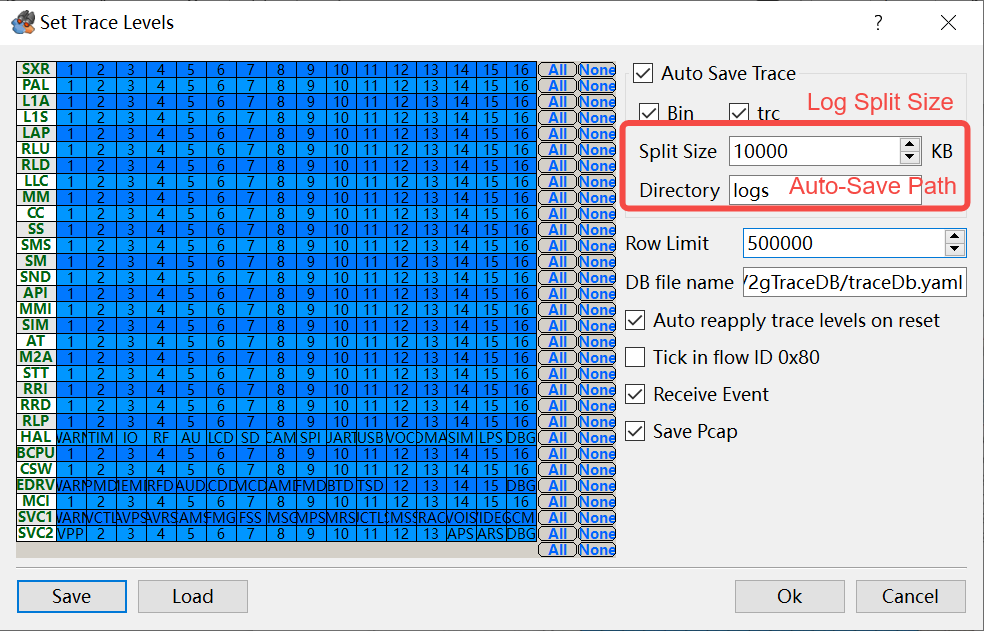

### 2.3. CP Log Capture

#### 2.3.1. Tool Connection And Usage
Refer to Section 2.2.1. After identifying the module, open the tool.  

After opening, you can see the following window.  
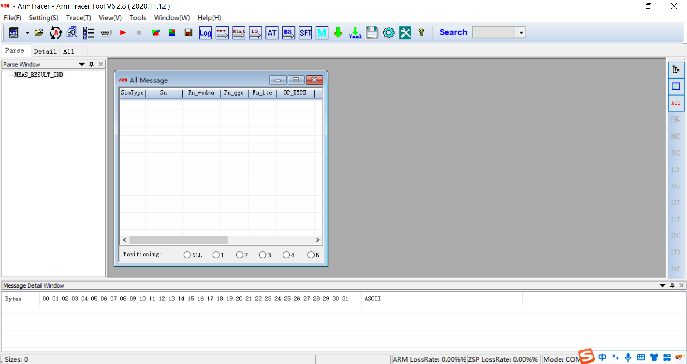

Select “COM Setting” in the drop-list of “Setting(S)” or the icon shown as below to configure corresponding COM port. As for the device port, please select “Quectel USB CP Log Port”.  
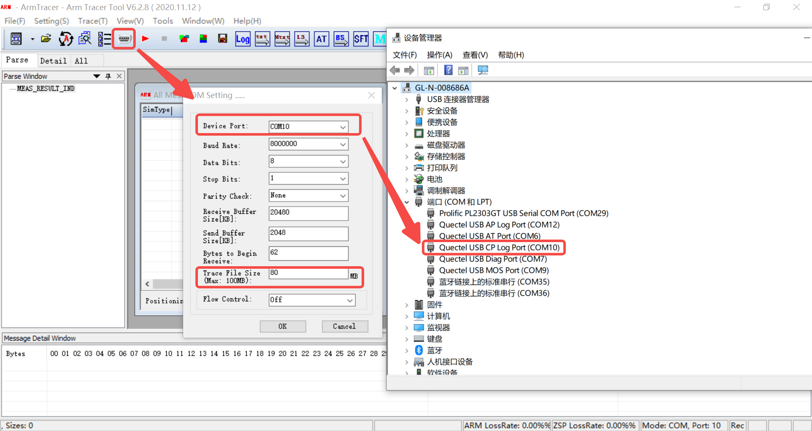

`Note`: It is suggested to set the Trace File Size as large as possible (no more than 100M) to avoid inconvenience during analysis and import due to excessive log split.

After configuration is complete, simply click "OK" to start capturing the logs.

Click "Log Setting" in the menu of “Setting(S)” or icon in the toolbar to configure the file name and path to save log as shown below.  
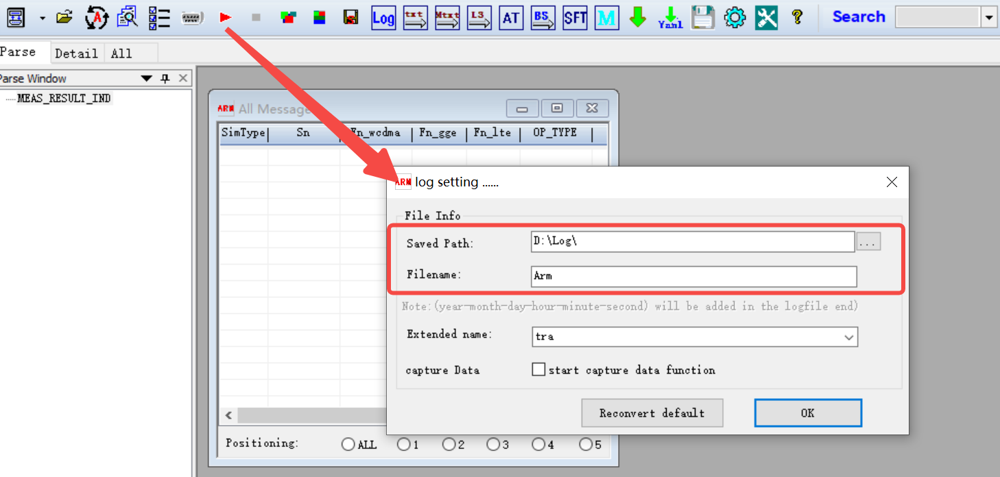

`Note`: If the log information is not displayed in ArmTracer window in capturing stage, it is available to judge whether the log is outputted in accordance with actual speed.  
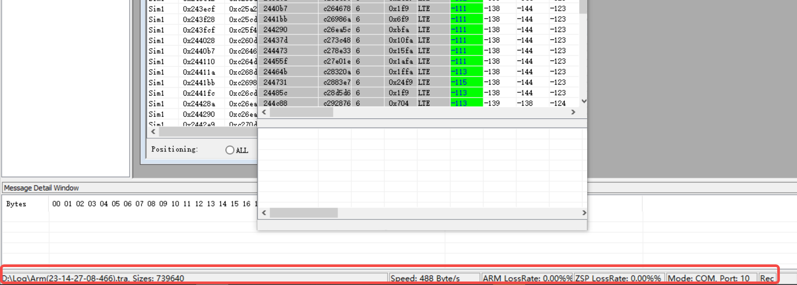

In addition, please also keep in mind that if the terminal/module is reset in stage of capturing, the ArmTracer needs to be reconnected; otherwise, there will be no log. Therefore, it is suggested to execute AT command AT+CFUN=0/AT+CFUN=1 to obtain the complete signaling log once the device is connected for sake of facilitating issue analysis.

Click the icon in the toolbar as shown below or "Stop" in the menu of “Trace” to stop capturing log.

#### 2.3.2. Save Log

As described above, when capturing log, the saving path and file name shall be configured, or view the LOG and path shown as below.  
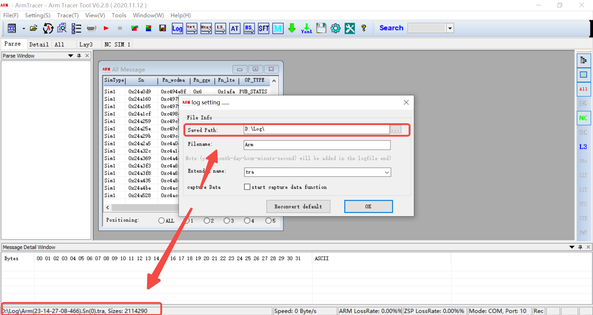

### 2.4. Dump Log Capture
#### 2.4.1. Tool Connection And Usage
Refer to Section 2.2.1 of the dump log capture. Open the Coolwatcher tool and select the connection to the AP port.

Before starting the capture process, the following AT command needs to be sent.
>`AT+QDBGCFG="dumpcfg",0` // Disable watchdog. The dump log is valid after storage 
`AT+QDBGCFG="dumpcfg",1` // After capturing dump log, it is suggested to enable watchdog
`AT+QDBGCFG="system/abort"`     //actively trigger the dump command

To send the above AT command, you need to download and open the QCOM tool.The download link for the tool can be found in Section 1.2.
In the tool, select the AT port and set the correct baud rate, stop bits, and ByteSize.  
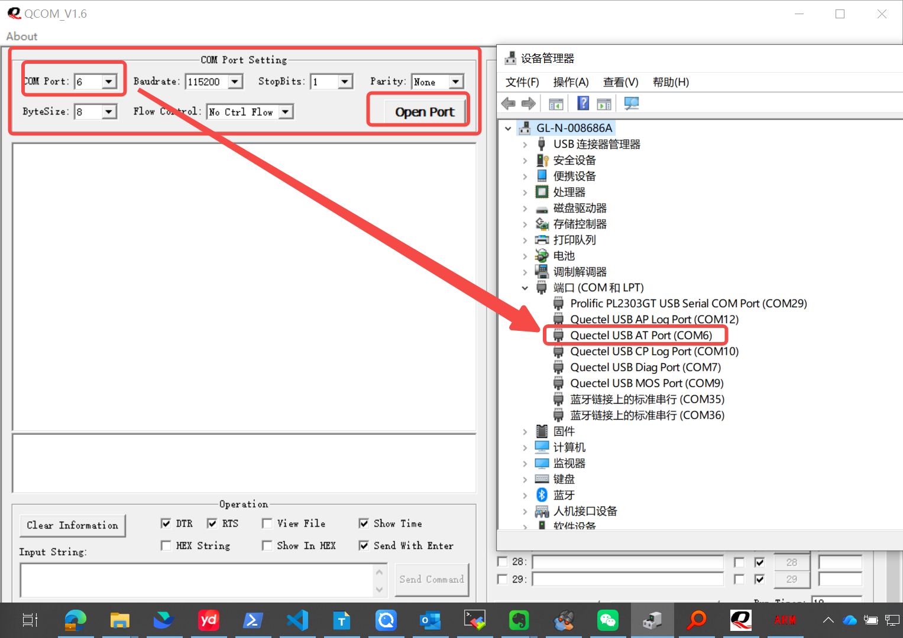
Then, connect to the AT port and send the AT command.  
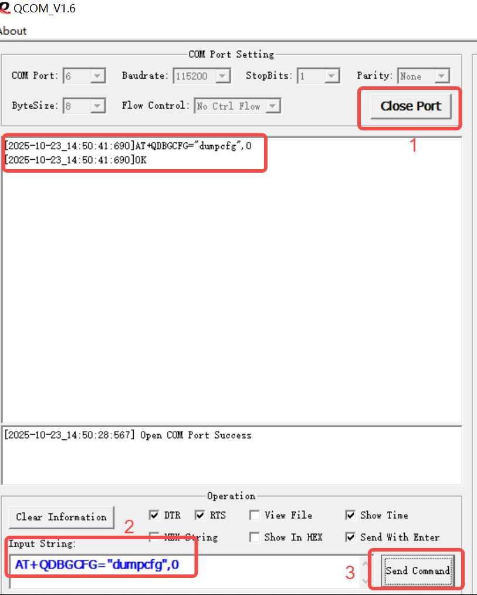

#### 2.4.2. Log Capture
Return to the coolwatcher tool

See following figure as a reference. Please display log tracing window via clicking the “Blue Screen Dump” in the drop-list of “Tools”.  
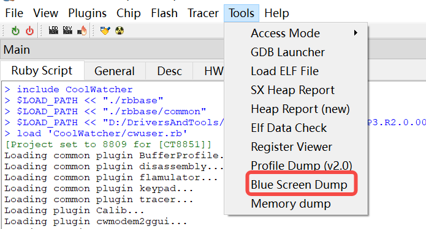

As for “Mode” and “XML file name”, please select the default ones. While in terms of “Elf file name”, please choose the “xxx_open.elf” that has been finished and compiled. Finally, when concerning about the “Output Directory”, please select according to actual demand.  
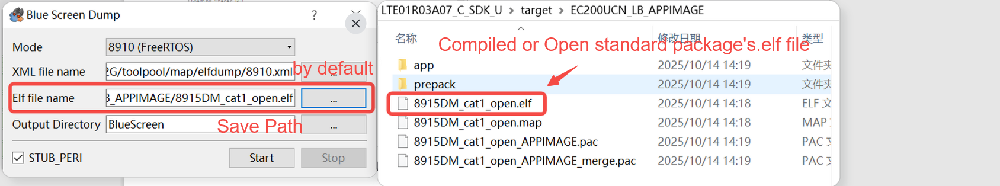

Click "start" to begin the capture.When it is done to capture dump log, it will remind “Blue screen dump has finished”.  
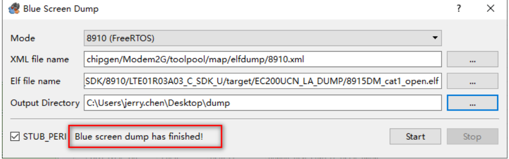

Package the captured dump file and the ELF file (which can be directly packaged into the "target" folder), and provide it for analysis.

After that, don't forget to use the AT command<`AT+QDBGCFG="dumpcfg",1` >to enable the watchdog.

## 3. Linux Environment
### 3.1. Test Environment:
>**System**:22.04.1-Ubuntu
**Kernel**:6.8.0-85-generic
**Driver**:Quectel_Linux_USB_Serial_Option_Driver_V1.0
**Module**:EC200UCNLB

### 3.2. USB Driver Installation
In the Linux environment, use the following command to decompress the `Quectel_Linux_USB_Serial_Option_Driver_V1.0` file in Chapter 1.2.
>tar -xvf Quectel_Linux_USB_Serial_Option_Driver_V1.0.tgz

Execute the following command in the window to check your Linux kernel version;
>uname -a

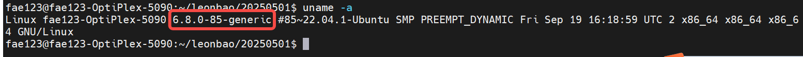

Locate the version that is closest to the system kernel in the `Quectel_Linux_USB_Serial_Option_Driver_V1.0` driver package;  

After entering the latest system version, execute command 'make'.  

Then execute "sudo make install".  

After the installation is completed, restart the system; after the restart, execute "lsusb" to check if the system has successfully recognized the modules and their USB ports. If successful, you will be able to see the following information.   

Typically, the VID for Quectel modules is 2C7C.

### 3.3. AP&CP Log Capture
#### 3.3.1. QLog Installation and Usage
After the module is successfully identified, next, download and extract QLog_Linux_and_Android_V1.5.28 in the Linux system.

After extracting the file, navigate to the QLog tool directory and compile it using "make". Once the compilation is successful, you will find the QLog executable file in the "out" directory.
(`If it involves the customer's upper computer, the cross-compilation toolchain of the customer's upper computer needs to be obtained.`)  
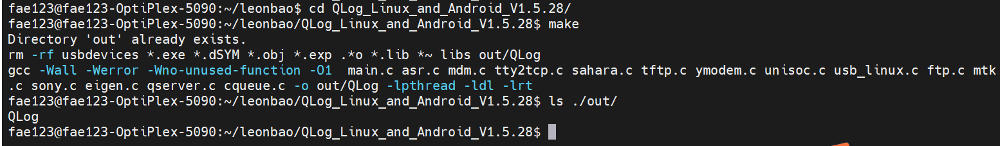

Navigate to the out directory and execute the following command to start capturing logs:
>sudo ./QLog -s <save path>

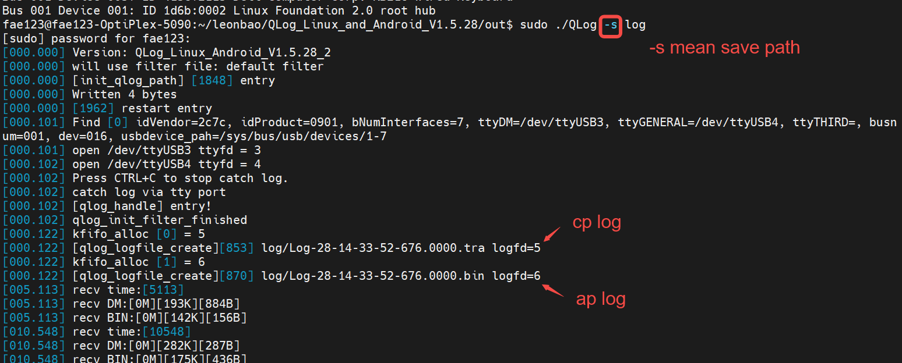

Press Ctrl + C to stop capturing logs.  
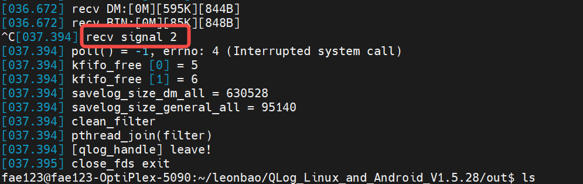

#### 3.3.2. Save Log

After capturing the logs in the previous step, the log save path was specified as the log directory under the current directory. Therefore, you can find the saved logs in the log directory.  
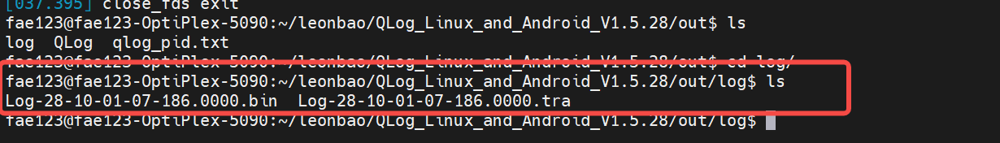

### 3.4. QLog Dump Log Capture

The installation of the QLog tool is covered in Section 3.2.1

`Note`: Before capturing the Dump log, you need to execute the command: <AT+QDBGCFG="dumpcfg",0>. After capturing is completed, it is recommended to execute: <AT+QDBGCFG="dumpcfg",1>. Additionally, ensure that the module has crashed before capturing the Dump log; otherwise, the capture will fail.

The command to actively trigger the dump can be referenced in Section 2.4.1. The specific function of this command can be referenced in Section 2.4.1.

Before capturing the Dump log, you need to contact Quectel or relevant personnel to obtain the corresponding .map file for the standard version or open version, such as 8915DM_cat1_open.map.  
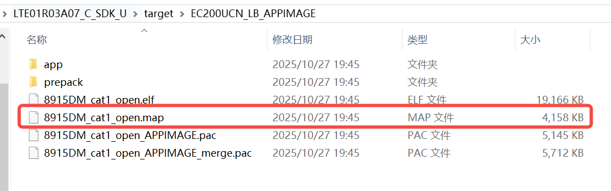

Look for the .gIsPanic field in the corresponding .map file and locate its associated address, as shown in the figure below.  
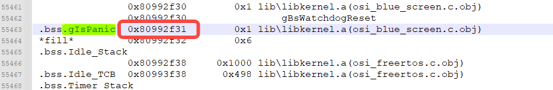

Execute the following command to start capturing logs:
>sudo ./QLog -s log1 -a <corresponding address>  
// Such as 0x80992f31
// -s refers to the path where logs are stored.-a refers to the address of .gIsPanic.  

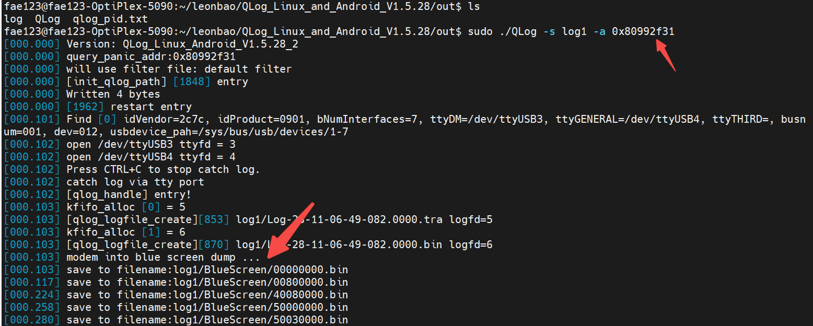

As shown in the figure below, it indicates that the Dump log capture is successful.  
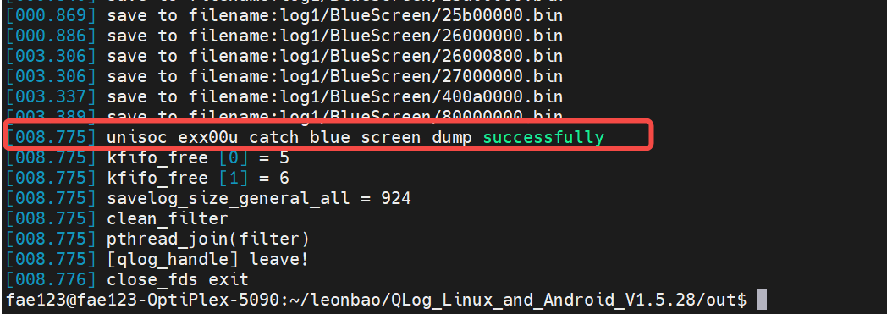

Locate the dump log in the log storage path and export it for analysis.  
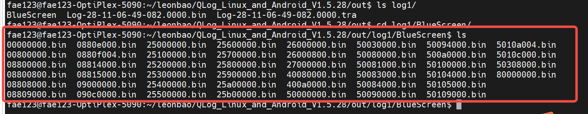
