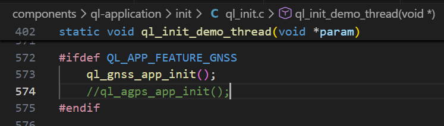
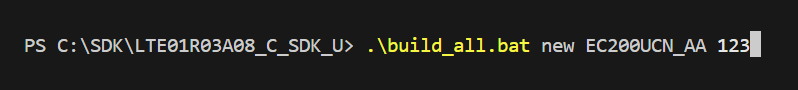
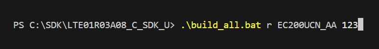
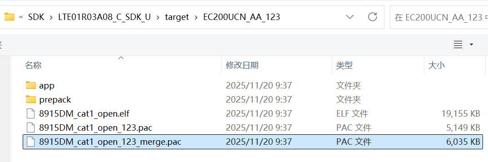
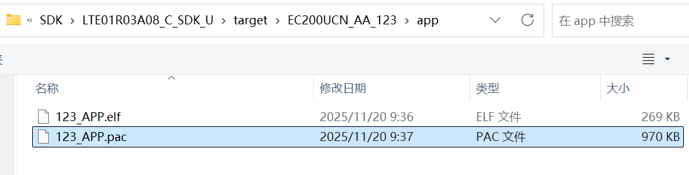
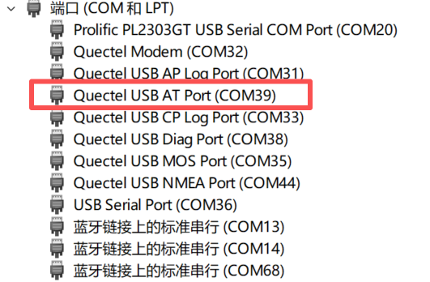

# SDK Build Guide

## 1\. SDK Directory Structure

The SDK directory is organized as follows:

| Directory | Description |
| --- | --- |
| cmake/ | Base modules for CMake build scripts |
| components/ | All system components (AT, FS, GNSS, MQTT, etc.) |
| ohos/ | OpenCPU OS (RTOS layer / HAL / API) |
| prebuilts/ | Precompiled libraries and the GCC toolchain |
| tools/ | Flashing tools, packaging tools, and Python scripts |
| target/ | Output directory for build products such as PAC/BIN files |
| out/ | Final compilation output (obj, elf, bin) |

## 2\. Build Environment Preparation

- Install the toolchain (already included in the SDK)
- Use a Windows or Linux system (Ubuntu is recommended)

## 3\. Selecting and Configuring an Application

The SDK includes multiple example applications such as:

- at_demo
- mqtt_demo
- fs_demo
- gnss_demo

How to select an application:

Locate the ql_init.c file in the project path.  
Uncomment the corresponding _app init_ function to enable the desired demo application.

## 4\. Complete Build Process

Initial full build:

.\\build_all.bat new &lt;module_model&gt; &lt;custom_firmware_name&gt;

(e.g., .\\build_all.bat new EC200UCN_AA 123)

Rebuild after modifying only the app code:

.\\build_all.bat r &lt;module_model&gt; &lt;custom_firmware_name&gt;

(e.g., .\\build_all.bat r EC200UCN_AA 123)

  
During the build process, the SDK will automatically perform:

- Code compilation
- Linking to generate the .elf file
- Packaging the .pac upgrade file using the pack tool
- Producing the final firmware image

## 5\. Firmware Packaging and Flashing

**5.1 Packaging**

The SDK automatically generates the .pac package-no extra steps are required.

**5.2 Flashing**

Use the official QFLASH tool:

- Open QFLASH
- Select the generated firmware

For firmware located in:

\\target\\&lt;EC200UCN_AA_123&gt; (your compiled version folder)

After new build: select merge.pac  

After r build: select APP.pac  

**5.3 Select AT port as the COM port**

**5.4 Click Start**

Once flashing is completed, the module will reboot automatically.