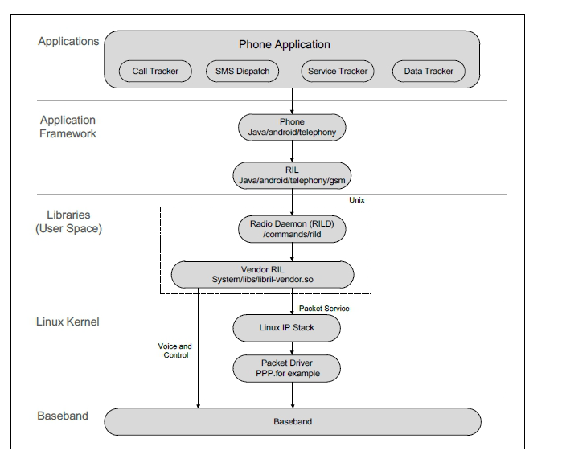

# RIL

What should we do

1. Make sure that Android support Telephony and RIL framework.
2. Make sure the ril-daemon is running.
3. Make sure the RILJ connected.

## What is the RIL

## Telephony Framework

On the Android device, make sure that you can see the following files.

    /vendor/bin/hw/rild
    /vendor/lib/libril.so
    /system/priv-app/TeleService/TeleService.apk
    /system/priv-app/TelephonyProvider/TelephonyProvider.apk
    /system/framework/telephony-common.jar

If you cannot see them please add them in the Android source code.

    PRODUCT_PACKAGES += \
        Telecom \
        TelephonyProvider \
        telephony-common  \
        rild

## ril-daemon

Service ril-daemon1) can be configured by adding the following lines to init*.rc or *rild.rc. The relevant lines vary depending on the accessing interface and the Android version being used.

The location of init*.rc varies according to your project settings. The following gives a non-exhaustive list of file paths which may contain the init*.rc file.
    
    device/fsl/imx6dq/sabresd_6dq/init.rc
    device/ti/am335xevm_sk/init.am335xevm.rc
    device/rockchip/rk3399/init.rk3399.rc
    device/samsung/smdkv210/init.smdkv210_sdmmc.rc
    
rild.rc is only available for Android 7.x or later versions.

The name of RILD service might also be vendor.ril-daemon. In this document, we will only use service ril-daemon for illustration.

For modules accessed via USB/PCIe interface, add the following lines to init*.rc or *rild.rc.

- For Android 4.x–7.x

    service ril-daemon /system/bin/rild -l <libreference-ril path>
            class main
            socket rild stream 660 root radio 
            socket rild-debug stream 660 radio system 
            user root 
            group radio cache inet misc audio sdcard_rw log

- For Android 8.x and later version

    service ril-daemon /vendor/bin/hw/rild -l <libreference-ril path>
            class main
            user root
            group radio cache inet misc audio sdcard_rw log
B
            capabilities BLOCK_SUSPEND NET_ADMIN NET_RAW

Make sure that 
getprop | grep ril
ps -efl | grep ril
You can see that rild is running.

## RILJ

## FAQ

### rild is restarting 

- librilutils.so not found

    CANNOT LINK EXECUTABLE "/vendor/bin/hw/rild": library "librilutils.so" not found: needed by /vendor/lib64/libril.so in namespace (default)

mmm hardware/ril/librilutils
PRODUCT_PACKAGES += librilutils.vendor

- android.hardware.radio.config-v2-ndk.so not found

    CANNOT LINK EXECUTABLE "/vendor/bin/hw/rild": library "android.hardware.radio.config-v2-ndk.so" not found: needed by /vendor/lib64/libril.so

mmm hardware/interfaces/radio/aidl
PRODUCT_PACKAGES += android.hardware.radio.config-v2-ndk.vendor

### build errors

