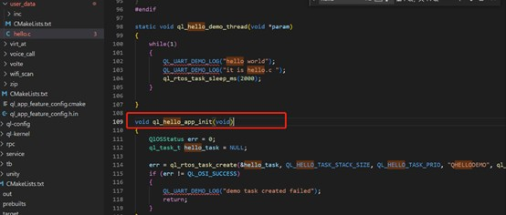
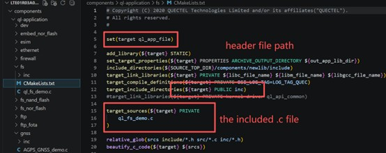
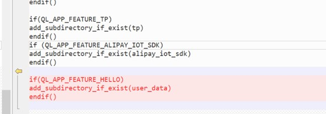
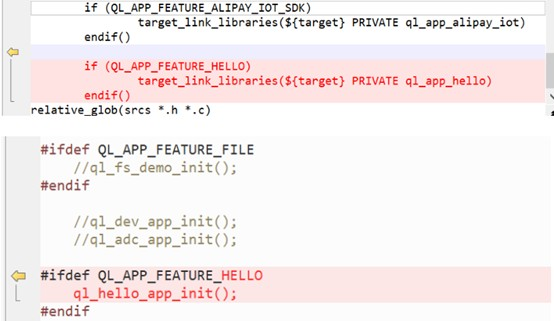
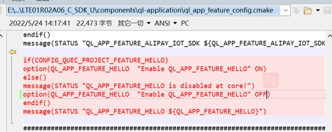
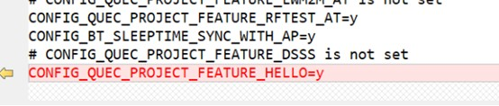
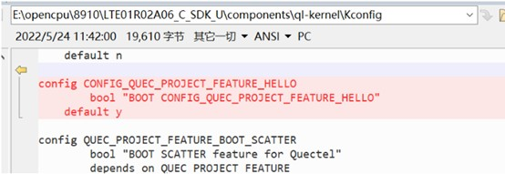

**Unisoc 8910 Platform - Creating Project**

1\. Add your own folder to the project**
Its basic structure should include the necessary source code files, header files, and the compilation configuration file CMakeLists.txt. The ql_hello_app_init entry function can be used to create threads.   

2\. Add the source file .c and its corresponding header file path to the CMakeLists.txt file in this folder, where ql_app_hello is the library file name.   

3\. Add the folder name (user_data) to the CMakeLists.txt file located in the ql-application directory.  

4\. Add the corresponding library link to ql-application\\init\\CMakeLists.txt, and also to init.c.   

5\. At the same time, add a switch to the ql_app_feature_config.cmake file to control whether QL_APP_FEATURE_HELLO is enabled.  
  

6\. In components\\ql-config\\build\\EC600UCN_LB\\8915DM_cat1_open\\target.config, change the default value of CONFIG_QUEC_PROJECT_FEATURE_HELLO=y to y.   
  

7\. In ql_kernel\\kconfig, the default value of CONFIG_QUEC_PROJECT_FEATURE_HELLO is also set to Y.   
  
 NOTE: If the above steps are performed without errors, but you still do not get the final result, try deleting the out folder and the target folder and then try again.  

8\. Adding a static library for the client:  
Place the library files in a new "lib" folder within the directory where the library is being used. Place the corresponding ".h" files in the "inc" folder.   
 
Then, add the path code to the corresponding CMakeLists.txt file to call the files in the library.