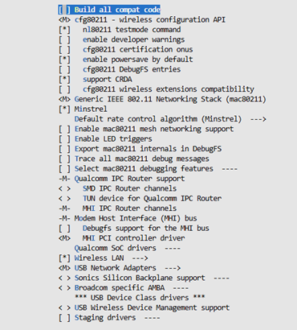
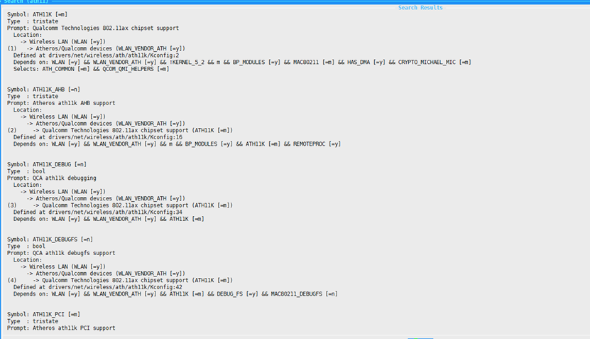
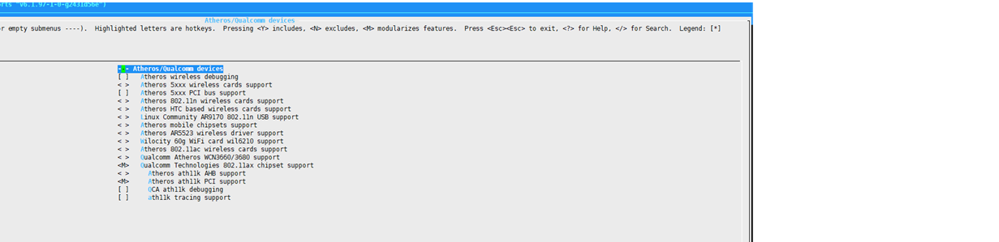
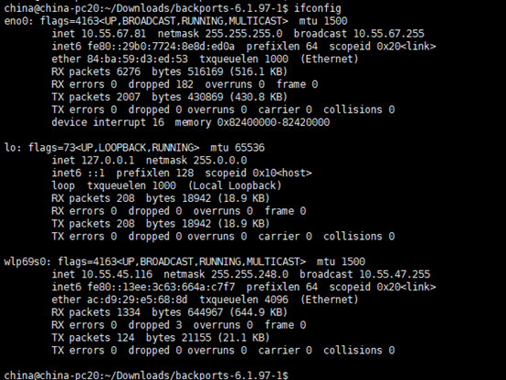

# 使用 backports 在 5.15 内核加载 ath11k WiFi6 驱动

## 第一章 下载 backports

首先下载 backports 工具（最新版本）：

https://backports.docs.kernel.org/releases.html#latest-releases


```bash
tar -xvf backports-xxx.tar
cd backports-6.1.97-1/
```

---

## 第二章 编译驱动

1. 将补丁 `0001-ath11k_v6.14_adpt_v5.15.patch` 应用到 backports
2. 指定已编译好的内核源码路径

```bash
make menuconfig KLIB_BUILD=/home/china/Downloads/linux-5.10.218
```

开启如下配置：



搜索 ath11k 并开启配置：




编译驱动：

```bash
make -j$(nproc) KLIB_BUILD=~/Downloads/linux-5.10.218
```

编译成功：


---

## 第三章 添加固件

驱动编译完成后拉取固件：

https://git.kernel.org/pub/scm/linux/kernel/git/ath/ath.git/

```bash
git clone https://git.kernel.org/pub/scm/linux/kernel/git/firmware/linux-firmware.git
```

备份原固件：

```bash
mv /lib/firmware/ath11k /lib/firmware/ath11k_bak
```

拷贝新固件：

```bash
cp linux-firmware/ath11k /lib/firmware/
```

---

## 第四章 加载驱动

备份原驱动目录：

```bash
mv /lib/modules/5.15.148-rt74+/kernel/drivers/net/wireless/ath    /lib/modules/5.15.148-rt74+/kernel/drivers/net/wireless/ath.bak
```

加载驱动：

```bash
sudo insmod compat/compat.ko
sudo insmod net/wireless/cfg80211.ko
sudo insmod /lib/modules/5.10.218-rt110+/kernel/lib/crypto/libarc4.ko
sudo insmod net/mac80211/mac80211.ko
sudo insmod drivers/bus/mhi/host/mhi.ko
sudo insmod net/qrtr/qrtr.ko
sudo insmod net/qrtr/qrtr-mhi.ko
sudo insmod drivers/soc/qcom/qmi_helpers.ko
sudo insmod drivers/net/wireless/ath/ath11k/ath11k.ko
sudo insmod drivers/net/wireless/ath/ath11k/ath11k_pci.ko
```

加载完成后查看网卡：

```bash
ifconfig
```


